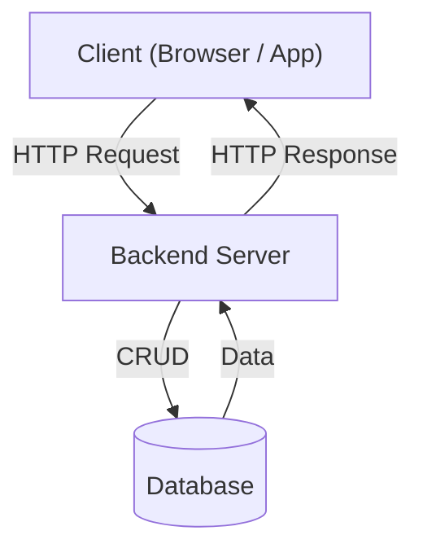
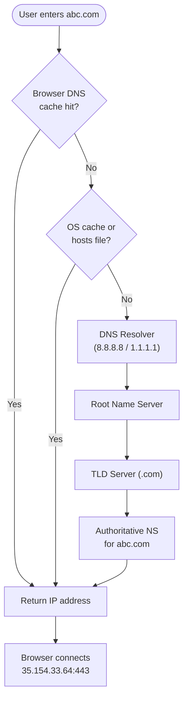
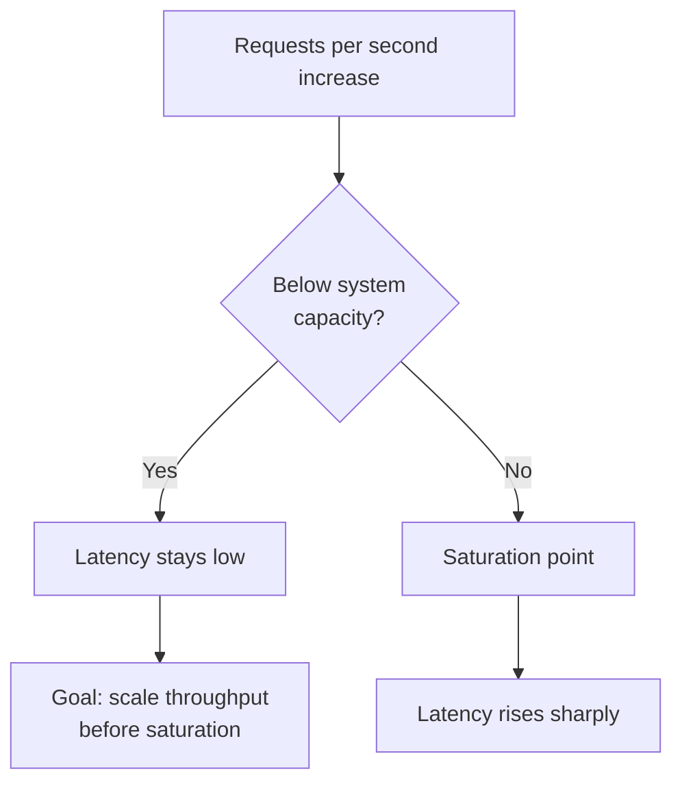
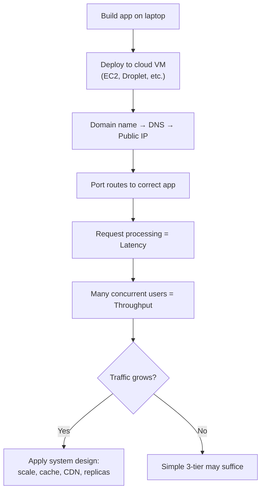

# System Design — Detailed Personal Notes (Chapter 1)

**Topics:** Intro, Servers, Deployment, Latency & Throughput

These notes are written for self-study and revision. Every concept is explained from scratch with real-world analogies, examples, diagrams, and edge cases so you never have to Google the basics again.

**Next →** [Chapter 2: Scaling & Estimation](Part2.md)

---

## Section 1 — Why Study System Design?

### 1.1 The Simple Architecture (College Level)

When you build a project in college, your setup typically looks like this:

```
[ Client (Browser / App) ]
          |
          |  HTTP Request
          ↓
[ Backend Server (Node.js / Django / Spring) ]
          |
          |  CRUD Operations (Create, Read, Update, Delete)
          ↓
[ Database (MySQL / MongoDB / PostgreSQL) ]
```



- Client sends a request (e.g., "Get me the list of products")
- Backend processes the request (calculations, business logic)
- Backend talks to the Database to fetch/store data
- Backend sends a response back to the Client

This is called a **MONOLITHIC** or **SIMPLE 3-TIER ARCHITECTURE**.

For a college project or prototype with 10–100 users → This works perfectly fine.

### 1.2 Why This Breaks in the Real World

Imagine Instagram using this architecture. They have 2+ **BILLION** users. On a Monday morning, millions of people open the app simultaneously.

What happens to our simple server?

| Problem | Description |
|--------|-------------|
| **1 — Server overload** | Your single server can only handle, say, 1000 requests/second. If 1,000,000 requests arrive per second → Server crashes. All users see an error page. Business loses money. |
| **2 — Single point of failure** | If your ONE server goes down (hardware failure, power cut, software bug), your ENTIRE application goes down. 100% downtime. No redundancy, no backup. This is called a **Single Point of Failure (SPOF)**. |
| **3 — No scalability** | Your app becomes popular overnight (viral moment). You have no way to quickly add capacity. Users leave because the site is slow/down. |
| **4 — Data bottleneck** | One database server handling millions of reads and writes simultaneously becomes a bottleneck. Queries slow down, locks happen, data gets corrupted. |
| **5 — Geographic distance** | If your server is in Mumbai and a user is in New York, every request has to travel halfway around the world. This adds significant **latency** (delay). |
| **6 — Security** | A single server with all your code and data exposed is easy to attack. DDoS attacks, SQL injections, data breaches become critical concerns. |

### 1.3 What System Design Teaches You

System Design is the discipline of architecting software systems that can:

| Goal | Meaning |
|------|---------|
| **Scalability** | Handle growth from 100 to 100 million users |
| **Reliability** | Stay operational even when parts fail |
| **Availability** | Be accessible 99.99% of the time (High Availability) |
| **Fault tolerance** | Detect failures and recover automatically |
| **Performance** | Respond quickly under high load |
| **Security** | Protect data and resist attacks |
| **Maintainability** | Easy to update and debug |
| **Cost efficiency** | Don't over-engineer; use resources wisely |

Real companies like Google, Amazon, Netflix, and Uber have massive engineering teams whose **sole job** is designing these systems correctly.

### 1.4 What Is a "Client"?

In system design diagrams, **"Client"** means **ANY** device or application that is sending requests to your system. It is **NOT** limited to a web browser.

**Client can be:**

- A ReactJS / Vue / Angular web application running in Chrome or Firefox
- An Android mobile app (written in Kotlin/Java)
- An iOS mobile app (written in Swift/Objective-C)
- A desktop app (Windows/Mac)
- Another backend service (Microservice calling another Microservice)
- A CLI tool (command-line script hitting an API)
- A smartwatch, IoT device, smart TV, etc.

**Important:** When we draw a "Client" box in system design, we mean: *"Whatever the end user is using to interact with our system."*

The client does **NOT** contain your business logic. It just sends requests and displays responses. All the heavy lifting happens on the server side.

---

## Section 2 — What Is a Server?

### 2.1 Definition

A **SERVER** is simply a computer (machine) that:

1. Has your application code running on it
2. Is connected to a network (internet or intranet)
3. Listens for incoming requests and responds to them
4. Runs 24 hours a day, 7 days a week (ideally)

There is **NOTHING magical** about a server. It is physically the same hardware as your laptop — it has a CPU, RAM, disk storage, and a network card.

| Your laptop | A server |
|-------------|----------|
| Personal use, goes to sleep, not always online | Always running, optimized for handling network traffic |
| | Has a public IP, often has no screen attached (headless) |

### 2.2 Localhost and IP Addresses

When you run your Node.js app:

```bash
$ node app.js
Server running on http://localhost:8080
```

#### What is localhost?

- **"localhost"** is a special hostname that **ALWAYS** refers to **YOUR OWN MACHINE**.
- It is not an external address. Nobody else on the internet can reach it.
- `localhost` → resolves to IP address → **127.0.0.1**
- This IP (127.0.0.1) is called the **LOOPBACK ADDRESS**. It always means "this machine itself."

#### What is an IP address?

- **IP** = Internet Protocol
- An IP address is a unique numerical label assigned to every device connected to a network. It's like a home address for computers.

**Two versions exist:**

| Version | Format | Notes |
|---------|--------|-------|
| **IPv4** | `xxx.xxx.xxx.xxx` (e.g., 192.168.1.1) | 4 numbers, each 0–255. ~4.3 billion addresses (running out!) |
| **IPv6** | `xxxx:xxxx:...` (long hex groups) | Example: `2001:0db8:85a3:0000:0000:8a2e:0370:7334`. Virtually unlimited |

**Private vs public IP addresses:**

| Type | Scope | Examples |
|------|-------|----------|
| **Private IP** | Only within your local network (home/office WiFi) | 192.168.x.x, 10.x.x.x, 172.16.x.x–172.31.x.x. **NOT** reachable from the internet. |
| **Public IP** | Assigned by ISP; reachable worldwide | Every website/server you visit has a public IP. |

**Key insight:** Your college project on `localhost:8080` uses your private/loopback IP. No one outside your machine can access it. To make it accessible worldwide, you need a **PUBLIC IP ADDRESS** attached to your machine/server.

### 2.3 What Is a Port?

A server machine can run **MANY** applications simultaneously — just like your laptop can run Chrome, Spotify, and VS Code at the same time.

So when a request arrives at IP address `35.154.33.64`, **HOW** does the server know **WHICH** application should handle it?

**Answer: PORTS.**

- A **Port** is a number (0–65535) that identifies a specific application/service running on a machine.
- Think of it as a door number inside an apartment building.
  - **IP Address** = The apartment building address (e.g., 35.154.33.64)
  - **Port** = The specific flat/apartment number (e.g., 8080)

So `35.154.33.64:8080` means: *"Go to the machine at IP 35.154.33.64, and talk to the app on door 8080"*

#### Well-known / reserved port numbers

| Port | Service / Protocol |
|------|-------------------|
| 80 | HTTP (unsecured web traffic) |
| 443 | HTTPS (secured web traffic with SSL/TLS) |
| 22 | SSH (secure shell / remote login) |
| 21 | FTP (file transfer) |
| 25 | SMTP (sending email) |
| 3306 | MySQL database |
| 5432 | PostgreSQL database |
| 27017 | MongoDB database |
| 6379 | Redis cache |
| 8080 | Common alternate HTTP (dev servers) |

**Port ranges:**

- **0–1023** — System/well-known ports (reserved, need admin access)
- **1024–49151** — Registered ports (common apps)
- **49152–65535** — Dynamic/private ports (temporary, ephemeral)

When you type `https://google.com`, your browser automatically uses port **443**. You don't type it because browsers assume 443 for HTTPS and 80 for HTTP. Behind the scenes: `https://google.com` = `142.250.77.46:443`

### 2.4 What Is DNS?

**DNS** = Domain Name System

- **Problem:** IP addresses like `142.250.77.46` are hard to remember.
- **Solution:** DNS is like the **PHONE BOOK** of the internet. You give DNS a domain name → It gives you back an IP address.

#### How DNS resolution works (step-by-step)

1. You type `https://abc.com` in your browser and hit Enter.
2. Your browser checks its own **DNS CACHE**. (It may already know the IP from a previous visit.) If found → skip to step 6.
3. If not cached, your OS checks its local DNS cache and the **hosts file** (`/etc/hosts` on Linux/Mac, `C:\Windows\System32\drivers\etc\hosts` on Windows). If found → skip to step 6.
4. If still not found, your OS sends the query to a **DNS RESOLVER** (usually ISP or public: Google `8.8.8.8`, Cloudflare `1.1.1.1`).
5. The DNS Resolver goes through a hierarchy:
   - **ROOT NAME SERVERS** → Know where `.com`, `.in`, `.org` etc. servers are
   - **TLD NAME SERVERS** → `.com` servers know where `abc.com`'s nameserver is
   - **AUTHORITATIVE NAME SERVER** → Has the actual IP address for `abc.com`
6. The IP address (e.g., `35.154.33.64`) is returned to your browser.
7. Browser connects to `35.154.33.64:443` and requests the page.

**Visual flow:**



#### DNS record types (common ones)

| Type | Purpose |
|------|---------|
| **A** | Maps domain to IPv4 address (`abc.com` → `35.154.33.64`) |
| **AAAA** | Maps domain to IPv6 address |
| **CNAME** | Alias — points one domain to another domain |
| **MX** | Mail servers for the domain (email routing) |
| **TXT** | Text records (verification, SPF, DKIM) |
| **NS** | Nameserver records — who manages DNS for this domain |

**TTL (Time To Live):**

- Every DNS record has a TTL — how many seconds it should be cached.
- After TTL expires, the resolver fetches fresh data.
- **Low TTL** = changes propagate quickly but more DNS queries.
- **High TTL** = fewer queries but changes take longer to propagate.

### 2.5 Full Request Lifecycle (Putting It All Together)

Let's trace **exactly** what happens when you visit `https://abc.com`:

```
[YOUR BROWSER]
     |
     |  1. User types https://abc.com and presses Enter
     ↓
[DNS RESOLVER]
     |
     |  2. Resolves abc.com → 35.154.33.64
     ↓
[YOUR BROWSER again]
     |
     |  3. Initiates TCP Connection to 35.154.33.64:443
     |     (3-way handshake: SYN → SYN-ACK → ACK)
     |
     |  4. TLS Handshake (for HTTPS security)
     |     (Certificates exchanged, encryption keys set up)
     ↓
[SERVER at 35.154.33.64]
     |
     |  5. Server receives request on port 443
     |     Identifies the correct application (web server / reverse proxy)
     |
     |  6. Application processes the request
     |     (fetch data from DB, run business logic, etc.)
     ↓
[YOUR BROWSER again]
     |
     |  7. Server sends back HTTP Response (HTML/JSON/etc.)
     |
     |  8. Browser renders the page / processes the data
     ↓
[YOU SEE THE WEBPAGE]
```

> **Note:** Steps 3–8 happen in milliseconds for a fast, well-designed system.

---

## Section 3 — How to Deploy an Application?

### 3.1 The Problem with Hosting Yourself

Theoretically, you **COULD** host your app on your own laptop and expose it to the internet. But here's why nobody does this for production:

| Challenge | Issue |
|-----------|-------|
| **Static public IP** | Most home/college connections have a **dynamic** IP. It changes when you reconnect. Domain breaks constantly. Static IP costs extra. |
| **Always on** | Laptop sleeps, shuts down, moves → app goes offline. Servers need 24/7/365. |
| **Hardware maintenance** | Disk dies, RAM fails, power cut → app gone. Need backups, UPS, redundant hardware. Expensive and complex. |
| **Bandwidth** | Millions of users need enormous bandwidth. Home internet isn't designed for this. |
| **Security** | Exposing laptop to internet is dangerous. Need firewalls, DDoS protection, intrusion detection. |
| **Scalability** | Traffic spikes — you can't instantly add more CPU/RAM to your laptop. |

### 3.2 Cloud Providers — The Solution

Cloud providers own **MASSIVE** data centers with thousands of physical servers. They rent you a slice of that infrastructure (called a **VIRTUAL MACHINE**).

#### Major cloud providers

| Provider | Virtual Machine Product Name |
|----------|------------------------------|
| AWS (Amazon) | EC2 — Elastic Compute Cloud |
| Azure (Microsoft) | Azure Virtual Machines |
| GCP (Google) | Compute Engine |
| DigitalOcean | Droplets |
| Linode / Akamai | Linode Instances |
| Vultr | Cloud Compute Instances |

**What you get from a cloud provider:**

- A Virtual Machine (VM) with dedicated CPU, RAM, Disk
- A public static IP address (or elastic IP)
- Network connectivity with high bandwidth
- Choice of OS (Ubuntu, Amazon Linux, Windows, etc.)
- Pay only for what you use (pay-per-hour or pay-per-second)
- Options to scale up (bigger machine) or scale out (more machines)
- Managed services for databases, storage, networking, etc.

### 3.3 What Is a Virtual Machine (VM)?

A **Virtual Machine** is software that simulates a physical computer. The cloud provider runs a **HYPERVISOR** on their physical servers. The hypervisor divides one physical machine into many virtual machines.

```
Physical Server (e.g., 128 CPU cores, 512GB RAM)
┌──────────────────────────────────────────┐
│              HYPERVISOR                  │
├──────────┬──────────┬──────────┬─────────┤
│ VM #1    │ VM #2    │ VM #3    │ VM #4   │
│ 2 CPUs   │ 4 CPUs   │ 8 CPUs   │ 2 CPUs  │
│ 4GB RAM  │ 16GB RAM │ 32GB RAM │ 8GB RAM │
│ Ubuntu   │ Windows  │ Amazon   │ Debian  │
│          │          │ Linux    │         │
└──────────┴──────────┴──────────┴─────────┘
```

- Each VM is **isolated** from others. You get full OS access and root control.
- You can install anything — Node.js, Python, Java, databases, etc.
- AWS calls their VMs: **EC2 INSTANCES**. EC2 = Elastic Compute Cloud ("Elastic" = can scale dynamically)

### 3.4 What Is Deployment?

**DEPLOYMENT** = The process of making your application accessible to users by running it on a server (usually in the cloud).

**Simplified deployment steps:**

1. Write code on your **LOCAL** machine (laptop)
2. Test it locally (`localhost:8080`)
3. Push code to version control (GitHub/GitLab)
4. Connect to your cloud VM (via SSH)
5. Pull the code onto the VM
6. Install dependencies (`npm install` / `pip install`)
7. Start the application on the VM (`node app.js` / `python app.py`)
8. Configure a domain name to point to the VM's public IP (DNS A record)
9. (Optional) Set up HTTPS with SSL certificate (Let's Encrypt)
10. App is now **LIVE** and accessible worldwide!

**Modern deployment approaches:**

- **CI/CD Pipelines** (GitHub Actions, Jenkins, GitLab CI) — Automatically test and deploy on push to main
- **Docker Containers** — Package app + dependencies for consistent environments
- **Kubernetes (K8s)** — Orchestrate many containers across many servers
- **Serverless** (AWS Lambda, Google Cloud Functions) — Run code without managing servers; pay per execution
- **Platform-as-a-Service (PaaS)** — Heroku, Railway, Render handle deployment; you just push code

### 3.5 Local vs Production Environment

| Environment | Characteristics |
|-------------|-----------------|
| **LOCAL (Development)** | Runs on laptop; only you can access (`localhost`); easy to test/debug; not optimized for performance |
| **STAGING** | Copy of production for testing before going live; same setup as production but test data; QA finds bugs before release |
| **PRODUCTION** | Live environment real users use; must be highly available, fast, secure; mistakes impact users; changes deployed carefully (often with rollback plans) |

---

## Section 4 — Latency and Throughput

These are the two most fundamental performance metrics in every system design discussion. Understanding them deeply is essential.

### 4.1 Latency — Deep Dive

#### Definition

**Latency** is the **TIME** it takes for a **SINGLE** request to travel from the client to the server, get processed, and return a response back to the client.

Think of it as: *"How fast does ONE thing get done?"*

- **Primary unit:** Milliseconds (ms)
- Also: microseconds (μs) for very fast ops, or seconds (s) for very slow ops

#### What contributes to latency?

Latency is made up of multiple parts:

1. **Network transmission latency** — Physical time for packets to travel. Limited by speed of light.
   - Same city: ~1–5ms
   - Cross-country (Mumbai to Delhi): ~20–40ms
   - Intercontinental (Mumbai to New York): ~100–200ms
2. **Propagation delay** — How far the signal travels. Cannot beat speed-of-light limit. Geographic proximity matters.
3. **Queuing delay** — If server is busy, request waits in queue. Under heavy load, adds significant latency.
4. **Processing/computation time** — Server runs code, executes queries. Depends on CPU and algorithm efficiency.
5. **Database query time** — Often the biggest contributor. Poor SQL or missing index → seconds instead of ms.
6. **Serialization / deserialization** — Converting to/from JSON, XML, Protobuf, etc.
7. **TLS handshake** — HTTPS adds 1–2 round trips before data is sent.

**Total latency** = Sum of all the above components.

#### RTT — Round Trip Time

**RTT** is the time for a request to go **FROM** the client **TO** the server, **AND** for the response to travel **BACK** to the client.

```
RTT = Time to send request + Server processing time + Time to receive response
```

RTT is essentially the full latency you experience as a user. **"Ping"** in networking tools measures RTT.

```bash
$ ping google.com
64 bytes from 142.250.77.46: icmp_seq=1 ttl=117 time=28.4 ms
# ← This "28.4 ms" is the RTT
```

#### Latency targets (industry standards)

| Type of application | Good latency | Bad latency |
|---------------------|--------------|-------------|
| Real-time gaming / trading | < 10ms | > 50ms |
| Interactive web app | < 100ms | > 300ms |
| API response (typical) | < 200ms | > 1000ms |
| Page load (full web page) | < 2 seconds | > 5 seconds |
| Video streaming (buffering) | < 500ms | > 3 seconds |
| Database query | < 10ms | > 100ms |

**Human perception:**

| Latency | User experience |
|---------|-----------------|
| < 100ms | Feels instantaneous |
| 100–300ms | Noticeable but acceptable |
| 300ms–1s | Noticeably slow, users get annoyed |
| > 1s | Users start abandoning the page |
| > 3s | 50%+ of mobile users leave (Google study) |

#### How to reduce latency

1. **CDN** — Cache static assets near users (Cloudflare, Akamai, AWS CloudFront). Mumbai server → NY user (200ms) vs NY CDN edge → NY user (5ms).
2. **Caching** — Redis, Memcached. DB query: 50ms → Cache hit: 0.5ms (~100x faster).
3. **Database indexing** — Index frequently queried columns. Seconds → milliseconds.
4. **Efficient algorithms** — O(n²) → O(n log n) or O(n).
5. **Connection pooling** — Reuse DB connections. New connection adds 10–50ms each time.
6. **HTTP/2 and HTTP/3** — Multiplexing, header compression, faster connection setup.
7. **Geographic distribution** — Deploy in multiple regions; route users to nearest server.

### 4.2 Throughput — Deep Dive

#### Definition

**Throughput** is the **NUMBER** of requests (or operations) a system can successfully handle **PER SECOND** (or per unit of time).

Think of it as: *"How MANY things can get done per second?"*

**Primary units:**

| Abbreviation | Meaning |
|--------------|---------|
| **RPS** | Requests Per Second (web servers, APIs) |
| **TPS** | Transactions Per Second (databases, payments) |
| **QPS** | Queries Per Second (databases) |
| **bps / Mbps / Gbps** | bits per second (network bandwidth) |

#### What limits throughput?

Every system has a **BOTTLENECK** — the slowest component that caps throughput.

1. **CPU speed & cores** — More cores → more parallel processing.
2. **Memory (RAM)** — Out of RAM → swap to disk (100x slower than RAM) → throughput drops.
3. **Network bandwidth** — Connection maxes out → requests dropped or queued. 1 Gbps ≈ ~125 MB/s.
4. **Disk I/O** — Slow reads/writes; DB-heavy apps often disk-limited.
5. **Database connection limits** — All connections in use → new queries wait.
6. **Application code efficiency** — Blocking/sync code reduces concurrent handling.
7. **Thread / process limits** — One request per thread in traditional servers. Node.js uses non-blocking async I/O.

#### Throughput in practice

| Example | Numbers |
|---------|---------|
| **Simple API server** | Express on 2-core: 1,000–5,000 RPS (no DB); 100–500 RPS with DB |
| **Netflix at peak** | 200+ million concurrent users; millions of RPS globally |
| **Payment systems** | Visa ~24,000 TPS average; ~65,000 TPS peak |

#### How to increase throughput

1. **Horizontal scaling (scale out)** — More servers + load balancer. 1 server @ 1,000 RPS → 10 servers @ 10,000 RPS.
2. **Vertical scaling (scale up)** — Bigger machine (more CPU/RAM). Hardware ceiling exists.
3. **Asynchronous processing** — Queue slow tasks (email, images). Respond instantly; process in background.
4. **Caching** — Cached responses = no DB, no compute. More cache hits = more RPS.
5. **Database read replicas** — Primary for writes; replicas for reads.
6. **Connection pooling** — Pool of persistent connections serves thousands of requests.
7. **Efficient data formats** — Protobuf, MessagePack vs JSON/XML — less bandwidth per message.
8. **Non-blocking I/O** — Node.js handles other requests while waiting on DB.

### 4.3 The Relationship Between Latency and Throughput

These two are **RELATED** but **DIFFERENT**, and can sometimes **conflict**.

#### Little's Law (fundamental theorem of queuing systems)

Throughput (λ) = Concurrent Users (L) / Latency (W)
→ Or: L = λ × W

If you have more concurrent users and the same throughput, **latency increases**. To serve more users at the same latency, you must **increase throughput**.

#### The tradeoff

- Sometimes improving throughput **increases** latency.
  - **Example:** Batching DB writes (100 at once) → higher throughput, but each write waits for batch → higher latency.
- **Example:** Caching improves **both** (rare win!) → lower latency **and** higher throughput.

#### Saturation point

As load increases, latency stays low until the system approaches its throughput limit. Then latency increases rapidly.



```
Latency
│                              *
│                           * *
│                        * *
│              * * * * *
│* * * * * * *
└──────────────────────────────── Requests/sec
     ↑                    ↑
Low load zone        Saturation point
(latency stable)     (latency explodes)
```

**Ideal goal:** Optimize **both**:

- Low latency → Each user gets a fast response
- High throughput → Many users served simultaneously

### 4.4 Analogies (Multiple for Easy Memory)

| Analogy | Latency | Throughput |
|---------|---------|------------|
| **Highway** | Time for ONE car from City A to City B | Cars passing through per hour |
| **Restaurant** | Order to plate (30 min) | Customers served per hour (50/hour) |
| **Water pipe** | Time for first drop from tank to tap | Liters per second |
| **Assembly line** | Time to build ONE car (8 hours) | Cars produced per day (500/day) |

- Wider highway = higher throughput; faster speed limit = lower latency.
- A factory can produce 500 cars/day (high throughput) even if each car takes 8 hours (high latency) — many cars at different stages (**parallelism/concurrency**).

### 4.5 Percentile Latency (p50, p95, p99)

In production, you **NEVER** just look at **average** latency. Averages hide terrible experiences for some users.

| Percentile | Meaning |
|------------|---------|
| **p50 (median)** | 50% of requests faster than this |
| **p75** | 75% faster |
| **p95** | 95% faster |
| **p99** | 99% faster |
| **p99.9** | 99.9% faster ("three nines") |

**Example API measurements:**

| Percentile | Value |
|------------|-------|
| p50 | 50ms — half of users under 50ms |
| p95 | 200ms |
| p99 | 800ms |
| p99.9 | 3000ms — slowest 0.1% wait up to 3s |

**p99 and p99.9** = **TAIL LATENCIES**. At scale:

- 10 million requests/day → 1% = 100,000 requests @ 800ms
- 0.1% = 10,000 requests @ 3 second latency

Amazon found that every **100ms** of latency costs them **1%** in sales.

**Why tail latency exists:**

- Garbage collection pauses (JVM)
- Disk I/O or swap
- Network congestion
- Database lock contention
- Cold starts (serverless)
- CPU scheduling delays

---

## Section 5 — Putting It All Together

### 5.1 How These Concepts Connect



```
You build an app (code on laptop)
      ↓
You DEPLOY it to a CLOUD SERVER (AWS EC2, etc.)
      ↓
Users access it via DOMAIN NAME → DNS resolves to SERVER IP
      ↓
Request goes to correct app via PORT NUMBER
      ↓
Server processes request — this takes LATENCY time
      ↓
System must handle many users simultaneously — this is THROUGHPUT
      ↓
As users grow, simple architecture breaks → Need SYSTEM DESIGN principles
```

### 5.2 Common Interview Questions on These Topics

**Q: What is the difference between latency and throughput?**

**A:** Latency measures how long **ONE** request takes (speed). Throughput measures how **MANY** requests can be handled per second (capacity).

**Q: If I add more servers, does latency decrease?**

**A:** Not necessarily. Latency per request stays the same. But **throughput** increases. Under heavy load, more servers prevent queue buildup, which **indirectly** keeps latency from spiking (less queuing delay).

**Q: What is a single point of failure?**

**A:** A component that, if it fails, brings the entire system down. Example: One server with no backup = SPOF. Solution: Redundancy — multiple servers, load balancers, DB replicas.

**Q: What is the difference between scaling up and scaling out?**

**A:** **Scale up (vertical):** Make one server bigger (more CPU/RAM). **Scale out (horizontal):** Add more servers and distribute load. Scale out is generally preferred for large systems.

**Q: Why do we use ports?**

**A:** One server runs many applications. Ports let the OS route traffic to the correct app.

**Q: What is RTT?**

**A:** Round Trip Time — total time for request to server **and** response back. Essentially equals latency from the user's view.

---

## Section 6 — Master Reference Tables

### 6.1 Key Concepts Summary

| Concept | Explanation |
|---------|-------------|
| Server | Machine (physical or virtual) that runs your app |
| Client | App/device users use to interact with your system |
| IP Address | Unique address for every machine on a network |
| localhost / 127.0.0.1 | Refers to the current machine itself |
| Public IP | IP reachable from the internet |
| Private IP | IP only reachable within a local network |
| Port | Number routing traffic to the correct app (0–65535) |
| DNS | Translates domain → IP address |
| RTT | Round Trip Time = request + response time |
| Latency | Time for a single request to complete |
| Throughput | Requests handled per second |
| RPS | Requests Per Second |
| TPS | Transactions Per Second |
| Deployment | Putting your app on a public server |
| EC2 | AWS virtual machine product |
| VM | Virtual Machine — simulated computer on real hardware |
| Hypervisor | Software that creates and manages VMs |
| SPOF | Single Point of Failure |
| Horizontal Scaling | Adding more servers |
| Vertical Scaling | Upgrading existing server hardware |
| Tail Latency | Slowest requests (p99, p99.9) |
| CDN | Geographically distributed content servers |
| Cache | Fast temporary storage to avoid repeated work |
| Load Balancer | Distributes requests across multiple servers |

### 6.2 Latency vs Throughput Comparison

| Dimension | Latency | Throughput |
|-----------|---------|------------|
| Definition | Time for ONE request | Requests handled/second |
| Measures | Speed / responsiveness | Capacity / volume |
| Unit | ms | RPS / TPS / QPS |
| Ideal goal | LOW | HIGH |
| Improves with | Caching, CDN, better code | More servers, async, cache |
| Analogy | Speed of ONE car | Cars/hour on highway |
| User impact | How fast page loads | How many users served |
| Bottleneck cause | Network distance, slow DB | CPU, RAM, bandwidth, I/O |

### 6.3 Well-Known Port Numbers (Quick Reference)

| Port | Protocol / Service |
|------|-------------------|
| 20 | FTP (data transfer) |
| 21 | FTP (control) |
| 22 | SSH |
| 25 | SMTP |
| 53 | DNS |
| 80 | HTTP |
| 110 | POP3 |
| 143 | IMAP |
| 443 | HTTPS |
| 3000 | Common Node.js / React dev server |
| 3306 | MySQL |
| 5432 | PostgreSQL |
| 6379 | Redis |
| 8080 | Alternate HTTP / dev server |
| 8443 | Alternate HTTPS |
| 27017 | MongoDB |

### 6.4 Cloud Provider Comparison (Beginner Level)

| Provider | VM Product | Market | Known for |
|----------|------------|--------|-----------|
| AWS (Amazon) | EC2 | Largest | Widest range of services |
| Azure (Microsoft) | Virtual Machines | 2nd | Enterprise / Windows workloads |
| GCP (Google) | Compute Engine | 3rd | ML, big data |
| DigitalOcean | Droplets | Smaller | Developer-friendly, simple |
| Linode/Akamai | Linodes | Smaller | Simple, affordable |

### 6.5 Latency Benchmarks (Order of Magnitude — memorize these!)

Rough numbers for system design interviews:

| Operation | Approx latency |
|-----------|----------------|
| L1 cache reference (CPU) | 0.5 ns |
| L2 cache reference (CPU) | 7 ns |
| RAM memory read | 100 ns |
| SSD random read | 100 μs (0.1 ms) |
| HDD read | 10 ms |
| Redis / in-memory cache read | 0.1–1 ms |
| DB query (indexed, simple) | 1–10 ms |
| DB query (complex / no index) | 100 ms – seconds |
| Network within same data center | 0.5–1 ms |
| Network cross-region (Mumbai → Singapore) | 20–40 ms |
| Network cross-continent (India → USA) | 150–200 ms |
| DNS lookup | 10–100 ms |
| TLS handshake (HTTPS setup) | 50–200 ms |

**Key insight:** RAM is ~100,000× faster than disk. This is why **caching** (storing in RAM) dramatically reduces latency.

---

## Section 7 — Things to Remember / Common Mistakes

| Mistake | Truth |
|---------|-------|
| "High throughput means low latency too." | They are **independent**. High throughput + high latency is possible (e.g., batch systems). |
| "Adding more servers always reduces latency." | More servers increase **throughput**. Latency depends on network, DB, algorithms. More servers only reduce latency **indirectly** (less queuing under load). |
| "Average latency is a good metric." | Averages hide outliers. Use **percentiles** (p95, p99). 50ms average with 5000ms p99 = awful experience for 1% of users. |
| "localhost and 127.0.0.1 are different." | They're the **same**. localhost resolves to 127.0.0.1. |
| "Port 80 and 443 are optional." | They're **default** ports — browsers assume them. Still used behind the scenes. |
| "Vertical scaling is always better." | Vertical scaling has limits. Horizontal scaling is more scalable and fault-tolerant. One big server = SPOF. |
| "My app works locally, so deployment is easy." | Local ≠ production. Different OS, deps, security groups, firewalls, env vars, SSL, etc. |

---

## Glossary — Alphabetical

| Term | Definition |
|------|------------|
| **Bandwidth** | Maximum rate of data transfer across a network (Mbps/Gbps) |
| **Cache** | Fast temporary storage to serve repeated data without recomputing |
| **CDN** | Content Delivery Network — servers distributed globally near users |
| **Client** | Any device/app that sends requests to your system |
| **Deployment** | Moving your application to a live server for public access |
| **DNS** | Domain Name System — translates domain names to IP addresses |
| **EC2** | Amazon Web Services' virtual machine product |
| **Fault Tolerance** | System's ability to continue operating despite partial failures |
| **Horizontal Scaling** | Adding more machines to handle more load |
| **HTTP** | HyperText Transfer Protocol — port 80 |
| **HTTPS** | HTTP secured with SSL/TLS — port 443 |
| **Hypervisor** | Software that creates and manages VMs on hardware |
| **IP Address** | Numerical label identifying a device on a network |
| **IPv4** | 32-bit IP format — ~4.3B addresses |
| **IPv6** | 128-bit IP format — virtually unlimited addresses |
| **Latency** | Time to complete a single request (ms) |
| **Load Balancer** | Distributes incoming requests across multiple servers |
| **localhost** | Hostname meaning "this machine" — resolves to 127.0.0.1 |
| **Monolith** | Single application containing all code and functionality |
| **p95/p99** | Latency percentiles — 95%/99% of requests faster than this |
| **Port** | Number (0–65535) identifying a specific app on a server |
| **Public IP** | IP reachable from the internet |
| **Private IP** | IP only reachable within a local network |
| **RPS** | Requests Per Second |
| **RTT** | Round Trip Time — request + response (= latency from user view) |
| **Scalability** | System's ability to handle increasing load |
| **Server** | Machine that runs your application and serves requests |
| **SPOF** | Single Point of Failure |
| **Tail Latency** | Latency of slowest requests (p99, p99.9) |
| **Throughput** | Number of requests handled per unit time |
| **TLS/SSL** | Encryption for HTTPS |
| **TPS** | Transactions Per Second |
| **TTL** | Time To Live — how long DNS/cache entry stays valid |
| **Vertical Scaling** | Upgrading a machine (more CPU/RAM) |
| **Virtual Machine** | Software-simulated computer on real hardware |

---

## End of Chapter 1

**Next →** [Chapter 2: Scaling & Estimation](Part2.md)
