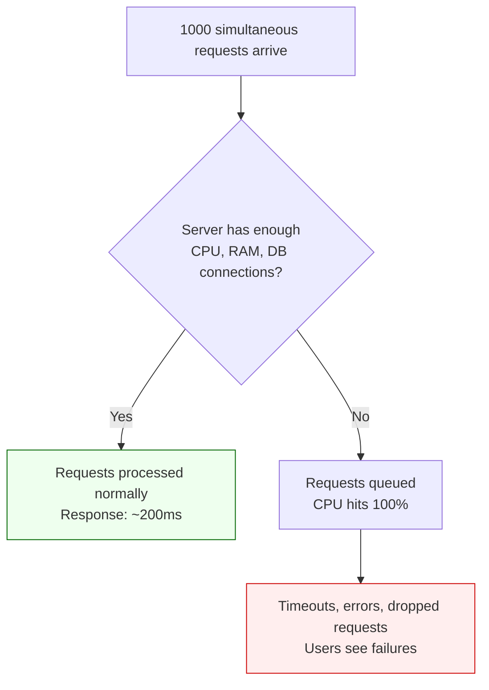
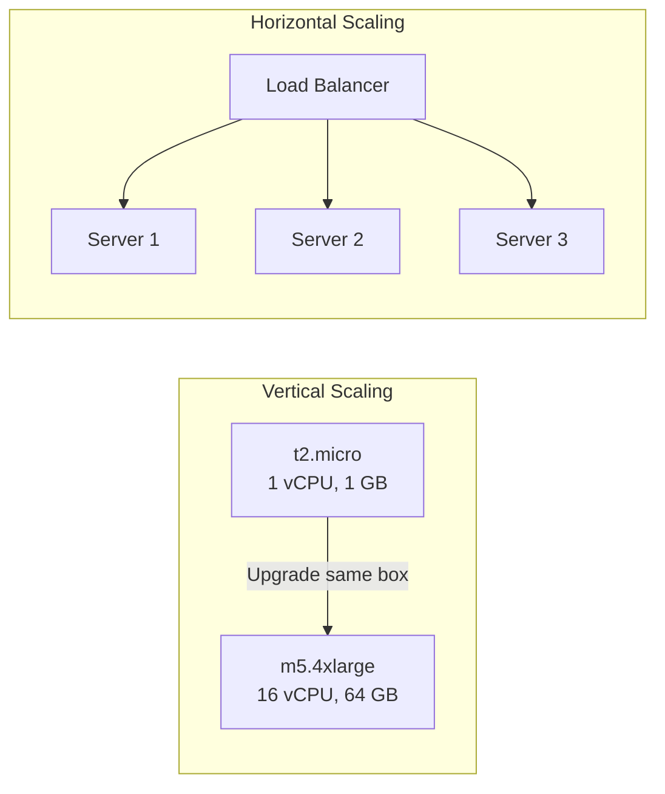
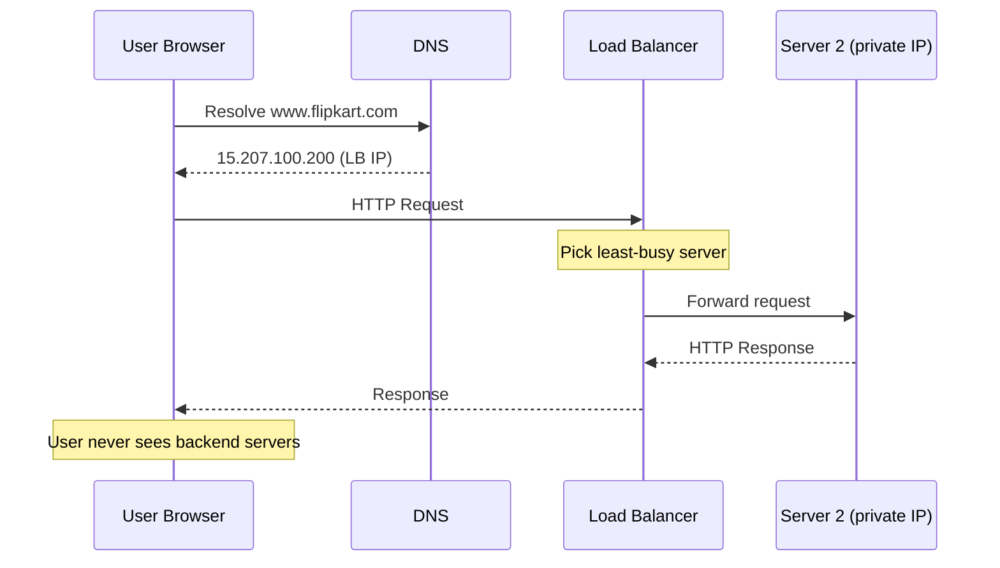
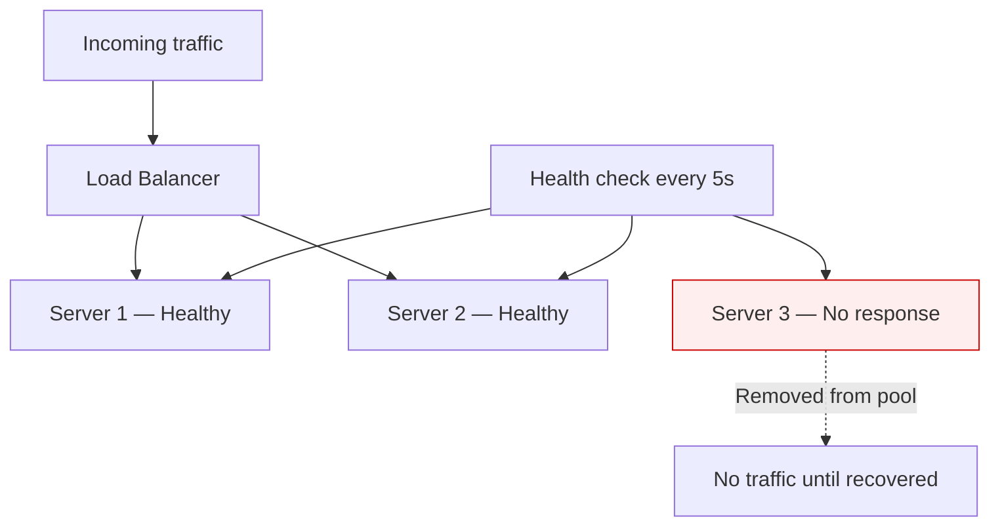
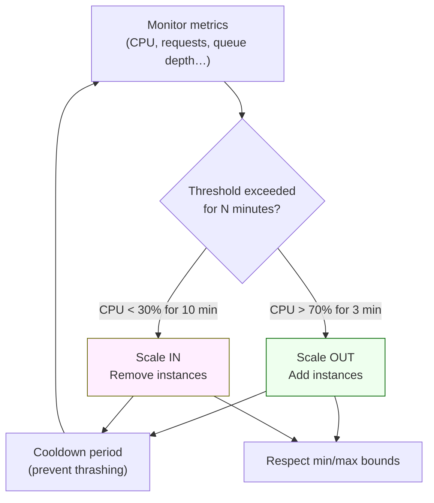
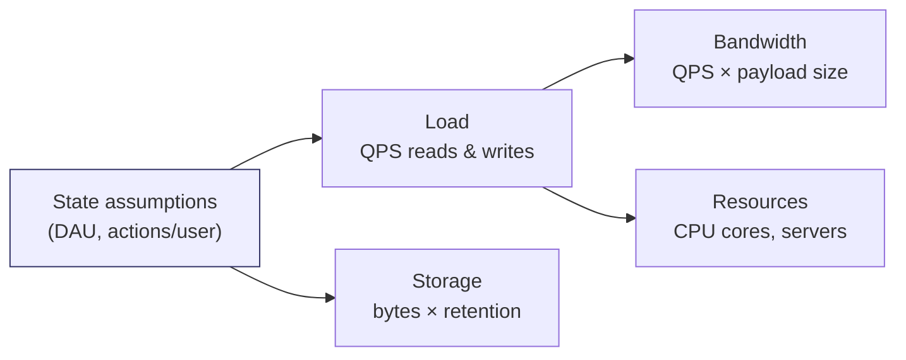

# System Design — Detailed Personal Notes (Chapter 2)

**Topics:** Scaling (Vertical & Horizontal), Load Balancing, Auto Scaling, Back-of-the-Envelope Estimation

These notes continue from [Chapter 1](Part1.md). Every concept is explained from first principles with real-world analogies, diagrams, and worked examples.

**Previous ←** [Chapter 1: Intro, Servers & Deployment](Part1.md) · **Next →** [Chapter 3: CAP Theorem & Database Scaling](Part3.md)

---

## Table of Contents

| Section | Topic | Key Ideas |
|---------|-------|-----------|
| **1** | Scaling | Capacity problem, vertical vs horizontal, load balancers, auto scaling |
| **2** | Estimation | Memory table, Twitter worked example, QPS, storage, bandwidth |

---

# PART 1: SCALING — The Complete Deep Dive

## Why Does Scaling Even Exist As A Problem?

Let's build the mental model from the very beginning.

When you write a backend application and deploy it, it runs on a physical or virtual machine somewhere in a data center. This machine has real, physical limits:

- It has a CPU with a fixed number of cores
- It has a fixed amount of RAM
- It has a fixed amount of storage
- It has a fixed network bandwidth

Your application uses these resources to process incoming requests. Every time a user opens your website, a request travels through the internet, hits your server, your server does some work (reads from database, runs some logic, prepares a response), and sends the response back.

Now here is the critical question: **What happens when 1000 users all send requests at exactly the same time?**

Your server has to handle all 1000 requests simultaneously. Each request needs:
- A thread or process (uses RAM)
- CPU time to execute logic
- Database connections (limited resource)
- Network I/O

If your server only has enough RAM for 500 concurrent threads, the other 500 requests get queued. If CPU is at 100%, processing slows down for everyone. If the queue grows faster than it drains, eventually requests start timing out or getting dropped. Users see errors. Your website crashes effectively even though the server is still running.

This is not a coding bug. This is a **capacity problem**. You need more capacity. That is what scaling is.



> **Key takeaway:** Scaling is about adding capacity — not fixing application logic. You scale when hardware limits are the bottleneck.

---

## Vertical Scaling — Explained With Full Depth

### The Core Idea

Vertical scaling means you take the same machine your application is already running on, and you make it more powerful. You upgrade its specs.

Think about this analogy in detail. You have a dhaba (small restaurant) with one kitchen. Your one chef can cook 50 dishes per hour. Business is going well and now you need to cook 200 dishes per hour. 

Vertical scaling says: **don't add more kitchens — make this one kitchen better**. Buy a faster stove. Hire a more skilled chef. Get a bigger refrigerator. The kitchen is still one kitchen, but it can now handle more throughput.

In server terms:
```
BEFORE VERTICAL SCALING:
┌────────────────────────────────────────────────┐
│              EC2 Instance (t2.micro)           │
│                                                │
│  CPU:     1 vCPU (1 virtual core)             │
│  RAM:     1 GB                                 │
│  Storage: 20 GB SSD                            │
│  Network: Up to 1 Gbps                         │
│                                                │
│  Can handle: ~100 concurrent users             │
│  Status: Choking at 500 users                  │
└────────────────────────────────────────────────┘

AFTER VERTICAL SCALING:
┌────────────────────────────────────────────────┐
│              EC2 Instance (m5.4xlarge)         │
│                                                │
│  CPU:     16 vCPUs (16 virtual cores)         │
│  RAM:     64 GB                                │
│  Storage: 500 GB SSD                           │
│  Network: Up to 25 Gbps                        │
│                                                │
│  Can handle: ~10,000 concurrent users          │
│  Status: Comfortable                           │
└────────────────────────────────────────────────┘
```

You didn't change anything about your application code. You didn't change your architecture. You just told AWS "give me a bigger machine." AWS stopped your old instance, migrated it to a bigger physical host, and restarted it. From your application's perspective, nothing changed — it just has more resources now.

### Why Is Vertical Scaling Used For SQL Databases and Stateful Apps?

This is a very important nuance that is worth understanding deeply.

**SQL Databases:**

SQL databases like PostgreSQL and MySQL are fundamentally designed around the assumption that all the data lives in one place. When you run a query like:

```sql
SELECT u.name, o.total, p.name AS product
FROM users u
JOIN orders o ON u.id = o.user_id
JOIN products p ON o.product_id = p.id
WHERE u.id = 42
```

This query needs to access the `users` table, the `orders` table, and the `products` table — all at the same time — and JOIN them together. If all these tables are on one machine, the JOIN is just a fast in-memory operation.

If you tried to split SQL databases across multiple machines (horizontal scaling), you would face the nightmare scenario: `users` is on Server A, `orders` is on Server B, `products` is on Server C. Now to run that JOIN, you need to pull data across the network from 3 different servers, combine them, and return the result. This is extremely slow and complex. SQL databases weren't designed for this.

So the natural path for SQL is: make one machine as powerful as possible. That's vertical scaling.

**Stateful Applications:**

A "stateful" application is one that remembers information between requests. For example:
- A user logs in → server creates a session and stores it in memory: `session["user_123"] = {name: "Rahul", cart: [...]}`
- User adds item to cart → server updates: `session["user_123"].cart.append("item_456")`
- User checks out → server reads `session["user_123"].cart`

All three requests MUST go to the SAME server because that's where the session data is stored in memory.

If you had 3 servers and these requests got distributed across all three (which is what horizontal scaling does), Server 2 wouldn't know about the session that Server 1 created. The user's cart would appear empty.

Solutions exist (like storing sessions in a shared Redis cache instead of in-memory), but they add complexity. For simpler stateful systems, vertical scaling keeps everything on one machine and avoids this problem entirely.

### The Fundamental Limitation of Vertical Scaling

Here is the hard truth that makes vertical scaling insufficient by itself:

```
AWS EC2 Instance Sizes (simplified progression):

t2.micro    → 1 vCPU,   1 GB RAM     ← starter
t2.medium   → 2 vCPU,   4 GB RAM
m5.xlarge   → 4 vCPU,   16 GB RAM
m5.4xlarge  → 16 vCPU,  64 GB RAM
m5.16xlarge → 64 vCPU,  256 GB RAM
u-24tb1     → 448 vCPU, 24,576 GB RAM ← AWS's largest as of recent years

THEN WHAT?

There is no "u-100tb1". AWS doesn't make it.
The physical laws of silicon set a ceiling.
You cannot put infinite RAM on one chip.
You cannot have infinite CPU cores on one socket.
```

So if your application needs the equivalent of 1000 vCPUs and 500 TB of RAM, vertical scaling literally cannot provide it. You've hit the physical ceiling of what one machine can be. This is called the **scaling bottleneck** or the **vertical ceiling**.

This is when horizontal scaling becomes not just an option but a necessity.

| Approach | What you change | Code changes? | Ceiling? | Best for |
|----------|-----------------|---------------|----------|----------|
| **Vertical** | Bigger single machine | None | Yes — physical limits | SQL DBs, stateful apps, quick wins |
| **Horizontal** | More machines of same size | Often yes (routing, sessions) | Theoretically unlimited | Web servers, stateless APIs, massive scale |



---

## Horizontal Scaling — Explained With Full Depth

### The Core Idea

Horizontal scaling says: instead of making one machine bigger and bigger until we hit a ceiling, let's add more machines of the same size and divide the work between them.

The beautiful thing about horizontal scaling is that it's theoretically unlimited. If you need more capacity, you just add another machine. Then another. Then another. Google runs millions of servers. They don't have one impossibly gigantic server — they have millions of normal servers all working together.

Let's go back to the dhaba analogy. Instead of making one kitchen bigger, you open multiple branches. Each branch has the same kitchen, the same menu, the same processes. When customers come in, they go to whichever branch has shorter queues.

```
WITHOUT HORIZONTAL SCALING:
                                     ┌─────────────────────────┐
                                     │        Server 1         │
                                     │  (desperately trying    │
Users 1 through 1000 ───────────────▶│   to serve everyone)    │
                                     │  CPU: 99%               │
                                     │  RAM: 98%               │
                                     │  Response: 8 seconds    │
                                     │  Status: CRASHING       │
                                     └─────────────────────────┘


WITH HORIZONTAL SCALING:
                                     ┌─────────────────────────┐
                                     │        Server 1         │
                          ┌─────────▶│  CPU: 33%               │
                          │          │  RAM: 35%               │
                          │          │  Response: 200ms        │
                          │          │  Serving: Users 1-333   │
Users 1 through           │          └─────────────────────────┘
1000 all send    ────▶  [LB]
requests to              │          ┌─────────────────────────┐
the Load                 │          │        Server 2         │
Balancer                 ├─────────▶│  CPU: 33%               │
                         │          │  RAM: 35%               │
                         │          │  Response: 200ms        │
                         │          │  Serving: Users 334-666 │
                         │          └─────────────────────────┘
                         │
                         │          ┌─────────────────────────┐
                         │          │        Server 3         │
                         └─────────▶│  CPU: 33%               │
                                    │  RAM: 35%               │
                                    │  Response: 200ms        │
                                    │  Serving: Users 667-1000│
                                    └─────────────────────────┘
```

Each server is only handling one-third of the load. Each one is comfortable. Response times are fast. If traffic doubles, you just add a 4th server and the load gets divided further.

### The Load Balancer — What It Is and How It Works

This is the component that makes horizontal scaling possible, so it deserves deep explanation.

**The Problem Without a Load Balancer:**

Imagine you have 3 servers with these IP addresses:
- Server 1: 13.234.45.67
- Server 2: 52.66.89.123
- Server 3: 43.204.56.78

Now you want to distribute users across these 3 servers. How do you tell each user which server to go to?

You could tell users: "Hey, if your name starts with A-H, use IP 13.234.45.67. If I-P, use 52.66.89.123. If Q-Z, use 43.204.56.78."

This is obviously ridiculous. Users don't know about your infrastructure. Users don't know if one of your servers is down and they shouldn't be sent there. Users can't know which server currently has the least load. Users can't be expected to make routing decisions.

**What the Load Balancer Does:**

A load balancer is a dedicated piece of infrastructure (it can be a physical device, a virtual machine, or a software service like AWS ELB) that sits in front of all your servers. It has exactly ONE public IP address or DNS name.

```
User types in browser: www.flipkart.com
DNS resolves this to: 15.207.100.200   ← This is the Load Balancer's IP

User's request goes to: 15.207.100.200
Load balancer thinks: "Which of my backend servers should I send this to?"
Load balancer decides: "Server 2 is least busy right now"
Load balancer forwards request to: Server 2's PRIVATE IP (10.0.1.52)
Server 2 processes the request
Server 2 sends response back to Load Balancer
Load balancer forwards response back to the user

From the user's perspective: They talked to www.flipkart.com
They have NO IDEA that 3 servers exist behind the scenes.
```

The load balancer acts as a **reverse proxy** — it is the single point of contact for the outside world, and it internally distributes work to backend servers.



**How Does the Load Balancer Decide Which Server to Use?**

There are multiple algorithms:

```
Algorithm 1: Round Robin
─────────────────────────
Request 1  →  Server 1
Request 2  →  Server 2
Request 3  →  Server 3
Request 4  →  Server 1  (cycle repeats)
Request 5  →  Server 2
...

Simple but dumb. Doesn't account for the fact that
some requests take 50ms and others take 5 seconds.
Server 1 might be handling a heavy request but still
gets the next request because it's "its turn."


Algorithm 2: Least Connections (Least Busy)
─────────────────────────────────────────────
Load balancer constantly monitors how many 
active connections each server has:

Server 1: 45 active connections
Server 2: 12 active connections   ← least busy
Server 3: 38 active connections

Next incoming request → Server 2 (least busy)

This is smarter. More appropriate for requests 
that vary widely in processing time.


Algorithm 3: IP Hash
──────────────────────
HASH(user's IP address) % number_of_servers = server index

Same user always goes to same server.
Useful when you NEED session stickiness.
(Though better solutions exist for sessions)


Algorithm 4: Weighted Round Robin
───────────────────────────────────
If your servers have different capacities:

Server 1: 8 cores  → weight 4  (gets 4 out of every 7 requests)
Server 2: 4 cores  → weight 2  (gets 2 out of every 7 requests)
Server 3: 2 cores  → weight 1  (gets 1 out of every 7 requests)
```

**The Load Balancer Also Does Health Checks:**

Every few seconds (say every 5 seconds), the load balancer sends a small "are you alive?" request to each backend server. If a server stops responding (crashed, hung, under maintenance), the load balancer marks it as unhealthy and stops sending traffic to it. Users never even notice that one server went down — the other servers just pick up the slack.

```
Health check cycle (every 5 seconds):
Load Balancer → pings Server 1 → Server 1 responds "200 OK" → Healthy (OK)
Load Balancer → pings Server 2 → Server 2 responds "200 OK" → Healthy (OK)
Load Balancer → pings Server 3 → No response after 3s timeout → Unhealthy (removed from pool)

Load Balancer now routes ALL traffic to Server 1 and Server 2 only.
Server 3 is removed from the pool.
When Server 3 recovers, it starts passing health checks again,
and the load balancer adds it back to the pool.
```

This is why horizontal scaling gives you high availability. No single server failure takes down your entire system.

| Algorithm | How it works | Best when |
|-----------|--------------|-----------|
| **Round Robin** | Cycles Server 1 → 2 → 3 → 1… | Requests are similar size/duration |
| **Least Connections** | Sends to server with fewest active connections | Request duration varies widely |
| **IP Hash** | Same client IP → same server | Session stickiness needed (prefer Redis instead) |
| **Weighted Round Robin** | Higher-capacity servers get more traffic | Mixed server sizes in the pool |



---

## Auto Scaling — The Full Deep Dive

### The Problem That Auto Scaling Solves

Let's think very carefully about the business reality here.

You run an online exam portal. Students take exams. Your traffic pattern looks like this:

```
Traffic Pattern Throughout the Day:
─────────────────────────────────────────────────────

12 AM  ░░░░░░░░░░░░░░░░░░░░░░░░░░░░░░░░  (100 users   - night, nobody active)
3 AM   ░░░░░░░░░░░░░░░░░░░░░░░░░░░░░░░░  (50 users    - dead silent)
6 AM   ░░░░░░░░░░░░░░░░░░░░░░░░░░░░░░░░  (200 users   - early risers)
9 AM   ████████████████████████████████  (10,000 users - morning exam window opens!)
10 AM  ████████████████████████████████  (15,000 users - peak)
11 AM  ████████████████████████████████  (12,000 users - still high)
12 PM  ░░░░░░░░░░░░░░░░░░░░░░░░░░░░░░░░  (500 users   - lunch break)
2 PM   ████████████████████████████████  (8,000 users  - afternoon exams)
5 PM   ░░░░░░░░░░░░░░░░░░░░░░░░░░░░░░░░  (300 users   - winding down)
11 PM  ░░░░░░░░░░░░░░░░░░░░░░░░░░░░░░░░  (100 users   - almost nobody)
```

Suppose 1 EC2 instance can handle 1,000 users. Then:
- At peak (10 AM): you need 15 instances
- At night (3 AM): you need 1 instance (or even 0.05 instances)

**Option A: Always keep 15 instances running.**
- Cost per instance per hour: ₹10 (hypothetical)
- Cost per day: 15 instances × 24 hours × ₹10 = ₹3,600/day
- But during the 16 off-peak hours, you only needed 1 instance
- Wasted cost: 14 instances × 16 hours × ₹10 = ₹2,240/day — literally money burning
- Monthly waste: ₹67,200

**Option B: Manually adjust the number of instances.**
- Wake up at 8:45 AM every day to spin up 14 new instances
- Shut them down at noon
- Spin them back up at 1:45 PM
- Shut them down at 4 PM
- This is unsustainable — and what if you're sick? On vacation? Traffic is unpredictable?

**Option C: Auto Scaling — let the system manage itself.**

| Option | Peak cost | Off-peak waste | Human effort | Handles surprises? |
|--------|-----------|----------------|--------------|---------------------|
| **A — Always 15 instances** | High | ~₹67,200/month wasted | None | Yes |
| **B — Manual scaling** | Lower | Less waste | Daily ops burden | No (sick day = outage) |
| **C — Auto Scaling** | Pay for what you use | Minimal | Set rules once | Yes |

### How Auto Scaling Actually Works

You define rules (called **scaling policies**) and the system automatically adds or removes servers based on real-time metrics.

```
AUTO SCALING CONFIGURATION:
────────────────────────────────────────────────────────

Minimum instances: 2   ← never go below 2 (for redundancy)
Maximum instances: 20  ← never go above 20 (cost cap)
Desired instances: 2   ← start with 2

Scale-OUT trigger: 
  "If AVERAGE CPU across all instances > 70% 
   for 3 consecutive minutes,
   ADD 2 new instances"

Scale-IN trigger:
  "If AVERAGE CPU across all instances < 30%
   for 10 consecutive minutes,
   REMOVE 1 instance"
   (we scale in slower than scale out — being conservative
    about removing capacity is safer than removing too fast)

Cooldown period: 
  "After a scale-out event, wait 5 minutes 
   before evaluating again"
  (prevents rapid thrashing — spinning up and down repeatedly)
```

Now let's trace through what happens in real life:

```
8:00 AM:
  Running instances: 2
  Average CPU: 15%
  Status: Normal, quiet morning

9:00 AM: Exam window opens. Students flood in.
  Running instances: 2
  Average CPU: 40%
  Status: Elevated but okay

9:15 AM: More students arrive.
  Running instances: 2
  Average CPU: 72%  ← exceeded 70% threshold!
  Auto Scaler: "Threshold exceeded! Launch 2 new instances."

9:16 AM:
  Running instances: 4  (2 new ones launching — takes ~2 minutes)
  Average CPU: 72% on old instances (new ones not ready yet)

9:18 AM: New instances are ready and attached to load balancer.
  Running instances: 4
  Average CPU: 36%  ← spread across 4 machines now
  Auto Scaler: "CPU dropped below 70%. Monitoring."

9:30 AM: Even more students.
  Running instances: 4
  Average CPU: 75%  ← threshold exceeded again!
  Auto Scaler: "Launch 2 more instances."

9:32 AM:
  Running instances: 6
  Average CPU: 50%
  Status: Comfortable

[Peak holds from 9 AM to 11 AM with 6-8 instances]

12:00 PM: Lunch break. Students log off.
  Running instances: 8
  Average CPU: 12%  ← below 30% threshold!
  Auto Scaler: "Low CPU for 10 minutes. Removing 1 instance."
  (we scale in slowly — 1 at a time, not all at once)

12:10 PM:
  Running instances: 7
  Average CPU: 14%  ← still low
  Auto Scaler: "Remove 1 more."

[...continues gradually scaling in over the next 40 minutes...]

1:00 PM:
  Running instances: 2  ← back to minimum
  Average CPU: 18%
  Status: Quiet. Saving money.
```

You're paying only for exactly what you need, exactly when you need it.

### Metrics You Can Scale On

CPU is the most common, but you can trigger auto scaling on many metrics:

```
CPU Utilization:       Most common. Good for compute-heavy applications.

Memory Usage:          "If RAM usage > 80%, add instances."
                       (Useful for memory-heavy apps)

Request Count:         "If incoming requests > 1000/sec, add instances."
                       (Useful when requests arrive faster than CPU reflects)

Network I/O:           "If inbound network > 500 Mbps, add instances."
                       (Useful for data-heavy streaming applications)

Queue Depth:           "If SQS queue has > 1000 unprocessed messages, 
                        add worker instances."
                       (Useful for background job processing)

Custom Metrics:        You can publish ANY metric to CloudWatch and 
                       scale based on it. Business logic, database 
                       connection pool usage — anything.
```

### How Do You Find the Right Threshold?

This is where **Load Testing** comes in.

You use tools like Apache JMeter, k6, or AWS Load Testing to simulate realistic traffic hitting your server. You gradually ramp up the number of virtual users and watch what happens to CPU, memory, response time, and error rate.

```
Load Test Results for your server:

100 virtual users  → CPU: 12%, Response: 45ms,  Errors: 0%   → Comfortable
500 virtual users  → CPU: 35%, Response: 78ms,  Errors: 0%   → Fine
1000 virtual users → CPU: 68%, Response: 150ms, Errors: 0%   → Acceptable
1500 virtual users → CPU: 82%, Response: 800ms, Errors: 1.2% → Degrading
2000 virtual users → CPU: 95%, Response: 4000ms,Errors: 15%  → BREAKING

Conclusion: Your server starts degrading meaningfully around CPU 70-75%.
Set your auto scaling trigger at 70% CPU.
```

This scientific approach gives you a real number, not a guess.



> **Rule of thumb:** Scale **out** fast (traffic spikes hurt users immediately). Scale **in** slow (removing capacity too early causes another spike).

---

# PART 2: BACK-OF-THE-ENVELOPE ESTIMATION — Complete Deep Dive

## Why This Matters In System Design

When you're designing a large system, you can't just start drawing boxes without understanding the scale. The scale of the system fundamentally changes your design decisions.

For example:
- If you expect 1,000 users/day, a single server with a single database is fine
- If you expect 100 million users/day, you need distributed databases, CDNs, caching layers, multiple data centers
- If you expect 1 billion users/day, you need sharding, complex replication, global infrastructure

Without estimation, you either under-design (system crashes in production) or over-design (waste millions on infrastructure you don't need).

In interviews, doing this estimation shows the interviewer that you think in terms of real-world constraints, not just theoretical architectures.



**Interview workflow:** Assumptions → Load (QPS) → Storage → Bandwidth → Servers. Always state numbers out loud before calculating.

## The Memory Table — Why These Numbers and What They Mean

```
┌──────────────┬────────────────────┬─────────────┬──────────┬───────────┐
│ Power of 2   │ Actual Value       │ Approx.     │ Name     │ Short     │
├──────────────┼────────────────────┼─────────────┼──────────┼───────────┤
│ 2^10 = 1,024 │ 1,024              │ 1 Thousand  │ Kilobyte │ 1 KB      │
│ 2^20         │ 1,048,576          │ 1 Million   │ Megabyte │ 1 MB      │
│ 2^30         │ 1,073,741,824      │ 1 Billion   │ Gigabyte │ 1 GB      │
│ 2^40         │ 1,099,511,627,776  │ 1 Trillion  │ Terabyte │ 1 TB      │
│ 2^50         │ huge number        │ 1 Quadrilli.│ Petabyte │ 1 PB      │
└──────────────┴────────────────────┴─────────────┴──────────┴───────────┘
```

Why powers of 2? Because computers store data in binary. A kilobyte is not exactly 1000 bytes — it's 1024 bytes (2^10). But for estimation purposes, we round to the nearest order of magnitude.

The key mental shortcut: **every 10 powers of 2 is roughly 10x in decimal terms.**

So 2^10 ≈ 10^3, 2^20 ≈ 10^6, 2^30 ≈ 10^9 — and these correspond to KB, MB, GB respectively.

## Also Memorize: Time Units

```
1 minute    =  60 seconds
1 hour      =  3,600 seconds
1 day       =  86,400 seconds   ≈ 100,000 seconds (for easy math)
1 month     =  ~30 days         = ~2,500,000 seconds
1 year      =  ~365 days        = ~31,000,000 seconds ≈ 30 million seconds
```

The approximation of 1 day ≈ 100,000 seconds is very commonly used in interviews. It slightly overestimates (86,400 vs 100,000) but makes math much easier.

## Also Memorize: Common Data Sizes

```
1 ASCII character        =  1 byte
1 Unicode character      =  2 bytes  (covers most languages including Hindi)
1 integer (32-bit)       =  4 bytes
1 long integer (64-bit)  =  8 bytes
1 UUID                   =  16 bytes
1 timestamp              =  8 bytes
1 small profile photo    =  ~200 KB
1 normal photo           =  ~2 MB
1 HD photo               =  ~5-10 MB
1 minute of audio (MP3)  =  ~1 MB
1 minute of HD video     =  ~100 MB
```

---

## Twitter Estimation — Step by Step With Full Working

### Setting Up The Problem

Before any calculation, establish your assumptions out loud (in an interview, always state your assumptions — it shows you know the numbers aren't exact):

```
Assumptions:
1. Twitter has 100 million Daily Active Users (DAU)
2. Each user posts an average of 10 tweets per day
3. Each user reads an average of 1,000 tweets per day
4. 10% of tweets contain a photo
5. One tweet text = 200 characters
6. One character = 2 bytes (Unicode, to support all languages)
7. One photo = 2 MB
8. System needs to store tweets for 5 years
```

---

### Load Estimation — Full Working

**Write Load:**

```
Total tweets per day:
= Number of users × tweets per user per day
= 100,000,000 × 10
= 1,000,000,000 tweets/day
= 1 Billion tweets per day
= 1 × 10^9 tweets per day

Now convert to per second (Tweets Per Second / TPS):
= 1,000,000,000 ÷ 86,400 seconds
= 1,000,000,000 ÷ 100,000  (using our approximation)
= 10,000 tweets per second

This is your WRITE QPS (Queries Per Second) = ~10,000/sec
```

**Read Load:**

```
Total tweet reads per day:
= Number of users × reads per user per day
= 100,000,000 × 1,000
= 100,000,000,000 reads/day
= 100 Billion reads per day
= 1 × 10^11 reads per day

Convert to per second:
= 100,000,000,000 ÷ 100,000
= 1,000,000 reads per second
= 1 Million reads per second

This is your READ QPS = ~1,000,000/sec
```

**The Read/Write Ratio:**
```
Read QPS  : Write QPS
1,000,000 : 10,000
= 100 : 1

Twitter is 100x read-heavy compared to writes.

This is a CRITICAL design insight.
It tells you:
→ Optimize your database for reads
→ Consider aggressive caching (memcached, Redis)
→ Consider read replicas
→ The bottleneck will almost certainly be in the read path, not write path
```

| Metric | Value | Design implication |
|--------|-------|-------------------|
| Write QPS | ~10,000/sec | Needs solid write path, but not the main bottleneck |
| Read QPS | ~1,000,000/sec | **Primary bottleneck** — cache + read replicas + CDN |
| Read:Write ratio | 100:1 | Optimize for reads everywhere |

---

### Storage Estimation — Full Working

**Text storage per day:**

```
Size of one tweet (text only):
= 200 characters × 2 bytes/character
= 400 bytes
≈ 500 bytes (round up slightly for metadata like timestamp, user_id, tweet_id)

Total text storage per day:
= 500 bytes × 1,000,000,000 tweets
= 500,000,000,000 bytes
= 500 GB per day
≈ 0.5 TB per day (text only)
```

**Photo storage per day:**

```
Number of tweets with photos:
= 10% × 1,000,000,000
= 100,000,000 photos per day
= 100 million photos per day

Total photo storage per day:
= 2 MB × 100,000,000
= 200,000,000 MB
= 200,000 GB
= 200 TB per day
```

**Combined storage per day:**

```
Total = text storage + photo storage
      = 0.5 TB       + 200 TB
      = 200.5 TB
      ≈ 200 TB per day

Note: We dropped the 0.5 TB because 0.5 TB is only 0.25% of 200 TB.
At this scale, it doesn't matter. This is correct approximation practice.
```

**Storage for 5 years:**

```
Daily storage needed   ≈ 200 TB/day
Annual storage needed  = 200 TB × 365 days ≈ 73,000 TB = 73 PB/year
5-year storage needed  = 73 × 5 = 365 PB ≈ ~400 PB (rounding up for safety)

Twitter would need approximately 400 Petabytes of storage
just for tweets and photos over 5 years.

For reference: 1 PB = 1,000 TB = 1,000,000 GB
400 PB = a genuinely staggering amount of storage.
```

**Important addition — bandwidth estimation:**

```
Outbound bandwidth (serving reads):
= Reads per second × average size of one tweet (with photo probability)

Average tweet size:
= (0.9 × 500 bytes) + (0.1 × 2,000,500 bytes)   ← 90% text, 10% with photo
= 450 bytes + 200,050 bytes
= ~200,500 bytes
≈ ~200 KB average tweet

Outbound bandwidth:
= 1,000,000 reads/sec × 200 KB
= 200,000,000 KB/sec
= 200,000 MB/sec
= 200 GB/sec

Twitter needs ~200 GB/sec of outbound bandwidth.
That's why they have multiple data centers and use CDNs 
(Content Delivery Networks) to distribute the load globally.
```

---

### Resource Estimation — Full Working

```
Given:
- 10,000 requests per second (write QPS from above)
- Each request takes 10ms of CPU time to process

Step 1: Total CPU-milliseconds needed per second
= 10,000 requests/sec × 10ms/request
= 100,000 ms of CPU work per second

Step 2: How much can one CPU core do per second?
One CPU core runs continuously for 1 second = 1000ms of processing capacity.
(Think of it as: 1 core × 1000ms/sec = 1000ms of throughput per second)

Step 3: Total CPU cores needed
= Total CPU-ms needed ÷ CPU-ms available per core
= 100,000 ms ÷ 1,000 ms per core
= 100 CPU cores needed

Step 4: Translate cores to servers
Each server has 4 CPU cores (assumption)

Number of servers = 100 cores ÷ 4 cores/server = 25 servers

CONCLUSION:
You need 25 servers with 4 CPU cores each, 
sitting behind a load balancer,
to handle Twitter's write traffic of 10,000 requests/second.

Buffer: In practice, you'd provision 30-35% extra capacity
        because CPU usage shouldn't max out — you want headroom
        for spikes and to avoid triggering auto-scaling constantly.
        
So realistic answer: ~35 servers.
```


---

## Quick Reference — Chapter 2

| Concept | One-line summary |
|---------|------------------|
| Vertical scaling | Bigger machine — simple, but hits a ceiling |
| Horizontal scaling | More machines + load balancer — unlimited scale |
| Auto scaling | Rules-driven add/remove instances based on metrics |
| Estimation | Assumptions → QPS → Storage → Bandwidth → Servers |
| Memory shortcut | 1 day ≈ 100,000 sec; 2^10 ≈ 10^3 (KB, MB, GB…) |
| Read:Write ratio | Drives caching, replicas, CDN — identify it early |

**Previous ←** [Chapter 1: Intro, Servers & Deployment](Part1.md) · **Next →** [Chapter 3: CAP Theorem & Database Scaling](Part3.md)
