# System Design — Detailed Personal Notes (Chapter 3)

**Topics:** CAP Theorem, Database Scaling (Indexing → Partitioning → Master-Slave → Multi-Master → Sharding)

These notes continue from [Chapter 2 — Scaling & Estimation](Part2.md). Every concept is explained from first principles with real-world analogies, diagrams, and worked examples.

---

## Table of Contents

| Section | Topic | Key Ideas |
|---------|-------|-----------|
| **1** | CAP Theorem | Consistency, Availability, Partition tolerance, CP vs AP, eventual consistency |
| **2** | Database Scaling | Indexing, partitioning, master-slave, multi-master, sharding |

---

# PART 1: CAP THEOREM — Complete Deep Dive

## Building The Mental Model From Scratch

### What Is A Distributed System?

Before you can understand CAP theorem, you need to deeply understand what a distributed system is and why it's hard.

A distributed system is one where data and computation are spread across multiple machines (nodes), often in different physical locations, connected by a network.

Why do we build distributed systems? Three main reasons:

**Reason 1: Scale beyond one machine**
As we saw in scaling, one machine has a ceiling. Distributing across many machines removes that ceiling.

**Reason 2: Geographic distribution for lower latency**
If all your servers are in Mumbai and a user in New York queries your database, the request has to travel thousands of kilometers and back. Round-trip time could be 200-300ms just from physical distance (light speed through fiber).

If you have a copy of your database in New York, the user queries their nearby server. Round-trip is now 5-10ms. 20-60× faster.

**Reason 3: Fault tolerance**
If all your data is on one server in Mumbai and that data center catches fire (it has happened), all your data is gone. If you have copies in Mumbai, Hyderabad, and Chennai, a fire in one location doesn't affect the other two.

```
Distributed Database Setup for an Indian company:

┌──────────────────────────────────────────────────────────┐
│                    India                                  │
│                                                          │
│   ┌────────────────┐   ┌────────────────┐   ┌──────────┐│
│   │  Mumbai Node   │   │Hyderabad Node  │   │ Bihar    ││
│   │ ┌────────────┐ │   │ ┌────────────┐ │   │  Node   ││
│   │ │{name:Shivam│ │   │ │{name:Shivam│ │   │{name:   ││
│   │ │ age: 21}   │ │   │ │ age: 21}   │ │   │ Shivam  ││
│   │ │{name:Rahul │ │   │ │{name:Rahul │ │   │ age:21} ││
│   │ │ age: 25}   │ │   │ │ age: 25}   │ │   │...      ││
│   │ └────────────┘ │   │ └────────────┘ │   └─────────┘│
│   └───────┬────────┘   └───────┬────────┘   └───────┬────┘
│           │                   │                   │     │
│           └───────────────────┼───────────────────┘     │
│                               │                         │
│                    Replication network                   │
│           (changes in one node propagate to others)      │
└──────────────────────────────────────────────────────────┘
```

Every piece of data is replicated across all three nodes. A user in Mumbai gets fast responses from the Mumbai node. A user in Hyderabad gets fast responses from the Hyderabad node. And so on.

But now a critical problem emerges: **What happens when these nodes get out of sync?**

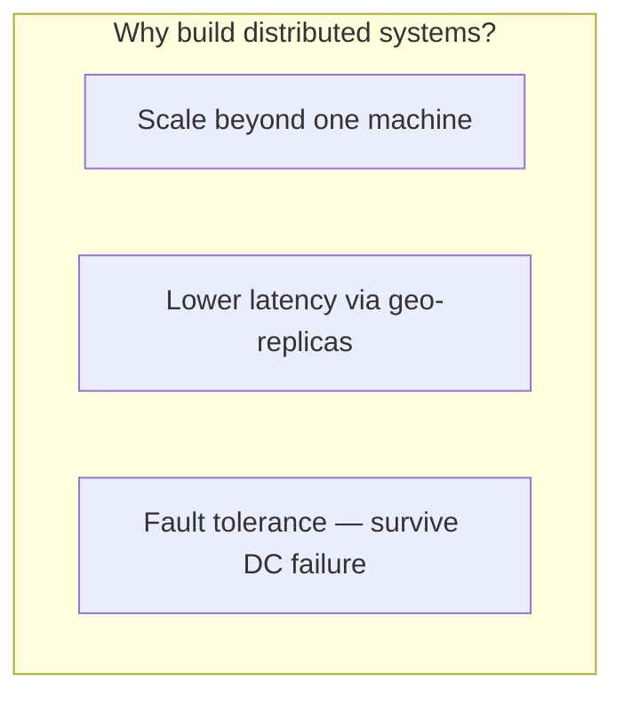

---

## The Three Guarantees — Deep Explanation

### Consistency (C)

Consistency in CAP theorem means: **no matter which node you read from, you always get the most up-to-date data.**

This is NOT the same as the C in ACID (which is about constraints). CAP consistency is specifically about data being identical across all nodes at all times.

```
SCENARIO: Demonstrating Consistency

State: All 3 nodes have { Shivam: age = 21 }

Step 1: User A sends a write to Mumbai Node:
        UPDATE user SET age = 22 WHERE name = 'Shivam'
        
Step 2: Mumbai Node updates its copy: Shivam age = 22

Step 3: Before Mumbai propagates to Hyderabad and Bihar,
        User B sends a read to Hyderabad Node:
        SELECT age FROM user WHERE name = 'Shivam'

INCONSISTENT SYSTEM response: Hyderabad returns age = 21
                               (stale data — Mumbai hasn't synced yet)
                               
CONSISTENT SYSTEM response:   Hyderabad returns age = 22
                               (This is only possible if...)
                               Option A: Hyderabad waited for Mumbai
                                         to sync before responding
                               Option B: All writes are blocked until 
                                         all nodes confirm the update
```

Achieving consistency means: before any node responds to a read, it must be guaranteed that it has received all recent writes. This requires coordination between nodes — communication must happen before responding.

### Availability (A)

Availability means: **the system always responds to requests. Every request gets a response (not an error).**

Note: The response might not contain the most current data. But you always get a response. The system never says "sorry, I can't answer right now."

```
SCENARIO: Demonstrating Availability

State: Mumbai Node has { Shivam: age = 22 }
       Hyderabad Node still has { Shivam: age = 21 }
       (replication is in progress, hasn't completed yet)

User B sends a read to Hyderabad Node:
SELECT age FROM user WHERE name = 'Shivam'

AVAILABLE but INCONSISTENT response:
   Hyderabad: "I'll respond immediately with what I have: age = 21"
   User gets age = 21 (stale, but a response was given)
   
NOT AVAILABLE response:
   Hyderabad: "I know I might have stale data. I'm waiting 
               for Mumbai to sync with me before I respond.
               User must wait... and wait... and wait..."
   If sync takes 2 seconds → user waited 2 seconds
   If sync fails → user gets a timeout error
```

Availability is essentially: "I will always answer you, even if my answer might be slightly outdated."

### Partition Tolerance (P)

A network partition is when the network connection between some nodes breaks. The nodes themselves are still running fine, but they can't communicate with each other.

```
NORMAL STATE:
Mumbai ←─────────────▶ Hyderabad ←─────────────▶ Bihar
         network OK                  network OK

PARTITION STATE (cable cut between Hyderabad and Bihar):
Mumbai ←─────────────▶ Hyderabad    ✂✂✂    Bihar
         network OK              PARTITION!

Hyderabad and Bihar can still talk to Mumbai,
but Hyderabad and Bihar CANNOT talk to each other.
```

Network partitions in distributed systems are **not rare events**. They happen regularly due to:
- Physical cable cuts (construction workers, sharks eating undersea cables — this literally happens)
- Data center network switch failures
- Cloud provider network issues (AWS has had many famous outages)
- Network congestion causing packet loss and timeouts
- Firewall misconfigurations
- Software bugs in network routing

Partition Tolerance means: **the system continues to operate even when network partitions occur.**

If you don't have partition tolerance, your system shuts down whenever a network partition happens. In a distributed system spanning multiple data centers, that's an unacceptable guarantee. Network partitions WILL happen — you can't prevent them.

---

## The CAP Theorem — The Actual Statement and Full Proof

**Statement: In a distributed system, when a network partition occurs, you must choose between Consistency and Availability. You cannot have both.**

Let me prove this rigorously with a scenario.

```
Setup:
- 3 nodes: Mumbai (M), Hyderabad (H), Bihar (B)
- All start with identical data: { Shivam: age = 21 }
- Network partition occurs: Mumbai is isolated from Hyderabad and Bihar

State after partition:
M (Mumbai)    ✂✂✂    H (Hyderabad) ←───────▶ B (Bihar)
  isolated            (H and B can still talk to each other)

Now TWO events happen simultaneously:

Event 1: User A (in Mumbai)  writes to Mumbai Node:
         UPDATE age = 22

Event 2: User B (in Delhi) reads from Hyderabad Node:
         SELECT age
```

**Case 1: You prioritize Consistency (CP)**

```
Mumbai Node receives the write: age = 22
Mumbai Node tries to propagate to Hyderabad and Bihar.
Mumbai Node CANNOT REACH Hyderabad and Bihar (partition!).

What does a consistent system do?
It REFUSES to confirm the write until all nodes agree.
Response to User A: "ERROR: Cannot complete write. 
                     Network partition in progress.
                     Please try again later."

Meanwhile, Hyderabad receives User B's read.
What does a consistent system do?
It knows a partition exists. It knows it might have missed
some writes. To maintain consistency, it REFUSES to respond.
Response to User B: "ERROR: System unavailable. 
                     Partition in progress.
                     Please try again later."

RESULT: Both users got errors. Nobody got stale data.
        Data is consistent (nobody saw wrong data).
        But the system was unavailable (CP achieved, A sacrificed).
```

**Case 2: You prioritize Availability (AP)**

```
Mumbai Node receives the write: age = 22
Mumbai Node can't reach Hyderabad and Bihar. But you know what?
Mumbai Node says: "Fine, I'll write locally. I'll sync later."
Mumbai confirms to User A: "Write successful! age = 22."

Mumbai still has: age = 22
Hyderabad still has: age = 21  (doesn't know about the write)
Bihar still has: age = 21      (doesn't know about the write)

Hyderabad receives User B's read.
Hyderabad says: "I'll respond with what I have."
Response to User B: "age = 21"

But the actual correct value is now 22.

RESULT: Both users got responses (system was available).
        But User B got stale data (age = 21 instead of 22).
        Consistency was sacrificed (AP achieved, C sacrificed).
```

**Why Can't We Have All Three?**

```
To achieve ALL THREE (CAP), you'd need to:
1. Respond to every request (A)
2. Always return correct/latest data (C)
3. Keep working during network partitions (P)

During a partition, to return correct data (C),
you need to communicate with other nodes to confirm 
you have the latest data.
But during a partition, you CAN'T communicate with other nodes!
So you can't confirm you have the latest data.
So you can't guarantee consistency.
But if you respond anyway (A), your response might be stale.

The logical impossibility: During a partition, 
maintaining consistency requires not responding (sacrificing A),
and maintaining availability requires responding (sacrificing C).
You cannot do both simultaneously. QED.
```

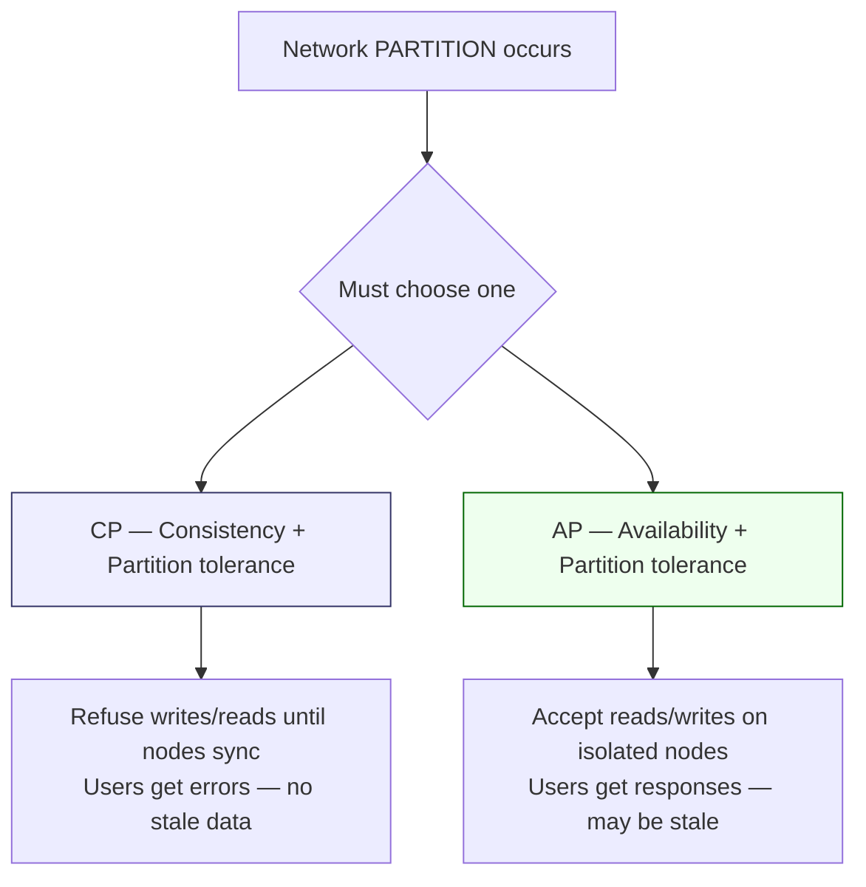

> **Remember:** In production distributed systems, **P is non-negotiable**. Partitions happen. The real choice is **CP vs AP**.

### Why P Is Always Chosen

In a real distributed system, P (Partition Tolerance) is non-negotiable. If you choose to not have partition tolerance, your system goes down every time a network glitch happens. For a production system serving millions of users across multiple data centers, this means the system would be down frequently.

So the real choice is always: **CP vs AP**. Not CA vs CP vs AP.

### Real-World Examples

```
CP Systems (Consistency over Availability):
─────────────────────────────────────────────
HBase, Zookeeper, MongoDB (in certain configs)

Example behavior during partition:
User: "Transfer ₹10,000 from my account"
System: "Service temporarily unavailable. Please try again."
User is frustrated but no money was lost or duplicated.


AP Systems (Availability over Consistency):
─────────────────────────────────────────────
Cassandra, DynamoDB (eventually consistent mode), CouchDB

Example behavior during partition:
User A: "What's my like count?" → System returns: 1,247
User B: (looking at same post) → System returns: 1,246
They're seeing slightly different values for the same data.
This is called "eventual consistency" — given time with no new writes,
all nodes will eventually converge to the same value.
```

### Eventual Consistency — A Key AP Concept

When you choose AP, you accept that nodes might temporarily have different values. But the system promises that once the partition heals, all nodes will sync and converge to the same value. This is called **eventual consistency**.

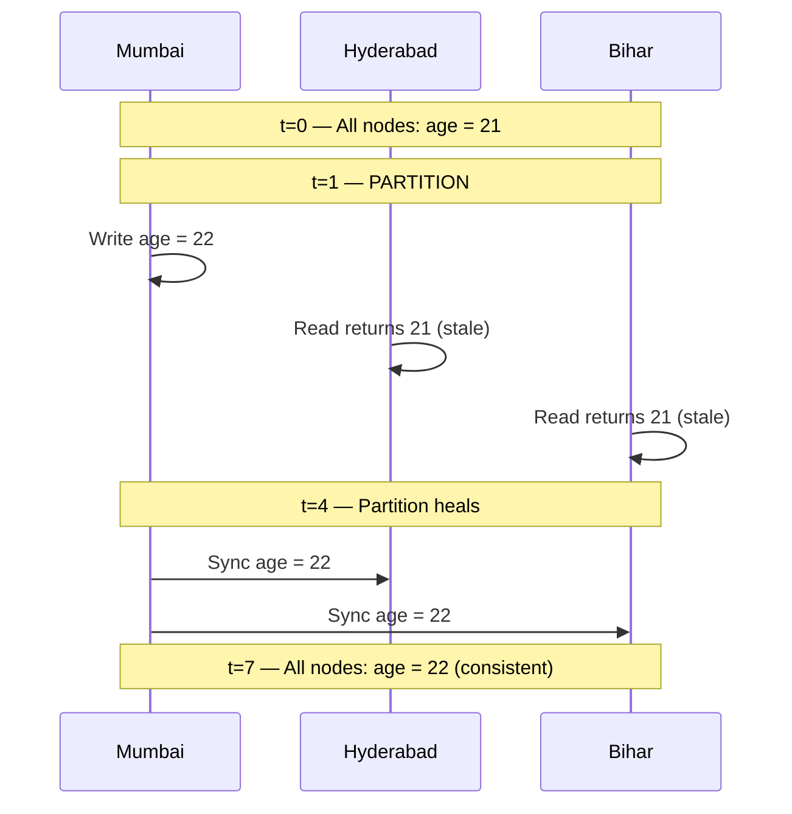

```
Timeline of an AP system during and after a partition:

t=0:  All nodes: Shivam age = 21
t=1:  PARTITION occurs
t=2:  Write hits Mumbai: age = 22
      Mumbai: age = 22
      Hyderabad: age = 21   ← stale
      Bihar: age = 21       ← stale
t=3:  Reads from Hyderabad return age = 21 (stale but available)
t=4:  PARTITION HEALS. Network restored.
t=5:  Mumbai tells Hyderabad: "I have age = 22, update yourself"
      Hyderabad updates to age = 22
t=6:  Mumbai tells Bihar: "I have age = 22, update yourself"
      Bihar updates to age = 22
t=7:  All nodes: Shivam age = 22  ← eventually consistent!

Between t=2 and t=6, different nodes had different values.
After t=7, they're consistent again.
This is "eventual" consistency — not instant, but guaranteed.
```

---

# PART 2: DATABASE SCALING — Complete Deep Dive

## The Starting Point — Understanding the Problem Deeply

Your application starts simple. One app server, one database server.

```
User's Browser
      │
      │  HTTP request: "Show me user profile"
      ▼
┌─────────────────────┐
│   App Server        │
│   (your Node.js /   │
│    Django / Spring  │
│    code runs here)  │
└──────────┬──────────┘
           │  SQL Query: SELECT * FROM users WHERE id = 123
           ▼
┌─────────────────────┐
│   Database Server   │
│                     │
│   ┌───────────────┐ │
│   │   Users Table │ │
│   │ ID | Name     │ │
│   │  1 | Shivam   │ │
│   │  2 | Rahul    │ │
│   │  3 | Ankit    │ │
│   │  4 | Aman     │ │
│   │  5 | Ayush    │ │
│   │  6 | Pulkit   │ │
│   └───────────────┘ │
└─────────────────────┘
```

This is perfectly fine for thousands of users. The database server has enough RAM to hold the entire table in memory, queries run in milliseconds, and the app server never waits long.

But as you grow to millions of users and billions of rows, each of these components breaks down. Let's solve them one by one.

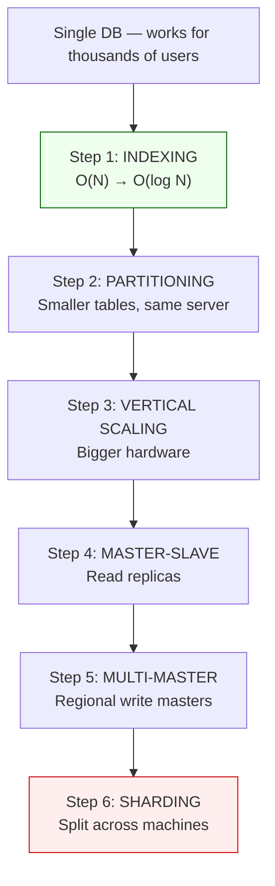

> **Golden rule:** Never skip steps. Index before you shard. Instagram ran on one PostgreSQL DB for ~13M users before adding replicas.

---

## Step 1: Indexing — Explained With Complete Depth

### Why Queries Get Slow Without Indexes

Imagine the `users` table has 50 million rows. A user visits their profile page. Your app runs:

```sql
SELECT * FROM users WHERE id = 7,432,891;
```

Without an index, the database has absolutely no idea where row #7,432,891 is. There's no directory. So it does the only thing it can: read every single row from disk, check if the id matches, and if not, move to the next one.

```
Full Table Scan:
Read row 1: id=1? No.
Read row 2: id=2? No.
Read row 3: id=3? No.
...
Read row 7,432,890: id=7,432,890? No.
Read row 7,432,891: id=7,432,891? YES! Found it.

Total rows checked: 7,432,891
Time: proportional to N (number of rows)
At 50 million rows, worst case: check all 50 million rows.
```

If this query runs 10,000 times per second (10,000 users loading their profiles), you're doing 500 billion row comparisons per second. Your database melts.

### How Indexing Solves This — The B-Tree Explained

When you create an index on the `id` column, the database builds a **B-Tree (Balanced Tree)** data structure and maintains it automatically.

A B-Tree is like a sorted, hierarchical directory. Here's a simplified version:

```
B-Tree Index on the 'id' column (simplified):

                          [25]
                         /    \
                    [12]        [37]
                   /    \      /    \
                [6]    [18] [30]    [44]
               / \    / \   / \    / \
             [3] [9][15][21][27][33][40][48]
             ↑
          Leaf nodes point to the actual row location on disk

Finding id = 27:
Start at root [25]
27 > 25, go right → [37]
27 < 37, go left → [30]
27 < 30, go left → [27] FOUND!

Disk location: Page 847, row 3 → fetch that row directly

Total comparisons: 4 (not 27!)
For 50 million rows: log₂(50,000,000) ≈ 26 comparisons
```

This is the difference between **O(N) and O(log N)**:

```
Table with 50 million rows:

Without index: Up to 50,000,000 comparisons
With index:    Up to log₂(50,000,000) ≈ 26 comparisons

26 vs 50,000,000 — that's a 2 million times speedup.
A 2ms query becomes ~0.000001ms effectively.
```

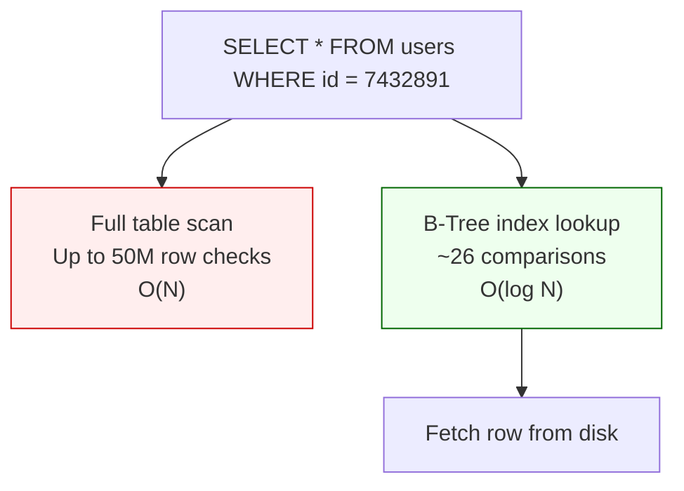

### Creating Indexes — What Happens Behind the Scenes

```sql
-- Creating a simple index
CREATE INDEX idx_user_id ON users(id);

-- What PostgreSQL does behind the scenes:
-- 1. Reads the entire users table
-- 2. Sorts the id column values
-- 3. Builds a B-Tree data structure with these sorted values
-- 4. Each leaf node in the B-Tree contains the id value 
--    AND a pointer (disk page + row number) to the actual row
-- 5. Saves this B-Tree to disk as a separate index file
-- 6. From now on, every INSERT/UPDATE/DELETE keeps this B-Tree updated
```

**The hidden cost of indexes — Write slowdown:**

When you add a row, the database must:
1. Insert the row into the table (fast)
2. Find the correct position in the B-Tree (fast — O(log N))
3. Insert the new entry into the B-Tree (fast — O(log N))
4. Rebalance the B-Tree if needed (sometimes slow — tree restructuring)

So writes become slightly slower when you have indexes. For a table with 10 indexes, a single INSERT must update 10 different B-Trees. That's why you should only index columns you actually search on frequently — not every column.

**Composite Indexes:**

```sql
-- Index on a single column
CREATE INDEX idx_email ON users(email);

-- Composite index on two columns
CREATE INDEX idx_name_city ON users(last_name, city);

-- This composite index speeds up queries like:
-- SELECT * FROM users WHERE last_name = 'Kumar' AND city = 'Delhi';
-- SELECT * FROM users WHERE last_name = 'Kumar';  (partial match, still works)

-- But does NOT help with:
-- SELECT * FROM users WHERE city = 'Delhi';  (must use leftmost column first)
```

---

## Step 2: Partitioning — Explained With Complete Depth

### Why Indexing Alone Eventually Fails

Your table now has 10 billion rows. Even with a B-Tree index, there are new problems:

**Problem 1: The index file itself is huge.**
```
Each B-Tree entry for the 'id' column takes about 20-30 bytes.
10 billion entries × 25 bytes = 250 GB just for the index.

When you do a search, the database reads nodes from this 250 GB index file.
The nodes that get accessed frequently are in memory (buffer pool/cache).
But the index is so large that much of it doesn't fit in RAM.
So the database has to read from disk → slow.
```

**Problem 2: Sequential scans of ranges are slow.**
```sql
-- Find all users created in December 2024:
SELECT * FROM users WHERE created_at BETWEEN '2024-12-01' AND '2024-12-31';

-- Even with an index on created_at, if 50 million rows match this range,
-- you need to fetch 50 million rows from disk.
-- That's slow regardless of the index.
```

**Problem 3: Vacuum/maintenance operations are brutal.**
```
PostgreSQL periodically runs VACUUM to clean up dead rows
(rows that were updated or deleted but still occupy space).

VACUUM on a 10-billion-row table takes hours.
During VACUUM, performance degrades.
You can't escape this maintenance — it's mandatory.
```

### What Partitioning Does

Partitioning breaks one giant table into multiple smaller tables, all still sitting on the **same database server**. Each smaller table is called a **partition**.

```
BEFORE PARTITIONING:
┌─────────────────────────────────────┐
│           users table               │
│        (10 billion rows)            │
│    Huge index, slow maintenance     │
└─────────────────────────────────────┘

AFTER PARTITIONING BY ID RANGE:
┌──────────────────────┐
│    user_table_1      │
│  IDs: 1 to 3 billion │
│   (3 billion rows)   │
│   Smaller index      │
└──────────────────────┘
┌──────────────────────┐
│    user_table_2      │
│  IDs: 3B to 6 billion│
│   (3 billion rows)   │
│   Smaller index      │
└──────────────────────┘
┌──────────────────────┐
│    user_table_3      │
│  IDs: 6B to 10 billion│
│   (4 billion rows)   │
│   Smaller index      │
└──────────────────────┘

All 3 partitions sit on the same server.
Each has its own B-Tree index → each index is 3× smaller.
VACUUM on each partition takes 3× less time.
```

**The Magic of Transparent Partitioning:**

The beautiful thing about partitioning in PostgreSQL is that from the application's perspective, nothing changes. You still query:

```sql
SELECT * FROM users WHERE id = 7,432,891,234;
```

PostgreSQL looks at the query, sees `id = 7,432,891,234`, knows that 7.4 billion is in the range of `user_table_3` (IDs 6B-10B), and goes directly to that partition. The other two partitions are never touched. This is called **partition pruning** — the optimizer prunes irrelevant partitions.

**Types of Partitioning:**

```
RANGE PARTITIONING (by value range):
user_table_1: id 1 to 1,000,000
user_table_2: id 1,000,001 to 2,000,000
user_table_3: id 2,000,001+

Or partition by date:
orders_jan_2024: created_at in January 2024
orders_feb_2024: created_at in February 2024
... etc.
This is extremely useful for time-series data.
You can drop an entire month's partition (old logs, old orders)
in milliseconds — much faster than DELETE which processes row by row.


LIST PARTITIONING (by specific values):
users_india:   country = 'IN'
users_usa:     country = 'US'
users_others:  country NOT IN ('IN', 'US')


HASH PARTITIONING (by hash of a column):
HASH(id) % 4 = 0 → partition_0
HASH(id) % 4 = 1 → partition_1
HASH(id) % 4 = 2 → partition_2
HASH(id) % 4 = 3 → partition_3
Ensures even distribution regardless of id values.
```

---

## Step 3: Master-Slave Architecture — Complete Deep Dive

### When Do You Need This?

After indexing and partitioning, your single database server can still get overwhelmed if you have millions of read requests per second. From our Twitter estimation: 1 million reads per second.

One database server, even a powerful one, might handle 100,000-200,000 simple reads per second at most. At 1 million reads per second, you need to distribute reads across multiple servers.

The key insight for this solution is: **reads and writes have very different requirements.**

```
WRITE requirements:
- Must be ACID-compliant (Atomic, Consistent, Isolated, Durable)
- Must not lose data
- Needs to be the single source of truth
- Usually low volume compared to reads

READ requirements:
- Just need to return data correctly
- Can tolerate slight staleness in many use cases
- Can be distributed across many machines
- Usually high volume — often 10x-100x more than writes
```

Since reads and writes have different needs, why should they compete for the same resources on the same machine? Master-Slave separates them.

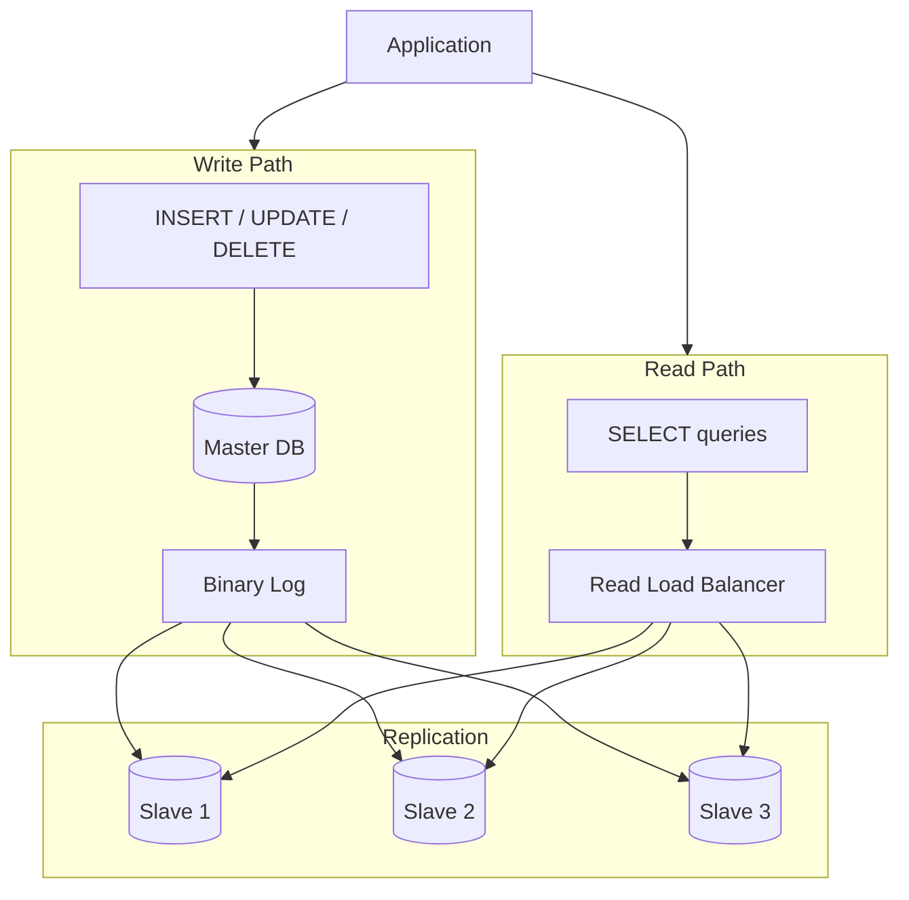

### How Master-Slave Works — Full Detail

```
WRITE PATH:
──────────────────────────────────────────────────────────────
Application Layer
       │
       │  INSERT INTO tweets VALUES (...)   ← write query
       │  UPDATE users SET name = 'Rahul'   ← write query
       │  DELETE FROM sessions WHERE ...    ← write query
       ▼
┌──────────────────────────────────────────────────────────┐
│                      MASTER DB                           │
│                                                          │
│  - ALL INSERT, UPDATE, DELETE operations land here       │
│  - Writes to its own storage first                       │
│  - Then writes to a "binary log" (replication log)       │
│    - The binary log records EVERY change in order        │
│  - Master is the single source of truth for all writes   │
│  - Every piece of data in all slaves originally          │
│    came from the master                                  │
└──────────────┬───────────────────────────────────────────┘
               │
               │  Binary Log streams to all slaves
               │  (async or sync, depending on config)
               │
    ┌──────────┼──────────┐
    ▼          ▼          ▼
┌────────┐  ┌────────┐  ┌────────┐
│Slave 1 │  │Slave 2 │  │Slave 3 │
│(replica│  │(replica│  │(replica│
│ of     │  │ of     │  │ of     │
│ master)│  │ master)│  │ master)│
└────────┘  └────────┘  └────────┘

Each slave:
- Receives the binary log stream from master
- Applies each change to its own copy of the data
- Stays as close to up-to-date as possible
- Has its own indexes, its own query executor


READ PATH:
──────────────────────────────────────────────────────────────
Application Layer
       │
       │  SELECT * FROM users WHERE id = 123  ← read query
       │  SELECT count(*) FROM tweets          ← read query
       ▼
┌──────────────────────────────────────────────────────────┐
│              Load Balancer (for DB reads)                │
│                                                          │
│  Algorithms:                                             │
│  - Round Robin: distribute reads evenly among slaves     │
│  - Least Connections: send to slave with fewest queries  │
│  - Health-based: skip slaves that are lagging behind     │
└──────────────┬────────────────────────────────────────────┘
               │
               │  Routes to least busy slave
               ▼
┌────────┐  ┌────────┐  ┌────────┐
│Slave 1 │  │Slave 2 │  │Slave 3 │
│handles │  │handles │  │handles │
│reads   │  │reads   │  │reads   │
└────────┘  └────────┘  └────────┘
```

### Synchronous vs Asynchronous Replication — Critical Difference

This is one of the most important subtleties of master-slave architecture.

**Asynchronous Replication (default):**

```
Timeline:
t=0: Write arrives at Master ("SET age = 22")
t=1: Master writes to its own disk → confirmed
t=2: Master responds to application: "Write successful!"
t=3: Master sends change to Slave 1 (network latency)
t=4: Master sends change to Slave 2 (network latency)
t=5: Slave 1 applies the change
t=6: Slave 2 applies the change

Problem: Between t=2 and t=5, if User B reads from Slave 1,
         they get the OLD data (age = 21), not the new data (age = 22).
         This is called "replication lag" — typically milliseconds to seconds.

Advantage: Write is fast (master doesn't wait for slaves)
Disadvantage: Brief inconsistency (AP trade-off in CAP terms)
```

**Synchronous Replication:**

```
Timeline:
t=0: Write arrives at Master ("SET age = 22")
t=1: Master writes to its own disk
t=2: Master sends change to Slave 1
t=3: Master sends change to Slave 2
t=4: Slave 1 confirms "I've applied the change"
t=5: Slave 2 confirms "I've applied the change"
t=6: Master responds to application: "Write successful!"

Now there is zero replication lag — all nodes have age = 22
when the write is confirmed.

Advantage: Strong consistency
Disadvantage: Write latency is now (Master write time + 
              slowest slave's replication time + network RTT)
              If a slave is slow or the network is slow, 
              every write in your system is slow.
              If a slave goes down, writes block until it recovers
              (or you configure it to proceed without that slave).
```

Most production systems use **semi-synchronous** — at least one slave must confirm before the master responds, but not all slaves. This balances durability and performance.

| Replication mode | Master waits for slaves? | Write speed | Read consistency | When to use |
|------------------|--------------------------|-------------|------------------|-------------|
| **Asynchronous** | No | Fastest | May read stale data on slaves | High write throughput, stale reads OK |
| **Semi-synchronous** | At least 1 slave | Balanced | Stronger durability | Most production defaults |
| **Synchronous** | All slaves | Slowest | Fully consistent at confirm time | Banking, inventory — correctness critical |

### Replication Lag — When It's a Problem and Solutions

```
Scenario where lag is a REAL problem:
─────────────────────────────────────────
1. User posts a tweet: "Just got promoted! 🎉"
   - Write goes to Master
   - Master confirms "tweet saved"
   - Page reloads
   
2. User immediately visits their own profile to see the tweet
   - Read goes to Slave 1
   - Slave 1 hasn't received the replication yet (20ms lag)
   - Slave 1 returns: "No tweets found"
   
3. User is confused: "Why didn't my tweet save?!"
   They reload again 2 seconds later → now it's there
   (replication caught up)

This "read your own write" problem is a classic 
replication lag issue.

SOLUTIONS:
1. "Read your own writes" guarantee:
   After a user WRITES something, route their next reads
   to the MASTER for the next few seconds.
   "I just wrote as user_123, so for the next 5 seconds,
    reads from user_123 go to master."
   
2. Session consistency:
   After any write, store a "read-from-master-until" timestamp.
   Any read within that window goes to master.
   
3. Stale reads are acceptable:
   For non-critical reads (like counts, recommendations),
   just accept the slight staleness. Nobody cares if the 
   "1,247 likes" is actually 1,249 for a few milliseconds.
```

### What Happens When Master Fails — Failover

```
Normal operation:
Application ──▶ Master (receiving writes)
                  │
                  ├──▶ Slave 1 (receiving reads)
                  ├──▶ Slave 2 (receiving reads)
                  └──▶ Slave 3 (receiving reads)

Master crashes!
Monitoring system detects: "Master not responding for 30 seconds"

Automatic failover process:
1. Determine which slave is most up-to-date 
   (which has applied the most recent binary log entries)
   → Slave 1 is most up-to-date

2. Promote Slave 1 to be the new Master:
   - Slave 1 starts accepting writes
   - Slave 1 starts generating its own binary log

3. Redirect Slaves 2 and 3 to replicate from the new Master:
   - Slave 2: "I'll now receive binary log from Slave 1 (new master)"
   - Slave 3: "I'll now receive binary log from Slave 1 (new master)"

4. Update the application's connection string to point to new Master.

5. When old Master recovers, it joins as a Slave of the new Master.

Total failover time: 30-60 seconds with good tooling 
(like MySQL Group Replication, Patroni for PostgreSQL)
Zero downtime for reads throughout (slaves kept serving)
Brief downtime for writes during failover
```

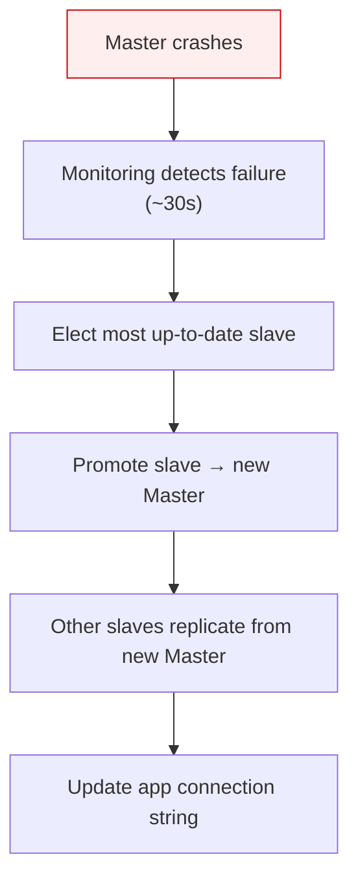

> **Failover notes:** Reads continue via slaves. Writes pause briefly until promotion completes (~30–60s with good tooling).

---

## Step 4: Multi-Master Architecture — Complete Deep Dive

### When You Need It

You've reached the point where your single master server is the bottleneck. Maybe:
- Your write QPS is 50,000/sec and one server maxes out at 30,000/sec
- Your users are globally distributed — writes from India going to a US master have 200ms latency
- Compliance requires data to be stored in the region it was created

```
PROBLEM WITH SINGLE MASTER IN GLOBAL DEPLOYMENT:

User in India                              Master DB (in USA)
     │                                           │
     │  "Place this order"                       │
     └──── request travels 200ms each way ──────▶│
     │                                           │  processes write
     ◀───────────────────────────────────────────┘
     │  receives response
     (Total: 400ms+ just for network, before any processing!)

This is unacceptable for a real-time application.
```

Multi-Master puts a master in each geographic region:

```
MULTI-MASTER SETUP:

Users in North India                         Users in South India
       │                                              │
       ▼                                              ▼
┌──────────────────────┐                 ┌──────────────────────┐
│  Master DB (North)   │◄───── SYNC ────▶│  Master DB (South)   │
│  Location: Delhi     │                 │  Location: Bangalore │
│                      │                 │                      │
│ Slaves:              │                 │ Slaves:              │
│  ├─ Slave A (Delhi)  │                 │  ├─ Slave C (Hyd.)   │
│  └─ Slave B (Lucknow)│                 │  └─ Slave D (Chennai)│
└──────────────────────┘                 └──────────────────────┘

North India users write to North Master → ~5ms latency
South India users write to South Master → ~5ms latency
Both masters periodically sync (replicate to each other)
```

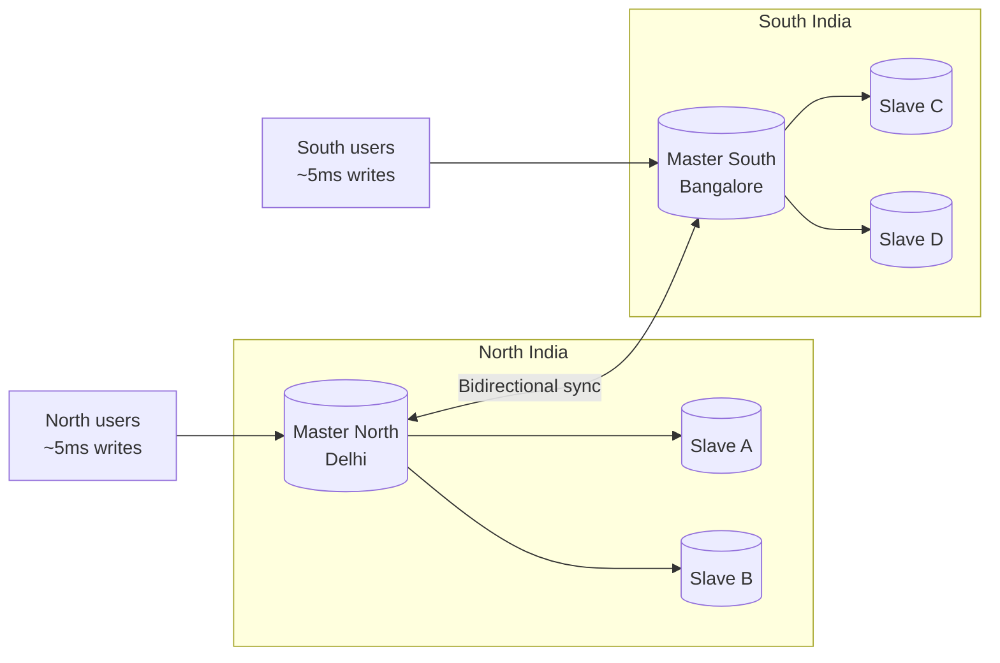

### The Hardest Problem: Conflict Resolution

This is where multi-master becomes genuinely complex. Let me walk through every scenario.

**Scenario 1: Two users update the same row simultaneously from different regions.**

```
t=0:  Both masters have: user_456 = { name: "Rahul", balance: 10,000 }

t=1:  User A (North India) updates: name = "Rahul Kumar"
      North Master: user_456.name = "Rahul Kumar"
      North Master will sync to South Master... (in progress)

t=1:  User B (South India) updates simultaneously: name = "Rahul Sharma"
      South Master: user_456.name = "Rahul Sharma"
      South Master will sync to North Master... (in progress)

t=2:  Sync happens:
      North Master receives South's update: "Set name to Rahul Sharma"
      South Master receives North's update: "Set name to Rahul Kumar"
      
CONFLICT: Both masters updated the same row at the same time.
          What should the final value be?
```

**Strategy 1: Last Write Wins (LWW)**

```
Assign a timestamp to every write.
Whichever write has the LATER timestamp wins.

North's write: timestamp = 14:23:01.456
South's write: timestamp = 14:23:01.461   ← later

Final value everywhere: "Rahul Sharma"

Problem: What if the clocks on the two servers are slightly out of sync?
         (Clock drift is a real issue in distributed systems.)
         If North's clock is 100ms ahead of South's clock, 
         the "later" timestamp might be wrong.
         Also, genuine user intent is lost — User A's change is silently discarded.
```

**Strategy 2: Conflict Avoidance (Partitioned Writes)**

```
Prevention is better than resolution.
Design the system so the same data is never written by two masters.

Example: Shard users by region.
- User IDs 1-100M: can ONLY be written to North Master
- User IDs 100M+: can ONLY be written to South Master

If User 456 (a North India user) is in Delhi and traveling to Chennai,
their writes still go to North Master (just takes 200ms instead of 5ms).

No conflicts are possible because each record has exactly one "owning" master.
This is the cleanest solution — avoid the problem entirely.
```

**Strategy 3: Merge / Application-Level Resolution**

```
For certain data types, you can merge conflicting writes.

Example: User has a "preferences" JSON object.

North Master update: { "theme": "dark" }
South Master update: { "language": "hindi" }

Merge result: { "theme": "dark", "language": "hindi" }

Both updates are non-overlapping, so merging makes sense.

But what if both updates changed the same field?
North: { "theme": "dark" }
South: { "theme": "light" }

Merge is ambiguous. You need a tie-breaker rule.
```

**Strategy 4: Show the Conflict to the User**

```
Like Google Docs when it can't auto-merge:
"We detected a conflict. Version 1: 'Rahul Kumar'. Version 2: 'Rahul Sharma'. 
Which one do you want to keep?"

This is the most correct but worst UX. Only practical for certain document types.
```

| Strategy | Idea | Pros | Cons |
|----------|------|------|------|
| **Last Write Wins** | Latest timestamp wins | Simple | Clock drift; loses user intent |
| **Partitioned writes** | Each record owned by one master | No conflicts | Cross-region latency for travelers |
| **Merge** | Combine non-overlapping fields | Works for JSON prefs | Ambiguous when same field changes |
| **User resolves** | Show both versions | Most correct | Poor UX |

---

## Step 5: Database Sharding — The Complete Deep Dive

### Why Sharding Is Necessary

Even with master-slave and multi-master, there comes a point where the sheer volume of data is too large to fit on any single machine.

```
Scenario: 
You store all tweets ever posted on Twitter.
Estimated tweets since Twitter launched: ~500 billion tweets
Average tweet size: 500 bytes (text + metadata)
Total size: 500 billion × 500 bytes = 250 Terabytes

The largest single database server AWS offers handles maybe 
24 TB of storage and 448 vCPUs. That's not enough.

Even if you use a 24 TB server:
- Your entire dataset doesn't fit
- Even if it did, 448 vCPUs can't handle 1 million queries/sec

The data itself must be split across multiple servers.
That's sharding.
```

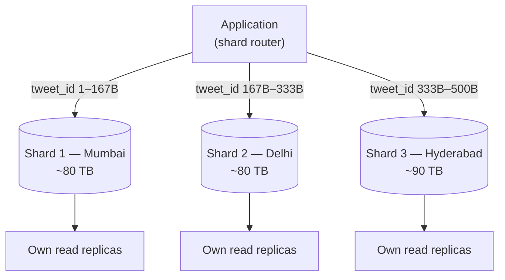

### How Sharding Works — Full Detail

Sharding splits your data horizontally (by rows) and distributes chunks to completely separate database servers.

```
CONCEPTUAL:

All 500 billion tweets split into 3 groups:

Shard 1 (DB Server in Mumbai):
┌──────────────────────────────┐
│  Tweets with IDs 1 to 167B   │
│  (~167 billion tweets)       │
│  Storage: ~80 TB             │
│  Its own slaves for reads    │
└──────────────────────────────┘

Shard 2 (DB Server in Delhi):
┌──────────────────────────────┐
│  Tweets with IDs 167B to 333B│
│  (~167 billion tweets)       │
│  Storage: ~80 TB             │
│  Its own slaves for reads    │
└──────────────────────────────┘

Shard 3 (DB Server in Hyderabad):
┌──────────────────────────────┐
│  Tweets with IDs 333B to 500B│
│  (~167 billion tweets)       │
│  Storage: ~90 TB             │
│  Its own slaves for reads    │
└──────────────────────────────┘
```

Each shard is an independent database server with its own master-slave setup. You can scale each shard independently based on its load.

### The Application Layer Must Know About Shards

This is the fundamental difference from partitioning. With partitioning (same server), PostgreSQL routes automatically. With sharding (different servers), **your application code must route queries manually**.

```
APPLICATION-LEVEL SHARD ROUTER:

function getShardForTweetId(tweet_id):
    if tweet_id <= 167_000_000_000:
        return connect to "shard1.db.internal:5432"
    elif tweet_id <= 333_000_000_000:
        return connect to "shard2.db.internal:5432"
    else:
        return connect to "shard3.db.internal:5432"

function writeTweet(tweet):
    shard_id = HASH(tweet.user_id) % 3  # or range-based
    connection = getShardConnection(shard_id)
    connection.execute("INSERT INTO tweets VALUES (...)")

function getTweetById(tweet_id):
    connection = getShardForTweetId(tweet_id)
    return connection.execute("SELECT * FROM tweets WHERE id = ?", tweet_id)
```

This routing logic is now YOUR responsibility. Every read, every write must be routed to the correct shard. If you get it wrong, you write to shard 2 but read from shard 1 — data not found.

### All 4 Sharding Strategies — Deep Dive

**1. Range-Based Sharding**

```
SETUP:
Shard 1: user_id 1          to 10,000,000     (10 million users)
Shard 2: user_id 10,000,001 to 20,000,000     (10 million users)
Shard 3: user_id 20,000,001 to 30,000,000     (10 million users)

QUERY ROUTING (trivial):
user_id = 7,500,000  → Shard 1 (1 to 10M)
user_id = 15,000,000 → Shard 2 (10M to 20M)
user_id = 25,000,000 → Shard 3 (20M to 30M)

RANGE SCANS (the big advantage):
"Get all users who registered in 2023" 
(user_ids 5,000,000 to 8,000,000 for that year)
→ All go to Shard 1. No cross-shard needed.

THE HOT SHARD PROBLEM:
Your system just launched. New users sign up.
New user IDs: 20,000,001, 20,000,002, 20,000,003...
All new signups go to Shard 3.
Shard 1 and 2 are barely touched (old, mostly-inactive users).
Shard 3 is hammered with all new user activity.
This is a "hot shard" — one shard takes disproportionate load.

SOLUTION: Design ranges based on activity, not just ID.
Or use hash-based sharding instead.
```

**2. Hash-Based Sharding**

```
SETUP:
Number of shards: 4
Sharding formula: shard_number = HASH(user_id) % 4

user_id = 1234  → HASH(1234) = 678,901,234 → 678,901,234 % 4 = 2 → Shard 2
user_id = 5678  → HASH(5678) = 234,567,890 → 234,567,890 % 4 = 2 → Shard 2
user_id = 9012  → HASH(9012) = 345,678,901 → 345,678,901 % 4 = 1 → Shard 1
user_id = 3456  → HASH(3456) = 789,012,345 → 789,012,345 % 4 = 1 → Shard 1
user_id = 7890  → HASH(7890) = 456,789,012 → 456,789,012 % 4 = 0 → Shard 0

Distribution is statistically uniform.
No hot shards when your hash function is good (MD5, SHA-1, MurmurHash).

THE REBALANCING NIGHTMARE:
Your system grows. 4 shards are now too few. You add a 5th shard.
Formula changes: HASH(user_id) % 5

user_id = 1234 previously → Shard 2
user_id = 1234 now        → HASH(1234) % 5 = 4 → Shard 4 ← DIFFERENT!

EVERY SINGLE record needs to be moved to potentially a different shard.
If you have 1 billion records, you need to move most of them.
During this move:
- Your system can't serve requests (or serves wrong data)
- This move takes hours or days
- Extremely disruptive

THE SOLUTION: Consistent Hashing
(An advanced technique where adding a new shard only
 requires moving 1/n of the data, not nearly all of it.
 Used by systems like Cassandra and DynamoDB.
 Worth learning separately as a deep topic.)
```

**3. Geographic/Entity-Based Sharding**

```
SETUP:
Shard 1: Users from India
Shard 2: Users from USA
Shard 3: Users from Europe
Shard 4: Rest of world

BENEFITS:
- Data locality: Indian users' data is in India (low latency for reads)
- Compliance: GDPR requires European user data to stay in Europe
              Achieved automatically with this sharding strategy
- Regional isolation: An outage in US Shard doesn't affect Indian users

ROUTING:
When creating a user account, store their country.
When querying, use their country code to determine shard.

SELECT * FROM users WHERE id = 123
→ Application knows user_123 is from India
→ Routes to India Shard

THE HOT SHARD PROBLEM (again, differently):
India has 1.4 billion people. Europe has 450 million.
If usage correlates with population:
India shard: 3× more traffic than Europe shard
India shard might need to be further sub-sharded.

Also: User traveling from India to USA.
Their data is in India Shard.
All their requests now cross the ocean to India Shard.
Higher latency. No easy solution without data migration.
```

**4. Directory-Based Sharding**

```
SETUP:
A dedicated "directory service" (often called a "routing table" or "shard map") 
maintains a lookup table:

┌────────────────────────────────────────────────────────────┐
│                    Shard Directory                         │
│                                                            │
│  Key Range              → Shard Location                  │
│  ─────────────────────────────────────────────             │
│  user_id 1-1,000,000    → shard1.db.internal               │
│  user_id 1,000,001-2M   → shard2.db.internal               │
│  user_id 2,000,001-3M   → shard1.db.internal  ← reassigned!│
│  user_id 3,000,001-4M   → shard3.db.internal               │
│  VIP users (list)       → shard_premium.db.internal        │
└────────────────────────────────────────────────────────────┘

QUERY ROUTING:
Application receives: "Find user_id = 2,500,000"
Application queries directory: "Where is 2,500,000?"
Directory responds: "shard1.db.internal"
Application queries shard1 directly.
Two-step lookup but fully flexible.

THE HUGE ADVANTAGE — Flexible Rebalancing:
"Shard 2 is getting too hot. Move range 1M-2M to Shard 4."
Step 1: Copy data from Shard 2 to Shard 4
Step 2: Update directory entry: "1M-2M → shard4.db.internal"
Step 3: Done. No application code changes. No formula changes.

THE PROBLEM — The Directory Is A Bottleneck:
EVERY query must first hit the directory before hitting the shard.
Directory is now in the critical path of every single database operation.
If the directory is slow: everything is slow.
If the directory goes down: nothing works.

SOLUTIONS:
- Cache the directory mapping in application memory 
  (refresh periodically, e.g., every 10 minutes)
- Replicate the directory across multiple servers for availability
- Use a high-performance key-value store (Redis) for the directory
```

### Why Cross-Shard JOINs Are a Nightmare

```
SIMPLE QUERY ON AN UNSHARDED DATABASE:
SELECT 
    u.name,
    t.content,
    t.created_at
FROM tweets t
JOIN users u ON t.user_id = u.id
WHERE t.created_at > '2024-01-01'
ORDER BY t.created_at DESC
LIMIT 20;

On a single database: milliseconds. 
Database engine handles the JOIN in memory.


SAME QUERY WITH SHARDING 
(tweets on one shard by tweet_id, users on another shard by user_id):

Step 1: Application queries Tweet Shard:
        "Get all tweets created after 2024-01-01"
        → Returns 1 million tweet records with user_ids

Step 2: Application queries User Shard:
        "Get all users whose IDs appear in those 1 million tweets"
        SELECT * FROM users WHERE id IN (1,234, 5,678, 9,012, ...)
        This IN clause has potentially millions of IDs.
        This is a massive query.

Step 3: Application code manually joins the results:
        for each tweet in tweets:
            tweet.user_name = users_dict[tweet.user_id].name

Step 4: Sort the combined results by created_at.

Step 5: Return top 20.

PROBLEMS:
- Fetched 1 million tweets from one shard (maybe only needed 20)
- Sent a massive IN query with millions of IDs over the network
- Did the sorting in application memory (not database engine — slower)
- Network round trips: 2 (one per shard) vs 1 (single DB)
- Total latency: potentially seconds vs milliseconds


THE GOLDEN RULE OF SHARDING:
Design your sharding key such that your most common queries
stay within a single shard (no cross-shard JOINs).

For Twitter: shard tweets by user_id (not tweet_id).
Then "get all tweets by user X" goes to exactly one shard.
The common query pattern stays within one shard.
```

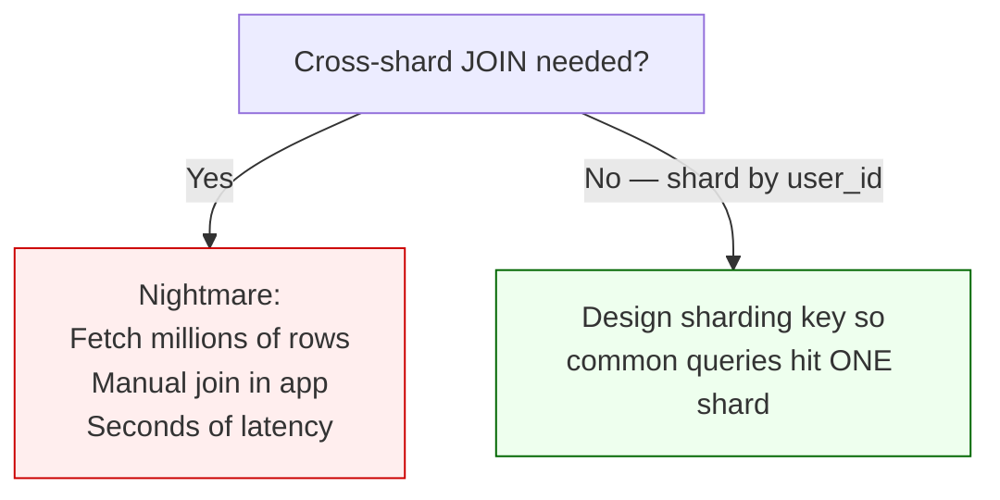

---

## The Full Database Scaling Decision Tree — With Context

```
START: You have a single database.
─────────────────────────────────────────────────────────

STEP 1: Slow queries on large tables?
        ↓ YES
        → Add INDEXES on columns used in WHERE clauses.
          Cost: near zero. Benefit: huge (O(N) → O(log N)).
          Always do this first, no matter what.
          Trade-off: Writes become slightly slower.
          
        ↓ STILL SLOW (index file itself is large)
        
STEP 2: Table has hundreds of millions of rows?
        ↓ YES  
        → Add PARTITIONING on the table.
          Split by range or hash. Same server.
          PostgreSQL routes queries automatically.
          Cost: moderate (restructure the table).
          Benefit: smaller indexes, faster maintenance.
          
        ↓ STILL SLOW (server itself is the bottleneck)
        
STEP 3: Is the server hardware the limit?
        ↓ YES
        → VERTICAL SCALING first. 
          Double the RAM and CPU. Easy. No code changes.
          Do this before any architectural changes.
          
        ↓ HIT THE VERTICAL CEILING (or cost is too high)
        
STEP 4: Is traffic READ-HEAVY? (reads >> writes)
        ↓ YES
        → MASTER-SLAVE (Read Replicas).
          All writes → Master.
          All reads → distributed across N slaves.
          Each slave can handle the same read QPS as master.
          With 5 slaves: 5× read throughput.
          Cost: replication lag (usually milliseconds).
          
        ↓ STILL NOT ENOUGH (slaves can't keep up or writes are the bottleneck)
        
STEP 5: Is write traffic globally distributed?
        ↓ YES (users in multiple regions writing)
        → MULTI-MASTER setup.
          One master per region.
          Writes are local (low latency).
          Masters sync periodically.
          Hard part: conflict resolution strategy.
          
        ↓ Data volume is the problem (doesn't fit on one machine)
        
STEP 6: Does the total data exceed one machine's storage/RAM?
        ↓ YES
        → SHARDING.
          Split data across multiple machines.
          Choose sharding key carefully.
          You handle routing in application code.
          Avoid cross-shard JOINs.
          Consider consistent hashing for future shard additions.
          Last resort — adds enormous complexity.
```

The most important lesson: **never skip steps**. Companies that jump straight to sharding when indexing would have solved their problem end up with a massively complex system that's hard to maintain, expensive to operate, and prone to bugs — all for no real benefit.

Instagram ran on a single PostgreSQL database for the first year with 13 million users. They added read replicas next. They didn't shard until they had hundreds of millions of users. The right tool at the right scale is what separates good engineering from over-engineering.

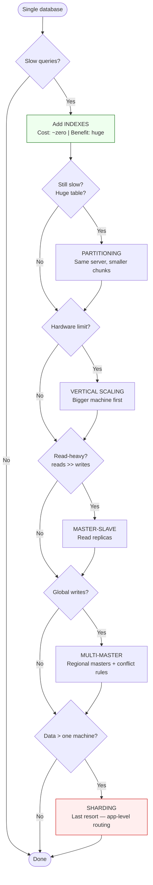

---

## Quick Reference — Chapter 3

| Concept | One-line summary |
|---------|------------------|
| CAP | During partition: pick Consistency **or** Availability (P is mandatory) |
| CP systems | HBase, Zookeeper — refuse requests rather than serve stale data |
| AP systems | Cassandra, DynamoDB — always respond; eventual consistency |
| Indexing | B-Tree — O(log N) lookups; slows writes slightly |
| Partitioning | Split table on one server — transparent to app |
| Master-Slave | One writer, many readers — watch replication lag |
| Multi-Master | Regional writes — conflict resolution is hard |
| Sharding | Split data across DB servers — avoid cross-shard JOINs |

**Previous ←** [Chapter 2: Scaling & Estimation](Part2.md) · **Next →** [Chapter 4: SQL/NoSQL, Microservices & Load Balancing](Part4.md)
