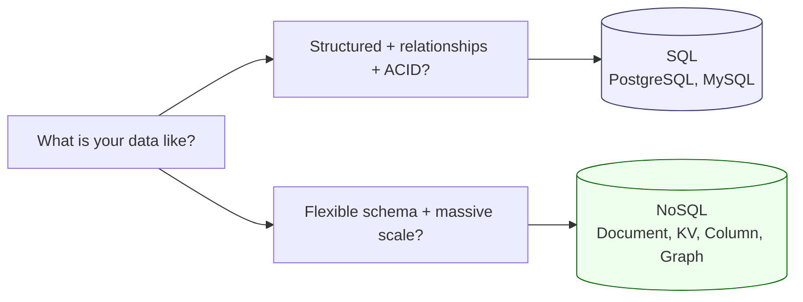
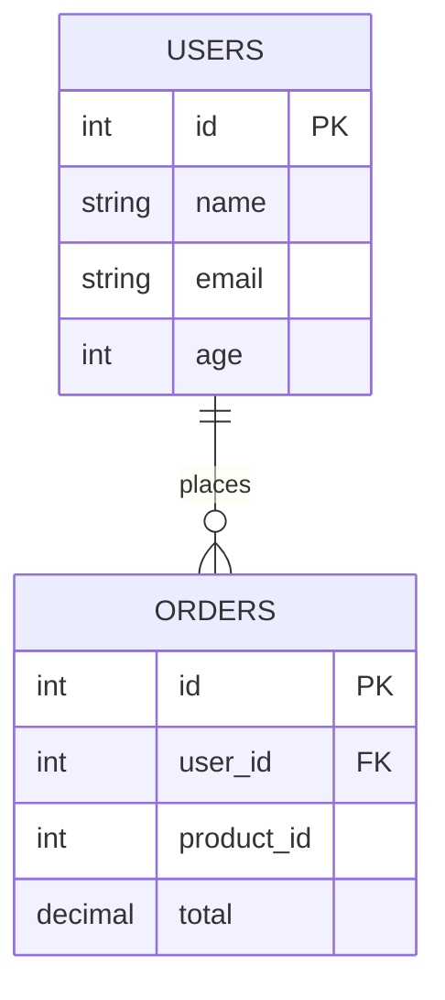
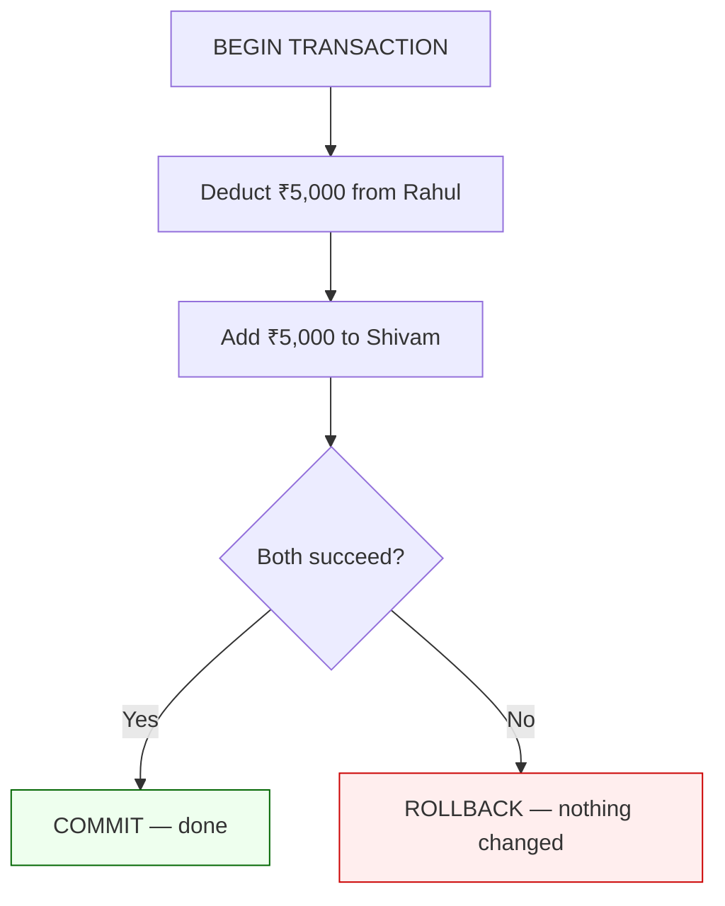
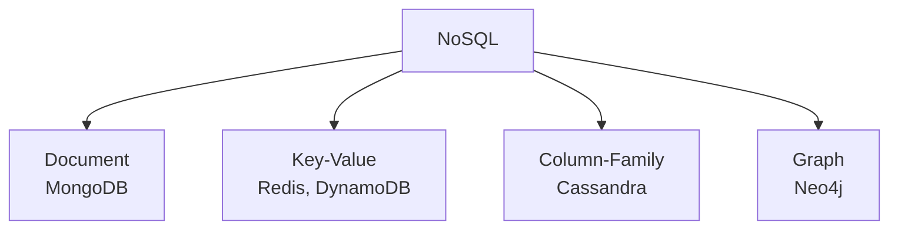
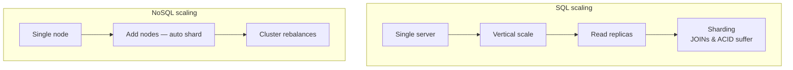
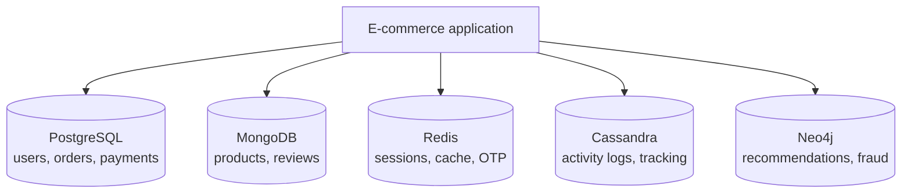
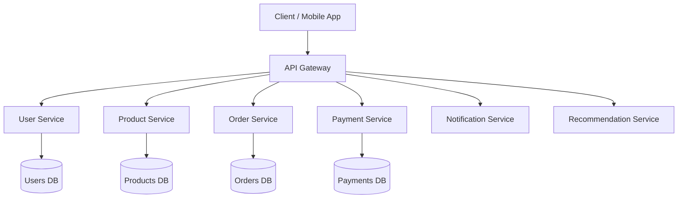
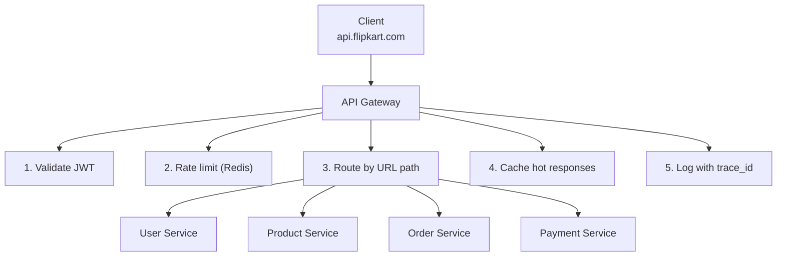
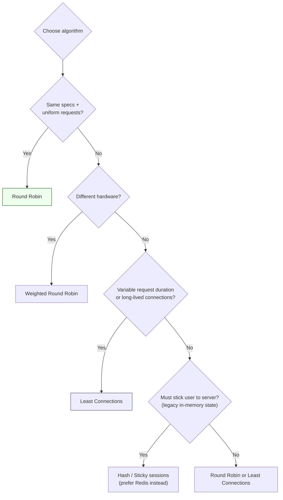

# System Design — Detailed Personal Notes (Chapter 4)

**Topics:** SQL vs NoSQL, Microservices vs Monolith, API Gateway, Load Balancer Algorithms (Deep Dive)

These notes continue from [Chapter 3 — CAP & Database Scaling](Part3.md). Every concept is explained from first principles with real-world analogies, diagrams, and worked examples.

---

## Table of Contents

| Section | Topic | Key Ideas |
|---------|-------|-----------|
| **1** | SQL vs NoSQL | ACID, four NoSQL types, scaling paths, polyglot persistence |
| **2** | Microservices | Monolith problems, service boundaries, API gateway, when to split |
| **3** | Load Balancing | Round robin, weighted, least connections, hash/sticky sessions |

---

# PART 1: SQL vs NoSQL Databases

## Why Choosing the Right Database Is Critical

This is not a trivial decision. The database you choose in the early stages of your system design determines how your data is structured, how it scales, how consistent it is, and how complex your queries can be. Getting this wrong means either rewriting your entire data layer later (extremely painful) or running a system that is slow, inconsistent, or expensive to operate.

Let's understand both types deeply before talking about when to use which.



---

## SQL Databases — The Full Picture

### What SQL Actually Is

SQL (Structured Query Language) databases store data in **tables** — just like an Excel spreadsheet, but far more powerful. Every table has rows (records) and columns (fields), and every column has a specific data type defined upfront.

```
users table:
┌────┬──────────┬───────────────────────┬─────┬────────────────────┐
│ id │  name    │        email          │ age │     created_at     │
├────┼──────────┼───────────────────────┼─────┼────────────────────┤
│  1 │  Shivam  │ shivam@gmail.com      │  21 │ 2024-01-15 09:23   │
│  2 │  Rahul   │ rahul@gmail.com       │  25 │ 2024-02-20 14:45   │
│  3 │  Ankit   │ ankit@gmail.com       │  22 │ 2024-03-10 11:30   │
└────┴──────────┴───────────────────────┴─────┴────────────────────┘

orders table:
┌────┬─────────┬────────────┬──────────┬──────────────────────┐
│ id │ user_id │ product_id │  total   │      ordered_at      │
├────┼─────────┼────────────┼──────────┼──────────────────────┤
│  1 │    1    │    101     │  ₹4,500  │ 2024-03-01 10:00     │
│  2 │    1    │    205     │  ₹1,200  │ 2024-03-05 16:30     │
│  3 │    2    │    101     │  ₹4,500  │ 2024-03-08 09:15     │
└────┴─────────┴────────────┴──────────┴──────────────────────┘
```

Notice that `orders.user_id` references `users.id`. This is a **foreign key relationship** — the database enforces that you can't create an order for a user that doesn't exist. This relationship enforcement is one of the biggest strengths of SQL.



### The Predefined Schema — What It Means in Practice

When you create a SQL table, you define its structure before inserting any data:

```sql
CREATE TABLE users (
    id          INT           PRIMARY KEY AUTO_INCREMENT,
    name        VARCHAR(100)  NOT NULL,
    email       VARCHAR(255)  UNIQUE NOT NULL,
    age         INT,
    created_at  TIMESTAMP     DEFAULT CURRENT_TIMESTAMP
);
```

This schema is a **contract**. Once defined:
- Every row MUST have `name` and `email` (they're NOT NULL)
- No two rows can have the same `email` (UNIQUE constraint)
- `age` must be an integer — you can't put "twenty-one" as a string
- The database will REJECT any data that violates these rules

If tomorrow you want to add a `phone_number` column, you must explicitly ALTER the table:

```sql
ALTER TABLE users ADD COLUMN phone_number VARCHAR(15);
```

This runs a migration — the database updates the schema for all existing rows. Existing rows will have `phone_number = NULL` until you fill them in.

**Why is this schema rigidity a good thing?**

Because it gives you **guarantees**. You know with 100% certainty that every row in the `users` table has a valid email. Your application code can rely on this — no need to defensively check "does this object have an email field?" before using it. The database already guaranteed it.

### ACID Properties — The Heart of SQL

ACID is the set of guarantees SQL databases provide. Understanding these deeply is essential because this is exactly why you choose SQL for financial and critical systems.

| Property | Meaning | One-line example |
|----------|---------|------------------|
| **Atomicity** | All or nothing | Transfer: debit + credit both succeed or both roll back |
| **Consistency** | Valid state → valid state | Balance cannot go below ₹0 |
| **Isolation** | Concurrent txs don't corrupt each other | Last item in stock → only one buyer wins |
| **Durability** | Committed = survives crash | Order saved even if server dies seconds later |

**A — Atomicity**

A transaction either completes entirely or doesn't happen at all. There is no partial completion.

```
Scenario: Rahul transfers ₹5,000 to Shivam.

This involves TWO database operations:
  Operation 1: Deduct ₹5,000 from Rahul's account
  Operation 2: Add ₹5,000 to Shivam's account

What if Operation 1 succeeds but Operation 2 fails?
  → Rahul loses ₹5,000. Shivam gets nothing. Money disappears.
  → This is a catastrophic bug.

With Atomicity, these two operations are wrapped in a TRANSACTION:

BEGIN TRANSACTION;
  UPDATE accounts SET balance = balance - 5000 WHERE user_id = 2;  -- Rahul
  UPDATE accounts SET balance = balance + 5000 WHERE user_id = 1;  -- Shivam
COMMIT;

If Operation 2 fails after Operation 1 has already run,
the database ROLLS BACK Operation 1 automatically.
Rahul's ₹5,000 is restored. Nothing happened. No money lost.

Atomicity means: all or nothing. No middle ground.
```



**C — Consistency**

Every transaction takes the database from one valid state to another valid state. All defined rules, constraints, and relationships are always satisfied.

```
Example: You have a constraint that account balance cannot go below ₹0.

Rahul's balance: ₹3,000
Rahul tries to send ₹5,000 to Shivam.

With Consistency:
The database checks: "After this transaction, will Rahul's balance be < 0?"
Answer: Yes (3000 - 5000 = -2000)
Database REJECTS the transaction with an error.
Rahul's balance remains ₹3,000. Constraint never violated.
```

**I — Isolation**

Multiple transactions running at the same time don't interfere with each other. Each transaction executes as if it's the only one running.

```
Scenario: Two people try to buy the LAST unit of a product simultaneously.

Without Isolation:
  Thread A: "SELECT stock WHERE product_id=101" → returns 1
  Thread B: "SELECT stock WHERE product_id=101" → returns 1
  Thread A: "UPDATE stock SET quantity = 0 WHERE product_id=101"
  Thread B: "UPDATE stock SET quantity = 0 WHERE product_id=101"
  Thread A: Creates order (success)
  Thread B: Creates order (success)
  
  Result: 2 orders created for 0 stock. Disaster.

With Isolation (using locks or MVCC):
  Thread A reads stock = 1, locks that row
  Thread B tries to read the same row → WAITS (locked)
  Thread A completes purchase, sets stock = 0, releases lock
  Thread B finally reads stock = 0 → "Out of stock", cannot purchase
  
  Result: Only 1 order created. Correct.
```

**D — Durability**

Once a transaction is committed, it stays committed — even if the server crashes immediately after. The data is written to disk, not just held in memory.

```
Timeline:
t=0: User places order. Transaction commits.
t=1: Database responds "Order placed successfully!"
t=2: Server crashes (power outage, hardware failure)
t=3: Server restarts

Without Durability: 
  The committed transaction might have been in memory and not yet 
  written to disk. After restart, the order doesn't exist.
  User paid money but has no order. Catastrophic.

With Durability:
  When the transaction committed at t=0, the database wrote it to
  its transaction log on disk immediately BEFORE responding to the user.
  After restart at t=3, the database replays its transaction log.
  The order is fully restored. Nothing was lost.
```

### What SQL Is Great At — JOINs and Complex Queries

SQL's relational model shines when you need to combine data from multiple tables and ask complex questions:

```sql
-- "Show me the top 5 customers by total spending in the last 30 days,
--  along with their names, email, and the number of orders they placed"

SELECT 
    u.name,
    u.email,
    COUNT(o.id)        AS total_orders,
    SUM(o.total)       AS total_spent
FROM users u
JOIN orders o ON u.id = o.user_id
WHERE o.ordered_at >= NOW() - INTERVAL '30 days'
GROUP BY u.id, u.name, u.email
ORDER BY total_spent DESC
LIMIT 5;
```

This single query crosses two tables, filters by date, groups by user, aggregates with COUNT and SUM, sorts, and limits results. A NoSQL database would require you to do most of this in application code — much slower and more complex.

---

## NoSQL Databases — The Full Picture

NoSQL doesn't mean "no SQL" — it means **"Not Only SQL."** It's an umbrella term for databases that don't follow the relational table model. There are four fundamentally different types, and understanding each is important.



### Type 1: Document Databases (MongoDB)

Data is stored as documents — JSON or BSON objects. Think of each document as a flexible row that can have different fields from every other document in the same collection.

```
Collection: "products"

Document 1 (a shirt):
{
  "_id": "prod_001",
  "name": "Cotton T-Shirt",
  "price": 499,
  "category": "clothing",
  "sizes": ["S", "M", "L", "XL"],
  "colors": ["red", "blue", "white"],
  "material": "100% cotton",
  "reviews": [
    { "user": "Rahul", "rating": 4, "comment": "Great quality!" },
    { "user": "Ankit", "rating": 5, "comment": "Perfect fit" }
  ]
}

Document 2 (a laptop):
{
  "_id": "prod_002",
  "name": "Dell XPS 15",
  "price": 85000,
  "category": "electronics",
  "processor": "Intel i7",
  "ram_gb": 16,
  "storage_gb": 512,
  "warranty_years": 2,
  "reviews": [
    { "user": "Shivam", "rating": 5, "comment": "Blazing fast!" }
  ]
}
```

Notice: the shirt has `sizes`, `colors`, `material`. The laptop has `processor`, `ram_gb`, `storage_gb`. These are completely different fields. In SQL, you'd need either separate tables for each product type or a messy "attributes" table with key-value pairs. In MongoDB, each document just has whatever fields it needs.

The `reviews` are embedded INSIDE the product document. In SQL, reviews would be a separate table with a foreign key. In MongoDB, you can embed related data directly — faster reads (one query instead of JOIN), but harder to query across all reviews.

**Flexible Schema in Action:**

```
Day 1: You store user profiles with:
{ "name": "Rahul", "email": "rahul@gmail.com", "age": 25 }

Day 180: You add a new feature — profile photos:
{ "name": "Shivam", "email": "shivam@gmail.com", "age": 21, "profile_photo": "url..." }

In SQL: You must run ALTER TABLE users ADD COLUMN profile_photo VARCHAR(500);
         This locks the table for minutes/hours on large tables. Downtime risk.

In MongoDB: Just start inserting documents with the new field.
             Old documents don't have the field — that's fine.
             No migration needed. No downtime.
```

This flexibility is incredible during early product development when requirements change every week.

### Type 2: Key-Value Stores (Redis, DynamoDB)

The simplest NoSQL type. Exactly what the name says — you store a value associated with a key. Like a giant dictionary/hashmap.

```
Key                          →  Value
─────────────────────────────────────────────────────────────────
"session:user_123"           →  { "name": "Rahul", "cart": [...], "logged_in_at": "..." }
"cache:product_456"          →  { "name": "Dell XPS", "price": 85000, ... }
"rate_limit:ip_192.168.1.1"  →  "47"  (number of requests in the last minute)
"otp:phone_9876543210"       →  "847291"  (expires in 5 minutes)
"leaderboard:game_xyz"       →  sorted set of players and scores
```

**Redis specifically** keeps all data in RAM (optionally persisted to disk). This makes it blindingly fast — sub-millisecond reads and writes. It's commonly used as:

- **Session store**: After login, store session data in Redis. Every request checks Redis for the session (much faster than querying PostgreSQL for auth on every request).
- **Cache**: Store results of expensive database queries. "What are today's top 10 products?" — compute it once, cache in Redis for 10 minutes, serve millions of requests from cache without touching the database.
- **Rate limiter**: Count how many requests came from a given IP in the last minute. Increment a Redis counter. If > 100, reject.
- **OTP store**: Generate OTP, store in Redis with a 5-minute TTL (time-to-live). Redis automatically deletes it after 5 minutes.

```
Redis TTL example:
SET otp:9876543210 "847291" EX 300   ← EX 300 = expire in 300 seconds (5 min)

GET otp:9876543210 → "847291"   (within 5 minutes)
GET otp:9876543210 → nil        (after 5 minutes — auto-deleted)
```

You **cannot** do complex queries on Redis. You can't say "give me all sessions where the user logged in from Delhi." You can only get, set, and delete by exact key. That's intentional — the simplicity is what makes it so fast.

### Type 3: Column-Family Stores (Apache Cassandra)

This is more complex and worth understanding because Cassandra is used at massive scale (Discord, Netflix, Instagram).

In a relational database, data is stored row by row. In a column-family store, data is stored **column by column**. This sounds subtle but has enormous performance implications.

```
Row-based storage (SQL):
When you store a row, all columns are physically adjacent on disk:
Row 1: [id=1, name=Shivam, age=21, city=Delhi, created=...]
Row 2: [id=2, name=Rahul,  age=25, city=Mumbai, created=...]

Reading a row → fast (all columns adjacent)
Reading one column from ALL rows → slow (must read every row's data)


Column-based storage (Cassandra):
All values of one column are physically adjacent on disk:
id column:      [1, 2, 3, 4, 5, ...]
name column:    [Shivam, Rahul, Ankit, ...]
age column:     [21, 25, 22, ...]

Query: "What is the average age of all users?"
→ Read ONLY the age column. Skip id, name, city, etc.
→ 10x less data read from disk → much faster for analytical queries
```

**Cassandra is designed for write-heavy, time-series workloads:**

```
Real-world use case: IoT sensor data

Every second, 10,000 sensors report temperature:
{ sensor_id: "s_001", timestamp: "2024-03-01 14:23:01", temperature: 24.5 }
{ sensor_id: "s_002", timestamp: "2024-03-01 14:23:01", temperature: 31.2 }
...

That's 864 million writes per day. 
Cassandra handles this with virtually no performance degradation.

Cassandra's design for this:
- Writes are always appended (never update-in-place) — very fast
- Data is automatically distributed across a cluster of nodes
- You design your tables around your queries, not around relationships
```

Cassandra sacrifices some consistency (it's an AP system in CAP terms) and doesn't support JOINs at all. But it can handle write volumes that would destroy a SQL database.

### Type 4: Graph Databases (Neo4j)

Graph databases store data as **nodes** (entities) and **edges** (relationships between entities). They're designed specifically for data where relationships are first-class citizens.

```
Social Network represented as a graph:

(Rahul) ──FRIENDS_WITH──▶ (Ankit)
(Rahul) ──FOLLOWS──────▶ (Shivam)
(Ankit) ──FRIENDS_WITH──▶ (Pulkit)
(Pulkit)──FRIENDS_WITH──▶ (Ayush)

Query: "Find all friends-of-friends of Rahul"
In SQL (joins are expensive at depth):
SELECT DISTINCT u3.*
FROM users u1
JOIN friendships f1 ON u1.id = f1.user_id1
JOIN users u2 ON f1.user_id2 = u2.id
JOIN friendships f2 ON u2.id = f2.user_id1
JOIN users u3 ON f2.user_id2 = u3.id
WHERE u1.name = 'Rahul'
AND u3.id != u1.id;

At depth 4 or 5 (friends of friends of friends...), this becomes impossibly slow.
Every extra level of depth multiplies the JOIN cost.

In Neo4j (Cypher query language):
MATCH (rahul:User {name: 'Rahul'})-[:FRIENDS_WITH*2]-(fof:User)
WHERE fof <> rahul
RETURN DISTINCT fof

The *2 means "traverse FRIENDS_WITH edges exactly 2 hops"
Change to *1..6 to find connections up to 6 degrees of separation.
Performance barely changes even at depth 6.
This is what LinkedIn uses to calculate "2nd connections" and "3rd connections."
```

Graph databases also power fraud detection — if a new credit card application shares a phone number with 5 previously fraudulent applications, a graph query finds this pattern instantly. In SQL, this would require multiple self-joins and would be impractically slow.

| NoSQL type | Examples | Best for |
|------------|----------|----------|
| **Document** | MongoDB | Flexible schemas, nested data, catalogs |
| **Key-Value** | Redis, DynamoDB | Cache, sessions, OTP, rate limits |
| **Column-Family** | Cassandra | Massive writes, time-series, IoT |
| **Graph** | Neo4j | Social networks, fraud, multi-hop relationships |

---

## SQL vs NoSQL — Scaling Differences

This is a fundamental architectural difference, not just a performance difference.

```
SQL SCALING PATH:
─────────────────────────────────────────────────────────
Single server
    │
    ▼ (vertical scaling — upgrade hardware)
Bigger single server
    │
    ▼ (read replicas — master-slave)
1 master + N slaves for read distribution
    │
    ▼ (sharding — last resort, very painful)
Data split across N servers BUT:
  - JOINs across shards = nightmare
  - ACID across shards = extremely complex (requires distributed transactions)
  - Foreign key constraints across shards = not possible
  - SQL loses most of its advantages when sharded

This is why SQL is called "primarily vertically scalable."
The horizontal path exists but kills SQL's core strengths.


NoSQL SCALING PATH:
─────────────────────────────────────────────────────────
Single node
    │
    ▼ (add more nodes — horizontal scaling built-in)
Cluster of N nodes
    │
    ▼ (data is automatically sharded across nodes)
Each node owns some "shards" of the data
    │
    ▼ (add more nodes — data rebalances automatically)
Larger cluster, same performance per node

MongoDB, Cassandra, DynamoDB were all designed from day one
for horizontal scaling. Adding a node to a Cassandra cluster
is a 5-minute operation. The cluster rebalances automatically.
No application code changes. No schema migrations. Just add hardware.
```



Why is NoSQL easier to shard? Because NoSQL doesn't have JOINs or foreign keys across documents/rows. Each document/row in MongoDB is self-contained. When you shard, each shard holds a set of self-contained documents. Querying a document on shard 3 doesn't need anything from shard 1.

---

## When to Use Which — The Real Framework

Don't think of this as a simple checklist. Think about it as a series of questions you ask about your specific use case.

**Question 1: Is your data structured or unstructured?**

```
STRUCTURED (fixed, well-defined schema) → SQL
────────────────────────────────────────────────────────────
Bank accounts:
  Every account always has: account_number, holder_name, 
  balance, account_type, branch_code, IFSC
  The schema is clear. It won't change unexpectedly.
  Use SQL (PostgreSQL/MySQL).

Customer records in e-commerce:
  Every customer always has: name, email, address, phone
  Use SQL.


UNSTRUCTURED / FLEXIBLE SCHEMA → NoSQL
────────────────────────────────────────────────────────────
Product catalog on Amazon:
  A book has: ISBN, author, page_count, publisher
  A shoe has: size, color, material, gender
  An electronic has: processor, battery, display_resolution
  Different product categories have completely different attributes.
  Use MongoDB (Document DB) — each product document has its own fields.

User activity logs:
  Some logs have location, some don't.
  Some have device type, some don't.
  Schema varies per event type.
  Use MongoDB or Cassandra.
```

**Question 2: Do you need ACID guarantees?**

```
YES — Data integrity is non-negotiable → SQL
────────────────────────────────────────────────────────────
Financial transactions (banking, payments, stock trading):
  "Deduct from account A AND add to account B" must be atomic.
  You CANNOT have money disappear in the middle of a transfer.
  PostgreSQL with transactions is the right choice.

Order and inventory management:
  "Reserve stock AND create order" must be atomic.
  If creating the order fails, stock must be unreserved.
  Use SQL.

Medical records:
  Partial writes to a patient record could be life-threatening.
  Use SQL.


NO — Eventual consistency is acceptable → NoSQL is viable
────────────────────────────────────────────────────────────
Social media feed:
  If someone's like count shows 1,247 for one user and 1,249 
  for another user for 50 milliseconds, nobody is harmed.
  Use Cassandra or DynamoDB.

Product recommendations:
  Slightly stale recommendations are fine.
  Use Redis or DynamoDB.
```

**Question 3: What is the read/write pattern and scale?**

```
READ-HEAVY with complex queries (analytics, reporting) → SQL
────────────────────────────────────────────────────────────
"Show sales by region, by product category, for Q3 2024,
 grouped by week, compared to Q3 2023"
This is a complex aggregation across multiple tables.
SQL with proper indexes handles this beautifully.
NoSQL would require you to pre-compute all possible views — impractical.


WRITE-HEAVY with simple reads (time-series, logging) → Cassandra / DynamoDB
────────────────────────────────────────────────────────────
GPS location of 500,000 delivery drivers updating every 5 seconds:
  2.5 million writes per second
  Read pattern: "Where is driver_X right now?" — simple key lookup
  Cassandra or DynamoDB handles this natively.
  PostgreSQL would melt under 2.5 million writes/sec.


CACHING, SESSION, RATE LIMITING → Redis
────────────────────────────────────────────────────────────
Always. For any sub-millisecond read/write requirement.
Redis is the default answer.


RELATIONSHIP-HEAVY (social graphs, fraud detection) → Neo4j
────────────────────────────────────────────────────────────
When the relationships between entities ARE the data.
When you need multi-hop traversals (friends of friends of friends).
```

### Real E-Commerce App — Polyglot Persistence

In practice, you almost never use ONLY SQL or ONLY NoSQL. Real systems mix them — **polyglot persistence**.



```
Flipkart's hypothetical architecture:

PostgreSQL (SQL):
  - users table (account info, addresses)
  - orders table (order history, payments)
  - inventory table (stock levels)
  - financial_transactions table
  Reason: ACID critical, structured schema, JOINs needed.

MongoDB (NoSQL - Document):
  - products collection (flexible schema per category)
  - reviews collection (unstructured review data, ratings, photos)
  Reason: Product attributes vary wildly per category.

Redis (NoSQL - Key-Value):
  - Session store (user login sessions)
  - Cart data (temporary, in-memory while browsing)
  - Product page cache (expensive queries cached for 10 min)
  - OTP storage (with auto-expiry TTL)
  - Rate limiting (requests per IP per minute)
  Reason: Sub-millisecond access needed.

Cassandra (NoSQL - Column-family):
  - User activity logs (every click, page view, search)
  - Delivery tracking events (location updates every 5 seconds)
  Reason: Massive write volume, simple key-based reads.

Neo4j (Graph):
  - "Customers who bought this also bought" graph
  - Fraud detection (shared device/IP graphs)
  Reason: Relationship traversal queries.
```

---

# PART 2: Microservices — The Complete Deep Dive

## Starting Point: Understanding Monolithic Architecture

Before you can appreciate why microservices exist, you need to deeply understand what a monolith is and what problems it creates at scale.

### What Is a Monolith?

A monolithic application is one where ALL the functionality lives in a single codebase, runs as a single process, and is deployed as a single unit.

```
E-COMMERCE MONOLITH:
─────────────────────────────────────────────────────────────────
One giant backend application (say, a single Node.js/Java/Django app)

app/
├── controllers/
│   ├── userController.js       (registration, login, profile)
│   ├── productController.js    (listing, search, details)
│   ├── orderController.js      (place order, order history)
│   ├── paymentController.js    (payment processing, refunds)
│   ├── notificationController  (email, SMS, push notifications)
│   └── analyticsController.js  (metrics, reports)
│
├── models/
│   ├── User.js
│   ├── Product.js
│   ├── Order.js
│   └── Payment.js
│
├── services/
│   ├── emailService.js
│   ├── smsService.js
│   └── inventoryService.js
│
└── app.js   ← Everything starts from here

One database. One deployment. One process.
All of this runs as a single application.
```

When you deploy this app, you deploy the entire thing. When you restart it, everything restarts. When it crashes, everything crashes.

### Problems With Monoliths at Scale

| Problem | What happens |
|---------|----------------|
| **All-or-nothing scaling** | Product traffic spikes 100× → you scale the entire app, wasting instances on low-traffic modules |
| **Blast radius** | One buggy module (e.g. recommendations) can take down login, checkout, payments |
| **Tech lock-in** | Entire stack is one language; hard to adopt Node for WebSockets or Python for ML |
| **Slow deployments** | 1-line payment fix requires full build, full test suite, full deploy (~80 min) |

**Problem 1: Scaling is all-or-nothing**

```
Scenario: It's Diwali sale season. The Product Service 
(search, listings, browsing) gets 100x normal traffic.
The User Service (login, profile) gets only 5x traffic.
The Payment Service gets 20x traffic.

In a monolith, everything is one app.
You can only scale the entire app as one unit.

To handle the Product Service load:
  You spin up 50 instances of the entire application.
  But this means you're also running 50 instances of 
  User Service and Payment Service, even though they 
  only need 5-10 instances.
  
Cost: You're paying for 50 instances when you needed
      50 for product, 5 for user, 10 for payment.
      You're wasting money on 35 unnecessary user service instances
      and 40 unnecessary payment service instances.
```

**Problem 2: One failure brings everything down**

```
Timeline of a typical monolith failure:

t=0:  A developer pushes a bug in the Recommendation feature.
      The bug causes an infinite loop in the recommendation algorithm.

t=1:  Recommendation requests start consuming 100% CPU each.

t=2:  CPU on all servers hits 100%.
      New incoming requests queue up and time out.
      
t=3:  Users can't log in.         ← Not the recommendation feature's fault
      Users can't view products.  ← Not the recommendation feature's fault
      Users can't check out.      ← Not the recommendation feature's fault
      Users can't pay.            ← Not the recommendation feature's fault
      EVERYTHING IS DOWN because one module has a bug.

Recovery:
  Rollback the entire deployment.
  All features are down during rollback (5-15 minutes).
  Revenue lost: enormous.
```

**Problem 3: Tech stack is locked in**

```
When you started the company, you chose Java.
Your entire monolith is Java.

3 years later, you want to add real-time features 
(live order tracking, live chat support).
NodeJS is far better for real-time WebSocket connections.
Golang is far better for high-throughput data pipelines.

But your entire codebase is Java.
You can't "add a bit of NodeJS" to a Java monolith.
Your hands are tied.
```

**Problem 4: Deployment is slow and risky**

```
In a monolith, to fix a 1-line bug in the Payment module:

1. Run the full test suite for the ENTIRE application (takes 45 minutes)
2. Build the entire application (takes 15 minutes)
3. Deploy the entire application (takes 20 minutes)
4. Total: ~80 minutes to deploy a 1-line fix

50 developers all wanting to deploy → coordination bottlenecks.
One bad deployment by Developer A can block Developers B through Z.
```

---

## Microservices — The Complete Solution

### What Microservices Actually Are

Microservices is an architectural style where you break your application into small, independent services that:
- Each handle one specific business capability
- Have their own codebase (separate repository)
- Have their own database (completely separate data store)
- Are deployed independently (don't need to redeploy others when one changes)
- Communicate over the network (via HTTP/REST, gRPC, or message queues)

```
E-COMMERCE WITH MICROSERVICES:
─────────────────────────────────────────────────────────────────

Service 1: User Service          Service 2: Product Service
┌─────────────────────┐          ┌─────────────────────┐
│  Handles:           │          │  Handles:           │
│  - Registration     │          │  - Product listings │
│  - Login/Logout     │          │  - Product search   │
│  - Profile mgmt     │          │  - Product details  │
│  - Auth tokens      │          │  - Category mgmt    │
│                     │          │                     │
│  Own DB: Users_DB   │          │  Own DB: Products_DB│
│  Language: NodeJS   │          │  Language: NodeJS   │
│  Deployed: 2 servers│          │  Deployed: 8 servers│
└─────────────────────┘          └─────────────────────┘

Service 3: Order Service          Service 4: Payment Service
┌─────────────────────┐          ┌─────────────────────┐
│  Handles:           │          │  Handles:           │
│  - Place order      │          │  - Process payment  │
│  - Order tracking   │          │  - Refunds          │
│  - Order history    │          │  - Payment history  │
│  - Cart management  │          │  - Fraud detection  │
│                     │          │                     │
│  Own DB: Orders_DB  │          │  Own DB: Payments_DB│
│  Language: Golang   │          │  Language: Java     │
│  Deployed: 4 servers│          │  Deployed: 3 servers│
└─────────────────────┘          └─────────────────────┘

Service 5: Notification Service   Service 6: Recommendation Service
┌─────────────────────┐          ┌─────────────────────┐
│  Handles:           │          │  Handles:           │
│  - Email sending    │          │  - Product recs     │
│  - SMS sending      │          │  - Similar items    │
│  - Push notifs      │          │  - Trending items   │
│                     │          │                     │
│  Own DB: Notifs_DB  │          │  Own DB: ML_DB      │
│  Language: Python   │          │  Language: Python   │
│  Deployed: 2 servers│          │  Deployed: 6 servers│
└─────────────────────┘          └─────────────────────┘
```

Each service is a completely separate application. The User Service has no idea how the Payment Service is built internally. They only know how to talk to each other through defined APIs.



### Independent Scaling — The Biggest Win

```
DIWALI SALE TRAFFIC:

User Service:     5x traffic needed  → Run 2 instances
Product Service:  100x traffic needed → Run 80 instances ← Only this scales big
Order Service:    20x traffic needed  → Run 16 instances
Payment Service:  20x traffic needed  → Run 16 instances
Notification:     30x traffic needed  → Run 24 instances
Recommendation:   80x traffic needed  → Run 64 instances

VS MONOLITH:
You'd need to run 80 instances of EVERYTHING
because the Product Service needs 80.
Even User Service runs at 80 instances when 2 is enough.

Microservices: Pay for exactly what each service needs.
Monolith:      Pay for the maximum any single module needs, applied to ALL.
```

### Fault Isolation — Failures Stay Contained

```
Scenario: The Recommendation Service has a memory leak bug.

WITH MICROSERVICES:
t=0:  Recommendation Service crashes.
      User, Product, Order, Payment services: still running.
      Impact: "You might also like..." missing — site still works.

WITH MONOLITH:
t=0:  Recommendation module leaks memory → entire app crashes.
      Login, products, checkout, payments: all down.
```

### Technology Flexibility — Each Service Uses the Best Tool

| Service | Stack | Why |
|---------|-------|-----|
| User | Node.js + PostgreSQL | Fast CRUD, structured user data, ACID |
| Order | Golang + PostgreSQL | High concurrency, ACID for orders |
| Recommendation | Python + MongoDB | ML libraries, flexible feature storage |
| Tracking | Node.js + Cassandra | WebSockets + massive write volume |

---

## API Gateway — The Front Door to Your Microservices

### The Problem Without an API Gateway

```
WITHOUT API GATEWAY:

Mobile App must know:
  User Service:           http://192.168.24.32:3001
  Product Service:        http://192.168.24.38:3002
  Order Service:          http://192.168.24.45:3003
  ...

PROBLEMS:
1. Hardcoded IPs — new deployment = new app release
2. Auth duplicated in every service
3. Rate limiting duplicated everywhere
4. SSL on every service
5. Debugging spans 6 log formats
```

### What the API Gateway Does

The API Gateway is a single entry point in front of all microservices. The client ONLY talks to the gateway.



```
CLIENT (mobile app / browser)
         │
         │  ONE endpoint: https://api.flipkart.com
         ▼
┌─────────────────────────────────────────────────────────────┐
│                        API GATEWAY                          │
│                                                             │
│  1. AUTHENTICATION: Validates JWT token on EVERY request.   │
│  2. RATE LIMITING: Max 100 req/min per user (Redis).        │
│  3. REQUEST ROUTING:                                        │
│     GET  /api/users/*      → User Service                   │
│     GET  /api/products/*   → Product Service                │
│     POST /api/orders/*     → Order Service                  │
│  4. CACHING: Cache hit → respond without hitting service.   │
│  5. TRANSFORMATION: Add user_id from token to headers.      │
│  6. LOGGING: Unique trace_id across all services.            │
└────────────┬────────────────────────────────────────────────┘
             │
    ┌────────┼─────────────────────┐
    ▼        ▼                     ▼
User     Product              Payment
Service  Service              Service
```

### API Gateway With Per-Service Load Balancers

```
Client → API Gateway
           ├──▶ User LB → User Instance 1, 2, 3
           ├──▶ Product LB → Product Instance 1…5
           └──▶ Payment Service (single instance for now)
```

The gateway talks to each service's load balancer — it doesn't need to know instance counts.

---

## When to Use Microservices vs Monolith

### Start With a Monolith

```
EARLY-STAGE STARTUP:

Team size: 2-3 developers
Traffic: Hundreds of users

Microservices overhead before business logic:
  - 6 repos, 6 CI/CD pipelines, 6 databases
  - API Gateway, service discovery, distributed tracing
  - Weeks of infrastructure work

Benefit at this stage: Near zero. Start monolith. Ship fast.
```

> **Conway's Law:** Organizations design systems that mirror their communication structure. **Microservice boundaries should align with team boundaries.**

```
If you have 1 team of 5 people        → Monolith is fine
If you have 2 teams (User vs Product) → ~2 services
If you have 5 teams                   → ~5 services (one per team)
```

### Signs You're Ready for Microservices

| Signal | Why it matters |
|--------|----------------|
| **Team scaling** | 5+ teams, daily merge conflicts on one repo |
| **Deployment bottlenecks** | Payment fix blocked by unrelated teams' changes |
| **Scaling asymmetry** | One module needs 20× CPU; others need 2× |
| **Different uptime needs** | Payments 99.99% vs recommendations 95% |
| **Different tech needs** | ML in Python inside a Java monolith |

---

# PART 3: Load Balancer Deep Dive

## Why a Load Balancer Is Not Optional

We covered load balancing conceptually in [Chapter 2](Part2.md). Here we go deeper on **algorithms** — because your choice has real performance implications.

The load balancer must decide, for each request, which server handles it. That decision must be:
- **Fast** — the LB must not become the bottleneck
- **Fair** — no single server overwhelmed
- **Adaptive** — account for capacity and health

---

## Algorithm 1: Round Robin

### How It Works — Full Detail

Round Robin maintains a counter that cycles through servers in order.

```
Available servers: [Server-1, Server-2, Server-3]

Request 1 → Server-1
Request 2 → Server-2
Request 3 → Server-3
Request 4 → Server-1  (wraps)
...

Over 9 requests: each server gets exactly 3. Perfectly even.
```

### The Fundamental Problem With Round Robin

Round Robin assumes all requests and all servers are equal. Both are often wrong.

```
Request A: 4K video upload — 30 seconds, CPU-heavy → Server-1
Request B: Profile page — 20ms → Server-2

Next 60 lightweight requests:
Round Robin still sends some to Server-1 while it's at 95% CPU.
Users on Server-1 wait seconds for a simple profile page.
Server-2 and Server-3 are mostly idle.
```

### When Round Robin Is Appropriate

- Stateless, similar-duration requests (uniform JSON APIs)
- Identical server hardware
- Simplicity matters and workload is uniform

---

## Algorithm 2: Weighted Round Robin

### How It Works — Full Detail

Each server has a **weight**. Weight 3 gets 3× the traffic of weight 1.

```
Server-1: weight = 1  (2 cores)
Server-2: weight = 1  (2 cores)
Server-3: weight = 3  (6 cores, 16 GB)

Cycle of 5 requests: S1, S2, S3, S3, S3 → repeat

Over 10 requests:
Server-1: 2 (20%)
Server-2: 2 (20%)
Server-3: 6 (60%)  ← matches 3/5 weight ratio
```

### The Limitation

Weights are **static**. If Server-3 runs a background job and effective capacity drops, the LB still sends 60% traffic there.

**Good for:** Different hardware specs, **canary deployments** (old server weight 9, new server weight 1, gradually shift).

---

## Algorithm 3: Least Connections

### How It Works — Full Detail

Route each new request to the server with the **fewest active connections**.

```
Server-1: 45 active connections
Server-2: 12 active connections   ← next request here
Server-3: 38 active connections

After routing: Server-2 has 13 connections.
```

### Why This Beats Round Robin for Variable Workloads

```
Heavy video on Server-1 (30s, 11 connections).
Light profile requests go to Server-2 and Server-3 (fewest connections).
Server-1 protected until the video finishes.
```

### The Subtlety: Connections ≠ CPU

```
Server-1: 50 idle WebSocket connections (0.01% CPU each)
Server-2: 5 heavy DB queries (100% CPU total)

Least Connections picks Server-2 — wrong!
Advanced LBs can route by actual CPU utilization instead.
```

**Used by:** nginx, HAProxy (`least_conn`)

---

## Algorithm 4: Hash-Based (Sticky Sessions)

### The Problem It Solves

```
Cart stored in server memory (no Redis):

Request 1: Add Laptop → Server-1 (cart in memory)
Request 2: Add Mouse  → Server-2 (doesn't know about Laptop!)
Request 3: View cart  → Server-3 (empty cart!)
```

### How IP Hash Works

```
server_index = HASH(client_IP) % number_of_servers

192.168.1.100 → always Server-1
10.0.0.55     → always Server-3
```

### Problems With IP Hash

| Problem | Effect |
|---------|--------|
| Server removed | `% N` changes → many users remapped, sessions lost |
| Corporate NAT | 500 employees, one public IP → all hit one server |

**Better:** Hash on `user_id` from JWT (more even, works behind NAT).

### Modern Solution: Redis Session Store

```
Request 1: Server-1 writes cart to Redis
Request 2: Server-2 reads Redis, adds item
Request 3: Server-3 reads Redis — cart correct

Now use Round Robin or Least Connections freely.
Stateless servers + shared cache = best practice.
```

---

## Which Algorithm to Choose?



| Situation | Algorithm |
|-----------|-----------|
| Uniform API, same hardware | Round Robin |
| Mixed server sizes | Weighted Round Robin |
| Variable duration / WebSockets | Least Connections |
| Legacy sticky sessions | Hash (user_id > IP) |
| Modern stateless + Redis | Round Robin or Least Connections |

> **Production default:** Least Connections for app traffic; Weighted Round Robin for DB read replicas.

---

## Quick Reference — Chapter 4

| Concept | One-line summary |
|---------|------------------|
| SQL | Tables, schema, ACID, JOINs — structured critical data |
| Document DB | Flexible JSON documents — catalogs, evolving schemas |
| Redis | Key-value — cache, sessions, OTP, rate limits |
| Cassandra | Column-family — massive writes, time-series |
| Neo4j | Graph — relationships and multi-hop queries |
| Polyglot persistence | Right DB per data type — real systems use many |
| Monolith | One codebase/deploy — start here |
| Microservices | Independent services, DBs, deploys — when teams/scale demand it |
| API Gateway | Single entry: auth, routing, rate limit, tracing |
| Round Robin | Simple cycle — uniform workloads only |
| Least Connections | Route to least busy — variable workloads |

**Previous ←** [Chapter 3: CAP & Database Scaling](Part3.md)
