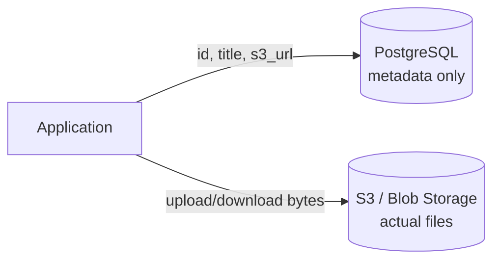
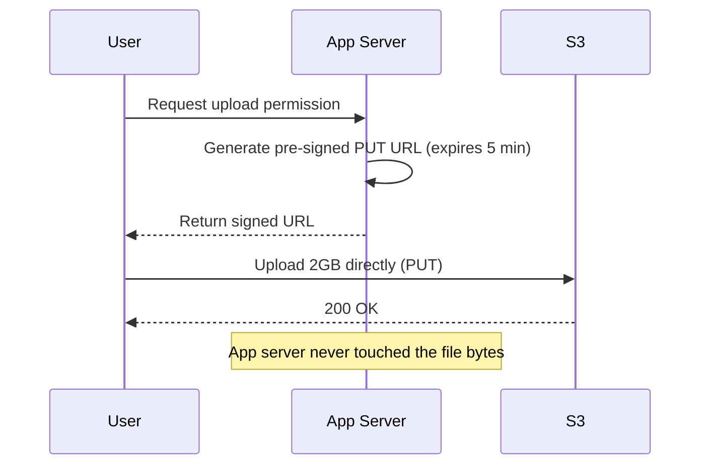
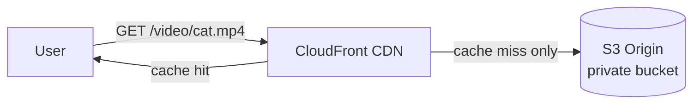
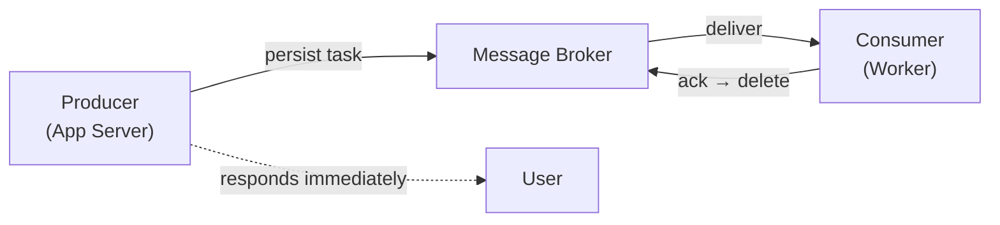
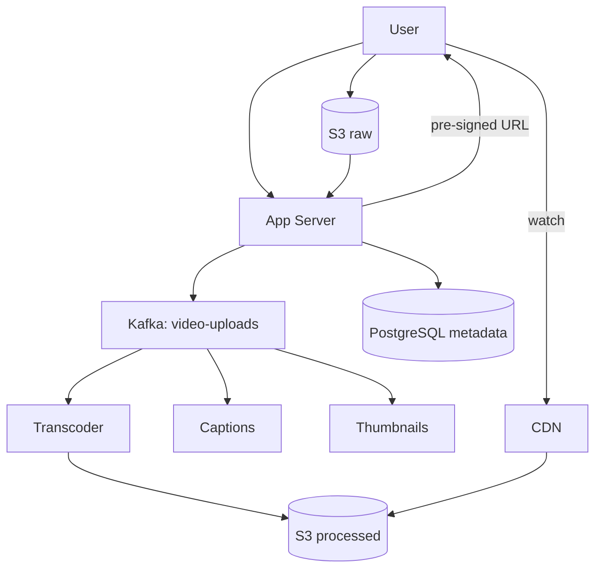

# System Design — Detailed Personal Notes (Chapter 6)

**Topics:** Blob Storage (S3), CDN, Message Brokers (Queues vs Streams), Async Microservice Communication

These notes continue from [Chapter 5 — Caching & Redis](Part5.md). Every concept is explained from first principles with real-world analogies, diagrams, and worked examples.

**Previous ←** [Chapter 5: Caching & Redis](Part5.md) · **Next →** [Chapter 7: Kafka Internals & Pub/Sub](Part7.md)

---

## Table of Contents

| Section | Topic | Key Ideas |
|---------|-------|-----------|
| **1** | Blob Storage | Why not DB for files, S3 model, pre-signed URLs, storage classes |
| **2** | CDN | GeoDNS, cache hit/miss at edge, TTL strategy, S3 + CloudFront |
| **3** | Message Brokers | Sync vs async, queues vs Kafka, REST vs broker, when to use which |

---

# PART 1: BLOB STORAGE — The Complete Deep Dive

## Why Files Can't Go Into Regular Databases

To understand why blob storage exists, you need to understand what a relational database is actually optimized for — and where it completely breaks down.

A database like PostgreSQL stores data in a highly structured way. Every row is a fixed-width record on disk. The database knows exactly how many bytes a `VARCHAR(255)` column takes, exactly how many bytes an `INT` takes, and it uses this to build its B-Tree indexes and page structures. This predictability is what makes SQL fast for structured queries.

Now consider a video file.

A typical MP4 video:
  Duration:     10 minutes
  Resolution:   1080p
  File size:    ~1.5 GB
  Binary size:  ~12,884,901,888 bits

Trying to store this as a database column:
  CREATE TABLE videos (
    id         INT PRIMARY KEY,
    title      VARCHAR(255),
    video_data BLOB    ← the MP4 lives here
  );
  
  INSERT INTO videos VALUES (1, 'My Video', <12 billion bits of data>);

Here's what happens to your database when you do this:

**Problem 1: Memory and I/O collapse.** When PostgreSQL processes a query, it loads data pages into memory. A normal row might be 500 bytes. A video row is 1.5 GB. Loading one video row into PostgreSQL's buffer pool consumes more RAM than your entire database normally uses. Every other query gets evicted from memory. Your database grinds to a halt.

**Problem 2: Query performance for everything else tanks.** Database indexes work by storing column values in B-Trees. A B-Tree node containing a 1.5 GB blob is absurd. Indexes can't work on binary file data the way they work on integers and strings. You're essentially forcing the database to do full table scans — on a table that has gigabytes per row.

**Problem 3: Network transfer is brutal.** When you query `SELECT * FROM videos WHERE id = 1`, PostgreSQL sends the entire 1.5 GB across the network to your application server. Your database network connection gets saturated by a single query. All other queries queue up.

**Problem 4: Backups become nightmares.** A daily backup that normally takes 5 minutes now takes hours because it copies gigabytes of video data that never changes. Database backups are meant for transactional data — not large binary files.

**The core insight:** Files are opaque binary blobs. The database doesn't need to index them, query inside them, or join them. They just need to be stored and retrieved by a key (filename or URL). That is a different problem — and it needs a different solution.



---

## What a Blob Actually Is

BLOB stands for **Binary Large Object**. It's the binary representation of any file — the raw 0s and 1s that make up the file's content.

A PNG image at the binary level:
89 50 4E 47 0D 0A 1A 0A 00 00 00 0D 49 48 44 52 ...

A PDF document:
25 50 44 46 2D 31 2E 34 0A 25 E2 E3 CF D3 ...

An MP4 video:
00 00 00 20 66 74 79 70 69 73 6F 6D ...

At the storage level, they're all just bytes. The difference is how an application interprets them. Blob storage doesn't care — it stores bytes and returns bytes when asked.

---

## AWS S3 — How It Works Internally

S3 (Simple Storage Service) is Amazon's blob storage service.

### The Fundamental Data Model: Buckets and Objects

```
BUCKET: A named container (globally unique name)
  - Lives in a specific AWS region (ap-south-1, us-east-1, etc.)

OBJECT: A file stored in a bucket
  - KEY:    "videos/tutorials/redis-tutorial.mp4"
  - VALUE:  the actual binary content
  - METADATA: content-type, size, custom tags
  - ETag:   checksum for integrity

Structure:
my-company-bucket/
├── videos/tutorials/redis-tutorial.mp4
├── images/products/laptop-1.jpg
└── documents/invoice-2024-march.pdf
```

Important: The `/` in S3 keys is a naming convention. S3 is a **flat key-value store** — `"videos/tutorials/redis.mp4"` is one long key string, not a real folder hierarchy.

### How S3 Achieves 11 Nines of Durability

99.999999999% durability means: if you store 10 million objects, you might lose one every 10,000 years.

When you upload to S3:
1. File is split into chunks
2. Chunks stored with erasure coding (like advanced RAID)
3. Distributed across multiple drives, machines, and Availability Zones

For ap-south-1 (Mumbai):
  AZ-a, AZ-b, AZ-c — separate data centers

Your file's chunks live across all three simultaneously.
Losing data requires catastrophic simultaneous failure across all AZs.

### Pre-Signed URLs — The Right Way to Handle Uploads and Downloads

**Wrong approach — going through your server:**

```
USER UPLOADS A 2GB VIDEO — WRONG WAY:

User → [2GB] → App Server → [2GB] → S3

Problems:
- Server bandwidth and RAM consumed
- 100 simultaneous uploads = 200 GB through your server
- App server becomes a file shuttle, not a logic layer
```

**Right approach — pre-signed URLs:**



```
Step 1: User asks server: "I want to upload a video"
Step 2: Server generates pre-signed URL from S3 (valid 5 minutes, signed)
Step 3: User uploads DIRECTLY to S3 using that URL
Step 4: S3 stores file, returns 200

// NodeJS example:
const presignedUrl = await s3.getSignedUrlPromise('putObject', {
    Bucket: 'my-videos-bucket',
    Key: `videos/${userId}/${Date.now()}-tutorial.mp4`,
    ContentType: 'video/mp4',
    Expires: 300
});
```

**Result:**
- App server never touches the binary data
- S3 handles upload bandwidth
- URL expires quickly — can't be abused
- Cryptographic signature prevents tampering

Same pattern works for **downloads** — pre-signed GET URL, user downloads directly from S3.

### S3 Storage Classes — Cost Optimization

| Storage Class | Cost/GB/month | Access | Use case |
|---------------|---------------|--------|----------|
| **S3 Standard** | ~$0.023 | Milliseconds | Hot, frequently accessed files |
| **S3 Standard-IA** | ~$0.0125 | Milliseconds (+ retrieval fee) | Infrequent access |
| **S3 Intelligent-Tiering** | ~$0.023 | Auto-moves between tiers | Unknown access patterns |
| **S3 Glacier** | ~$0.004 | Hours | Archives, compliance |
| **S3 Glacier Deep Archive** | ~$0.00099 | 12–48 hours | Long-term cold storage |

Lifecycle example:
  Day 0-30:    S3 Standard
  Day 31-90:   S3 Standard-IA
  Day 91-365:  S3 Glacier
  Day 366+:    Glacier Deep Archive

Pay full price only for recent/popular content.
Archive old content at minimum cost.

---

# PART 2: CDN (Content Delivery Network) — The Complete Deep Dive

## The Physics Problem That CDNs Solve

Signals in fiber move at roughly 200,000 km/s. Physics sets a floor on latency.

Mumbai to New York:
  Distance: ~12,000 km
  Minimum one-way: ~60ms
  Real round trip: 180-250ms with routing overhead

User in New York, origin in Mumbai — loading 15 assets:
  ~3+ seconds from latency alone (before server processing)

**With CDN edge in New York:**
  Distance: ~20 km → ~2ms per asset
  Total: ~30ms — roughly 100x improvement

## How CDN Routing Works — GeoDNS

**WITHOUT CDN:**
DNS always returns same IP → Mumbai server for everyone

**WITH CDN (GeoDNS):**
  User in Mumbai  → DNS returns Mumbai PoP IP
  User in New York → DNS returns New York PoP IP
  User in Tokyo   → DNS returns Tokyo PoP IP

Same domain, different IPs based on user location.
Each user hits the geographically closest edge server.

## First Request vs Subsequent — Cache Miss vs Hit at Edge

**First user at an edge (cache miss):**

1. User → CDN edge (New York): GET /images/iphone-15.jpg
2. Edge cache: MISS
3. Edge → Origin (S3 in Mumbai): fetch image (~200ms)
4. Edge caches locally with TTL
5. Edge → User: image delivered (~220ms total)

**Every subsequent user in that region (cache hit):**

1. User → same CDN edge
2. Edge cache: HIT (TTL still valid)
3. Edge → User directly (~15ms)
  S3 never contacted

## TTL Strategy — Balancing Freshness vs Performance

STATIC ASSETS (content hash in filename):
  main.a3f8b2c1.js
  Cache-Control: public, max-age=31536000, immutable
  New deploy = new filename = automatic cache bust

PRODUCT IMAGES:
  Cache-Control: public, max-age=86400  (24 hours)
  Or ?v=2 query string for immediate bust

USER-GENERATED / SENSITIVE:
  Cache-Control: private, max-age=3600
  Or no-store / pre-signed URLs

DYNAMIC / PERSONALIZED:
  Cache-Control: no-store or no-cache
  no-cache = revalidate with origin before serving
  no-store  = never cache at all

## CDN Cache Invalidation

When you must clear cache before TTL expires:

```javascript
await cloudfront.createInvalidation({
    DistributionId: 'E2QWRUHEXAMPLE',
    InvalidationBatch: {
        Paths: {
            Quantity: 2,
            Items: [
                '/images/products/iphone-15.jpg',
                '/images/banners/*'
            ]
        },
        CallerReference: Date.now().toString()
    }
});
```

Invalidations cost money after free tier — another reason content-hashed filenames are preferred.

## CDN With S3 — The Standard Architecture



COMPLETE ARCHITECTURE:

- S3 bucket: block all public access
- Only CloudFront (Origin Access Identity) can read from S3
- Users access via CDN domain only (www.example.com/images)
- S3 URL is never exposed publicly

Flow:
  First user in region → edge fetches from S3, caches
  Next users in region → served from edge, S3 untouched

---

# PART 3: MESSAGE BROKER — The Complete Deep Dive

## Starting From Synchronous — Understanding the Baseline

```
SYNCHRONOUS REQUEST-RESPONSE:

Client: "Please process my order"
   ▼
Server:
  - Validates order
  - Checks inventory
  - Creates order in DB
  - Charges card
  - Sends confirmation email  ← user waits for this too
  - Updates inventory
   ▼
Client: confirmation page (~2-3 seconds)
```

Payment and order creation **must** be synchronous — user needs confirmation.

Email sending does **not** need to block the response. If email service is down, the order should still succeed.

## The Spectrum of Asynchronous Tasks

MUST BE SYNCHRONOUS (user waits):
  - Validating user input
  - Checking stock
  - Processing payment
  - Creating order record
  - Returning confirmation

CAN BE ASYNCHRONOUS (background):
  - Confirmation email / SMS
  - Recommendation model update
  - Invoice PDF generation
  - Warehouse notification
  - Analytics writes

MUST BE ASYNCHRONOUS (too long synchronously):
  - Video transcoding (30+ minutes)
  - Large report generation
  - ML training
  - Bulk email (100k recipients)
  - Large file parsing/indexing

**Key question:** *Does the user need this result before they can continue?* If no → async candidate.

## The Problem With Naive Async (No Broker)

```javascript
app.post('/orders', async (req, res) => {
    const order = await createOrder(req.body);
    await chargePayment(order);
    
    sendEmail(order.userEmail, 'Order Confirmed!').catch(err => {
        console.error('Email failed:', err);
    });
    
    res.json({ success: true, orderId: order.id });
});
```

**PROBLEM 1:** Server restart → in-flight email task lost
**PROBLEM 2:** No retry on SendGrid failure
**PROBLEM 3:** No visibility (pending/failed counts)
**PROBLEM 4:** 50k orders → 50k simultaneous HTTP calls → rate limit failures

A message broker fixes all four.

## Message Broker — What It Is and How It Works



Producer puts task in broker (written to disk).
Broker acknowledges persistence.
Server responds to user immediately.
Consumer picks up task independently.
Consumer acks when done → message removed.

**Critical difference:** Task is durable in the broker **before** the server responds. Server crash does not lose the task.

### Three Guarantees

**1. Durability** — tasks survive crashes (broker persists to disk before ack to producer)

**2. Retry** — message not acked within visibility timeout → visible again for another consumer. After N failures → **Dead Letter Queue (DLQ)** for manual inspection and replay.

**3. Decoupling** — producer doesn't know or care if consumer is up. Consumer scales independently.

---

## Message Queue vs Message Stream — The Critical Distinction

### Message Queue (RabbitMQ, AWS SQS)

**Competing consumers:** each message processed by **exactly one** consumer, then **deleted**.

```
Queue: [video_5] [video_4] [video_3] [video_2] [video_1]

Consumer A → video_1 (transcoding)
Consumer B → video_2
Consumer C → video_3

Consumer A finishes → ack → video_1 deleted from queue
Consumer A picks video_4

Scale: add more consumers → queue drains faster
```

**Consumer crash mid-job:** visibility timeout expires → message reappears → another consumer retries. **At-least-once delivery.**

### Why Queues Fail for Multiple Consumer Types

Video uploaded — naive approach writes to 4 separate queues:
  Transcoder queue
  Caption queue
  Thumbnail queue
  Search index queue

Crash after writing to queue 1 only:
  Video transcoded
  No captions, thumbnails, or search index

Can't atomically write to 4 queues in one operation.

### Message Stream (Apache Kafka, AWS Kinesis)

**Pub/sub:** multiple **consumer groups** each read **every** message. Messages retained by **time**, not deleted on read.

```
Topic: "video-uploads"
Offsets: [0, 1, 2, 3, 4]

Consumer Group A (Transcoder):     offset 3
Consumer Group B (Captions):       offset 1  (slower)
Consumer Group C (Thumbnails):   offset 4  (faster)

Each group has its own offset pointer.
All read the same messages independently.
One group down doesn't affect others.

Retention: 7 days default — late consumers can catch up
```

**Video upload with Kafka — one write, many consumers:**

Producer: ONE write to "video-uploads" topic

Consumer Group 1: Transcode to 360p–4K
Consumer Group 2: Generate captions (.srt)
Consumer Group 3: Extract thumbnail
Consumer Group 4: Update Elasticsearch index
Consumer Group 5: Update recommendation model

Producer wrote once. All five got the message.
Caption service crash? Others unaffected. Catches up from its offset.

**Write once, read by many** — Kafka's core power.

### Why Kafka Is So Fast

Not primarily "in-memory" — Kafka writes to DISK sequentially.

Sequential append-only log:
  HDD: ~250 MB/s sequential vs ~100 random IOPS
  SSD: even faster

Zero-copy (sendfile):
  Disk → network socket without copying through app memory

Result: millions of messages/sec per broker
      LinkedIn: ~7 trillion messages/day

---

## Microservice Communication: REST vs Message Broker

| | REST (sync) | Message Broker (async) |
|---|-------------|------------------------|
| **Coupling** | Tight — needs Service B URL | Loose — only needs broker |
| **Failure** | B down → A fails | B down → messages queue safely |
| **Speed** | A waits for B | A continues immediately |
| **Fan-out** | A calls B, C, D separately | One publish, many consumer groups |

**Use REST when:**
- Caller needs the result to proceed (payment approval)
- Operation must be atomic across services
- Downstream must be available now (auth validation)

**Use broker when:**
- Fire-and-forget (confirmation email)
- Long-running work (transcoding)
- Resilience to downstream outages
- One event → many independent services
- Rate-controlled processing

### Decision Framework

**Q1:** Does caller need the result to continue?
  YES → REST    NO → Broker

**Q2:** Is task quick (< 1-2 sec)?
  YES → REST OK    NO → Broker

**Q3:** Can downstream be temporarily unavailable?
  NO → REST    YES → Broker

**Q4:** One event triggers multiple services?
  YES → Kafka/pub-sub

**Q5:** Need ordered processing at scale?
  YES → Kafka (per-partition ordering)

---

## RabbitMQ/SQS vs Kafka — When to Use Which

| Use **Queue** (RabbitMQ, SQS) | Use **Stream** (Kafka, Kinesis) |
|-------------------------------|----------------------------------|
| Exactly one consumer per message | Multiple consumer groups per message |
| Flexible routing (RabbitMQ) | High throughput (millions+/day) |
| Message deleted after processing | Message replay within retention |
| Moderate scale | Strict ordering within partition |
| Managed simplicity (SQS) | Event sourcing, stream analytics |

**Queue examples:** email jobs, order fulfillment, image resize, PDF gen, payment retry

**Kafka examples:** activity tracking, transaction log, video pipeline, CDC, microservice event bus

---

## Putting It All Together — A Real Video Platform



UPLOAD:
1. Client asks App Server for upload URL
2. App Server returns S3 pre-signed URL
3. Client uploads 2GB directly to S3
4. S3 event → App Server → publish to Kafka "video-uploads"
5. Consumer groups: transcode, captions, thumbnails, notify user
6. On "video-ready" event → update DB status + URLs

WATCH:
1. HTML references cdn.example.com/videos/789/720p.mp4
2. CDN edge: miss → fetch from S3, cache
3. Next viewers in region: CDN hit, S3 untouched

Blob storage for files. CDN for global delivery. Kafka for async pipeline. Redis for hot metadata. PostgreSQL for structured data. REST for synchronous user-facing operations.

Each tool solves one problem. Together they scale to millions of users.

---

## Quick Reference — Chapter 6

| Concept | One-line summary |
|---------|------------------|
| Blob / BLOB | Raw binary file bytes — don't store large files in SQL |
| S3 | Key-value object storage — buckets, keys, 11-nines durability |
| Pre-signed URL | Client uploads/downloads directly to S3 — server never touches bytes |
| Storage classes | Standard → IA → Glacier — lifecycle for cost |
| CDN | Edge caches static content near users — GeoDNS routing |
| CDN cache miss | Edge fetches from origin once, then serves locally |
| Message queue | One consumer per message — job/work distribution |
| Kafka / stream | Many consumer groups, retained log — write once, read many |
| DLQ | Failed messages after retries — inspect and replay |
| REST vs broker | Need answer now → REST; background/resilient → broker |

**Previous ←** [Chapter 5: Caching & Redis](Part5.md) · **Next →** [Chapter 7: Kafka Internals & Pub/Sub](Part7.md)
