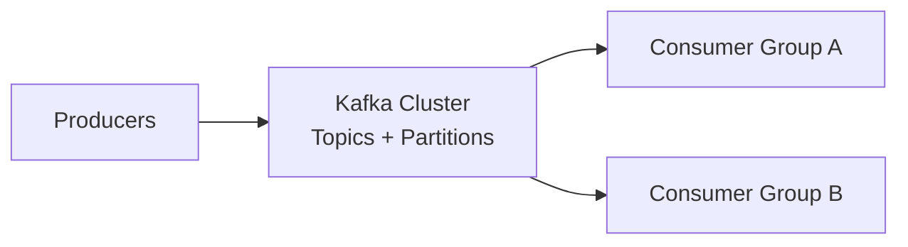
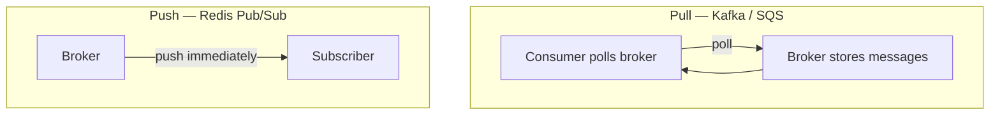
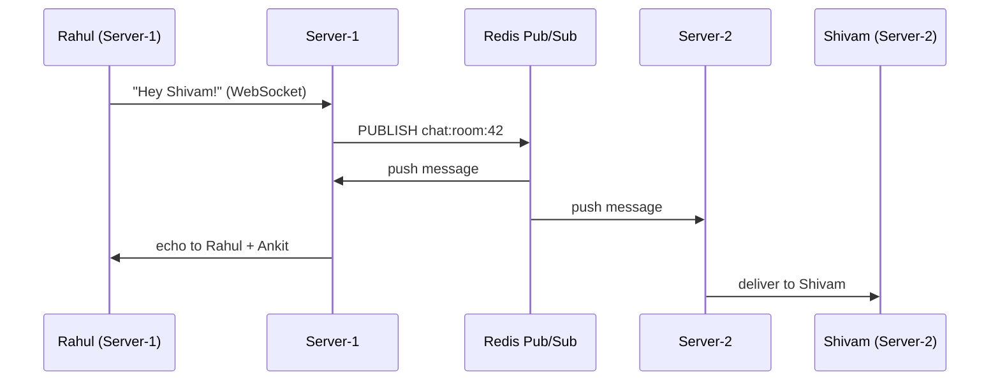
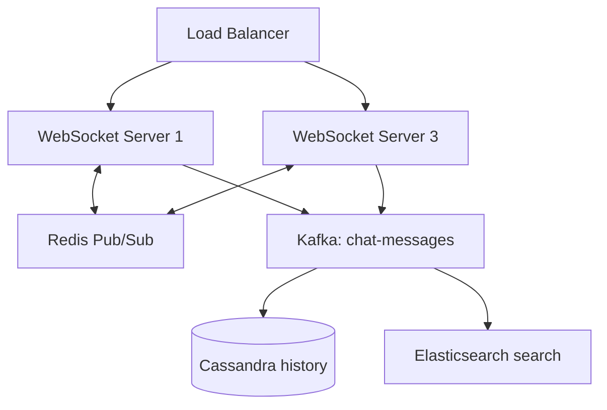

# System Design — Detailed Personal Notes (Chapter 7)

**Topics:** Kafka Internals (Brokers, Topics, Partitions, Consumer Groups, Offsets), Redis Pub/Sub, WebSockets, Pull vs Push

These notes continue from [Chapter 6 — Blob Storage, CDN & Message Brokers](Part6.md). Every concept is explained from first principles with real-world analogies, diagrams, and worked examples.

**Previous ←** [Chapter 6: Blob Storage, CDN & Message Brokers](Part6.md)

---

## Table of Contents

| Section | Topic | Key Ideas |
|---------|-------|-----------|
| **1** | Kafka internals | Brokers, topics, partitions, keys, consumer groups, offsets |
| **2** | Uber location case | High write throughput, batching to PostgreSQL, Redis hot path |
| **3** | Pub/Sub & WebSockets | Push vs pull, Redis channels, cross-server chat |
| **4** | Choosing tools | Pub/Sub vs Kafka, WhatsApp-style architecture |

---

# PART 1: KAFKA INTERNALS — The Complete Deep Dive

## Understanding Kafka's Architecture From First Principles

Kafka was created at LinkedIn in 2011 to process activity data (page views, searches, clicks, likes) at a scale no existing message queue could handle — billions of events per day.

The design — append-only logs, partitions, consumer groups, offset-based consumption — all flow from one requirement: **handle enormous throughput while allowing multiple independent consumers to process the same data.**



---

## Brokers — The Kafka Servers

A Kafka **broker** is a server that stores messages and serves them to consumers. Production always uses a **cluster** of brokers.

```
KAFKA CLUSTER (3 brokers):

┌───────────────────────────────────────────────────┐
│                   Kafka Cluster                   │
│  ┌─────────────┐  ┌─────────────┐  ┌─────────────┐ │
│  │  Broker 1   │  │  Broker 2   │  │  Broker 3   │ │
│  │ (Leader for │  │ (Leader for │  │ (Leader for│ │
│  │  some parts)│  │  some parts)│  │ some parts) │ │
│  └─────────────┘  └─────────────┘  └─────────────┘ │
└───────────────────────────────────────────────────┘

WHY MULTIPLE BROKERS?

1. Replication: partition data copied across brokers — Broker 1 dies, Broker 2 has copy
2. Parallelism: different brokers serve different partitions simultaneously
3. Fault tolerance: one broker down, cluster keeps working
```

| Kafka | Database analogy |
|-------|------------------|
| Broker | Database server |
| Topic | Table |
| Message | Row |
| Offset | Row ID (immutable, sequential per partition) |

---

## Topics — The Logical Categories

A **topic** is a named channel. Producers write to topics. Consumers read from topics.

```
Ride-sharing app topics:

Topic: "driver-location-updates"
  Producer: Driver mobile app via backend
  Consumers: Real-time map, ETA calculator

Topic: "ride-requests"
  Producer: User app
  Consumer: Ride matching service

Topic: "payment-events"
  Producer: Payment service
  Consumers: Finance reporting, fraud detection, notifications

Topic: "driver-trip-completed"
  Producer: Driver app
  Consumers: Payment service, rating service

Example message in "driver-location-updates":
{
  "driver_id": "drv_456",
  "latitude": 28.6139,
  "longitude": 77.2090,
  "timestamp": 1710000000,
  "speed_kmh": 42,
  "heading": 270
}
```

---

## The Uber Location Problem — Why Kafka's Throughput Matters

```
SCENARIO:
  500,000 active drivers
  Each sends GPS update every 2 seconds

WRITES PER SECOND:
  500,000 / 2 = 250,000 writes/sec
  Per hour: 900 million writes

POSTGRESQL DIRECTLY:
  Strong server: ~10,000–50,000 writes/sec max
  Required: 250,000/sec → saturated and crashing

Each PG write: disk I/O, index update, WAL, replication

KAFKA:
  Designed for sequential append-only writes
  No index updates per message
  Millions of writes/sec on a 3-broker cluster
  250,000/sec: comfortable
```

**Batching strategy:**

```
Producer: every driver update → append to Kafka immediately

Consumer (PostgreSQL path): batch every 10 minutes
  10 min × 250,000/sec × 60 = 150 million points
  But you only need LATEST location per driver

Consumer logic:
  1. Read 10 minutes of Kafka messages
  2. Per driver, keep only most recent location
  3. UPSERT ~500,000 rows into PostgreSQL
  4. ~833 writes/sec to PG — completely fine

REFINED real-time map approach:
  Hot path:  Kafka → Consumer → Redis (sub-ms, live map)
  Cold path: Kafka → Consumer batch → PostgreSQL (history, analytics)

  Map reads Redis. Analytics reads PostgreSQL.
  Same Kafka stream. Two consumer groups. One write.
```

---

## Partitions — Kafka's Parallelism Engine

Without partitions, a topic is one file on one broker — only one consumer reads at a time.

### What a Partition Actually Is

A partition is a physically separate, **ordered, immutable** sequence of records on disk — a log file.

```
Topic: "driver-location-updates" with 4 partitions:

PARTITION 0 (Broker 1):
  Offset 0: {driver: "drv_001", lat: 28.61, lng: 77.20, time: 1000}
  Offset 1: {driver: "drv_002", lat: 19.07, lng: 72.87, time: 1001}
  Offset 2: {driver: "drv_001", lat: 28.62, lng: 77.21, time: 1002}
  ...

PARTITION 1 (Broker 2):
  Offset 0: {driver: "drv_003", ...}
  ...

KEY PROPERTIES:
  - Ordering GUARANTEED within a partition
  - NO ordering guarantee across partitions
  - Each partition on one broker (replicated to others)
  - One partition read by at most ONE consumer per consumer group
```

### How Producers Choose a Partition

```
STRATEGY 1: Round Robin (no message key)
  Message 1 → P0, Message 2 → P1, Message 3 → P2, Message 4 → P3, ...
  Use when: even distribution, ordering doesn't matter
  Problem: same driver's updates can land in different partitions → out of order

STRATEGY 2: Key-Based Partitioning (recommended for entity ordering)
  partition = HASH(message_key) % num_partitions

  Key = driver_id:
  HASH("drv_001") % 4 = 0 → ALL drv_001 updates → Partition 0
  HASH("drv_002") % 4 = 1 → ALL drv_002 updates → Partition 1

  Use when: "all updates for driver X must stay in order"

STRATEGY 3: Custom Partitioner
  Your code picks partition by business logic
  Example: partition by geography (North/South/East/West India)
```

---

## Consumer Groups — Parallelism and Fan-Out

Consumer groups serve **two** purposes.

### Purpose 1: Parallel Processing Within One Group

Topic with 4 partitions, 3 consumers in group `"email-workers"`:

```
Kafka assigns partitions:
  Consumer-1 → Partition-0
  Consumer-2 → Partition-1 AND Partition-2
  Consumer-3 → Partition-3

Each consumer owns its partitions exclusively.
Horizontal scaling: 3 consumers ≈ 3× throughput.

WHY can't two consumers in the SAME group read the same partition?

  Same message would be processed twice.
  "Send welcome email to rahul@gmail.com"
  Consumer-1 sends it. Consumer-2 sends it again. Duplicate.

Kafka assigns each partition to at most one consumer per group.
```

**More consumers than partitions:**

```
4 partitions, 5 consumers in same group:

  Consumer-1 → P0
  Consumer-2 → P1
  Consumer-3 → P2
  Consumer-4 → P3
  Consumer-5 → IDLE (no partition)

RULE: Active consumers ≤ partitions in a group.

LESSON: Need N parallel workers → create at least N partitions upfront.
        (Adding partitions later changes HASH % N — affects key ordering)
```

### Kafka Rebalancing

Rebalancing reassigns partitions when group membership changes.

```
TRIGGER 1: New consumer joins
  All consumers pause briefly ("stop the world") during reassignment
  Kafka 2.4+ cooperative rebalancing: unaffected consumers keep consuming

TRIGGER 2: Consumer crashes or leaves
  Partitions redistributed to remaining consumers
  Resume from last committed offset — no message loss

TRIGGER 3: Session timeout (no heartbeat in session.timeout.ms, default 10s)
  Kafka assumes consumer dead → rebalance
```

### Purpose 2: Fan-Out Across Different Consumer Groups

Different groups have **independent offset pointers**. Messages are not deleted when read.

```
TOPIC: "video-process" — message {video_id: 789, s3_url: "...", duration: "10min"}

GROUP 1: "video-transcoder-group" (4 consumers)
  Reads all partitions, transcodes to 360p–4K, uploads to S3
  Offset on P0 might be 1000

GROUP 2: "caption-generator-group" (2 consumers)
  Completely separate offsets
  Runs speech-to-text, generates .srt
  Offset on P0 might be 500 (slower — that's fine)

GROUP 3: "thumbnail-generator-group" (new)
  Starts from offset 0 or "latest" depending on config
  Reads ALL historical messages if from 0
  Transcoder group unaffected

One write. Many consumer groups. Write once, read by many.
```

### Offset Management

Each group commits a **bookmark** per partition — stored in Kafka's internal topic `__consumer_offsets`.

```
GROUP "caption-generator-group":
  P0: committed offset = 47  (processed 0–46)
  P1: committed offset = 51
  P2: committed offset = 43
  P3: committed offset = 49

CONSUMER CRASH at offset 50 (not yet committed):
  Last committed = 47
  New consumer starts from 47
  Reprocesses 47, 48, 49, 50 → at-least-once delivery
  Consumer code must be IDEMPOTENT

AUTO-COMMIT (default):
  Every auto.commit.interval.ms (5s), offset advances automatically
  Risk: message fetched but not processed → offset advances → message "lost"

MANUAL COMMIT (recommended):
  transcodeVideo(message);
  uploadToS3(result);
  consumer.commitSync();  // only after success
```

---

# PART 2: REAL-TIME PUB/SUB — Push vs Pull

## The Core Difference



```
KAFKA / MESSAGE QUEUE (Pull):
  while True:
      messages = consumer.poll(timeout=1000ms)
      for msg in messages: process(msg)
      consumer.commitSync()

  Consumer pulls at its own pace
  Slow consumer → messages pile up in broker
  Messages retained until TTL or ack

REDIS PUB/SUB (Push):
  Broker pushes to subscribers the moment message arrives
  Subscriber not connected → message LOST (not stored)

Trade-off:
  Pub/Sub: ultra-low latency, no persistence
  Kafka:   reliable delivery, retained log
```

---

## Redis Pub/Sub

```
PUBLISHER:
  PUBLISH chat:room:42 '{"from": "rahul", "text": "Hello!", "time": 1710000000}'
  Returns: number of subscribers who received it NOW
  Zero subscribers → returns 0. Message gone forever.

SUBSCRIBER:
  SUBSCRIBE chat:room:42
  Connection enters subscribe mode — waits for pushes

PATTERN SUBSCRIBE:
  PSUBSCRIBE chat:room:*
  Receives all chat:room:1, chat:room:2, ...
```

---

## WebSockets + Redis Pub/Sub — Real-Time Chat

### Why Chat Needs WebSockets

```
HTTP POLLING (bad):
  Client asks every second: "Any messages?"
  1M users = 1M requests/sec even when idle
  Average ~500ms delay
  Wasteful connection churn

WEBSOCKET (correct):
  One persistent bidirectional connection
  Server pushes instantly when message arrives
  Client sends without new HTTP handshake
```

### The Horizontal Scaling Problem

```
Room #42:
  Rahul  → WebSocket on Server-1
  Ankit  → WebSocket on Server-1
  Shivam → WebSocket on Server-2

Rahul sends "Hey Shivam!" to Server-1
Server-1 only knows its own connections (Rahul, Ankit)
Shivam is on Server-2 — Server-1 cannot push to him
Message never reaches Shivam. Chat broken.
```

### Redis Pub/Sub as Cross-Server Bus



```
Both Server-1 and Server-2 SUBSCRIBE to "chat:room:42"

Rahul sends message:
  1. Client-1 → Server-1 (WebSocket)
  2. Server-1 → PUBLISH chat:room:42
  3. Redis pushes to ALL subscribed servers
  4. Server-1 → WebSocket to Rahul + Ankit
  5. Server-2 → WebSocket to Shivam

Add Server-3, Server-4 — all subscribe. All deliver to their clients.
Scales horizontally.
```

### Complete Code Architecture

```javascript
const WebSocket = require('ws');
const Redis = require('ioredis');

// Two connections: subscriber mode blocks other commands
const redisPublisher = new Redis();
const redisSubscriber = new Redis();

const roomConnections = new Map(); // channel → Set of WebSockets

wss.on('connection', (ws) => {
    ws.on('message', async (rawMessage) => {
        const message = JSON.parse(rawMessage);

        if (message.type === 'join_room') {
            const roomChannel = `chat:room:${message.roomId}`;
            if (!roomConnections.has(roomChannel)) {
                roomConnections.set(roomChannel, new Set());
                redisSubscriber.subscribe(roomChannel);
            }
            roomConnections.get(roomChannel).add(ws);
            ws.currentRoom = roomChannel;
        }

        if (message.type === 'chat_message') {
            const payload = JSON.stringify({
                from: message.userId,
                text: message.text,
                time: Date.now(),
                room: message.roomId
            });
            await redisPublisher.publish(`chat:room:${message.roomId}`, payload);
            await database.messages.insert({ /* ... */ });
        }
    });

    ws.on('close', () => {
        if (ws.currentRoom && roomConnections.has(ws.currentRoom)) {
            roomConnections.get(ws.currentRoom).delete(ws);
        }
    });
});

redisSubscriber.on('message', (channel, message) => {
    const connections = roomConnections.get(channel) || new Set();
    connections.forEach((clientWs) => {
        if (clientWs.readyState === WebSocket.OPEN) {
            clientWs.send(message);
        }
    });
});
```

---

# PART 3: CHOOSING THE RIGHT TOOL

## Pub/Sub vs Kafka

| Dimension | Redis Pub/Sub | Kafka |
|-----------|---------------|-------|
| **Storage** | No — fire and forget | Yes — retained days/weeks |
| **Consumer offline** | Message lost | Message waits in log |
| **Latency** | Sub-millisecond | Low milliseconds |
| **Replay** | Not possible | Yes — from any offset |
| **Model** | Push to subscribers | Pull (poll) |
| **Delivery** | At-most-once | At-least-once (with ack) |
| **Throughput** | Very high (in-memory) | Extremely high (millions/sec) |
| **Best for** | Live chat, scores, notifications | Pipelines, audit log, event bus |

### Decision Framework

```
Q: "What if consumer is offline when message arrives?"

  "Fine to miss it — real-time or nothing"
    → Redis Pub/Sub
    Example: live sports tick updates

  "Must eventually process — losing it is unacceptable"
    → Kafka or message queue
    Example: payment confirmation email

Q: "Need to reprocess old messages?"

  "Yes — new service or bug fix replay"
    → Kafka (start from offset 0, replay retention window)

  "No — only care about now"
    → Pub/Sub or non-replayable queue
```

---

## A Complete Real-World System — WhatsApp-Style Chat



```
INFRASTRUCTURE:
  - Load Balancer (WebSocket connections)
  - 5 WebSocket servers
  - Redis Pub/Sub per room channel
  - Kafka topic "chat-messages"
  - PostgreSQL / Cassandra for history
  - Elasticsearch for search

Rahul (Delhi) → Load Balancer → Server-1 → joins room 42
Shivam (Mumbai) → Load Balancer → Server-3 → joins room 42

Rahul sends: "Kya haal hai bhai?"

  Step 1: WebSocket → Server-1

  Step 2: Server-1 simultaneously:
    a) PUBLISH Redis "chat:room:42"     (real-time)
    b) PRODUCE Kafka "chat-messages"    (durable)

  Step 3a — Redis path (~5ms):
    Redis → all servers subscribed to room 42
    Server-1 → Rahul's socket
    Server-3 → Shivam's socket

  Step 3b — Kafka path:
    Persisted to disk
    Consumer "persistence" → Cassandra
    Consumer "search-indexer" → Elasticsearch
    Consumer "notification" → push if Shivam offline

Shivam offline 2 hours, then opens app:
  GET /api/chat/room/42/messages → Cassandra history
  WebSocket reconnects for new messages

WHY BOTH?

Redis Pub/Sub: speed — deliver to everyone connected RIGHT NOW
Kafka:         reliability — persist, fan-out, replay, notifications

Redis handles speed. Kafka handles durability.
Different tools. Different strengths. Together.
```

---

## Quick Reference — Chapter 7

| Concept | One-line summary |
|---------|------------------|
| Broker | Kafka server — cluster for replication and parallelism |
| Topic | Named channel — logical category of events |
| Partition | Ordered log shard — parallelism + per-key ordering |
| Message key | HASH(key) % N — keeps one entity's events in order |
| Consumer group | Competing workers share partitions — one reader per partition |
| Fan-out | Different groups = independent offsets on same topic |
| Rebalance | Partition reassignment when consumers join/leave |
| Offset | Bookmark per partition — at-least-once needs idempotent handlers |
| Pull vs push | Kafka pulls and retains; Pub/Sub pushes and forgets |
| Redis Pub/Sub | Cross-server WebSocket fan-out for chat |
| Kafka + Redis | Kafka for durable pipeline; Redis for live delivery |

**Previous ←** [Chapter 6: Blob Storage, CDN & Message Brokers](Part6.md)
