# SOLID Principles — Design Notes

> **Work in progress:** These notes are **not complete yet**. More principles (I — Interface Segregation, D — Dependency Inversion), examples, and revisions are coming. Treat this as a living document that will be updated as lecture material is added.

These notes explain **why** each SOLID principle exists, using the lecture’s class-diagram examples. Each section shows a **bad design**, the **problem**, and a **better design** you can substitute in interviews and low-level design docs.

---

## Table of Contents

| Principle | One-line idea |
|-----------|----------------|
| [S — Single Responsibility](#s--single-responsibility-principle-srp) | One class, one reason to change |
| [O — Open/Closed](#o--open-closed-principle-ocp) | Extend behavior without editing existing code |
| [L — Liskov Substitution](#l--liskov-substitution-principle-lsp) | Subtypes must honor the parent’s contract |
| ↳ [Four rules of LSP](#the-four-rules-of-lsp) | Signature, return type, exception, property |
| ↳ [Account hierarchy example](#design-example--account-hierarchy) | Split withdrawable vs non-withdrawable |
| ↳ [LSP checklist](#lsp-checklist-before-using-inheritance) | Questions before choosing inheritance |
| [Visual revision](#visual-revision) | All three at a glance |

---

# S — Single Responsibility Principle (SRP)

### Definition

> **A class should have only one reason to change.**

> **A class should do only one thing.**

A *reason to change* = a stakeholder or area of the system (UI, business rules, database, reporting). If two unrelated changes both force edits to the same class, SRP is violated.

---

## Bad Design

```text
ShoppingCart
│
├── calculateTotalPrice()
├── printInvoice()
└── saveToDB()

ShoppingCart ----> Product
                  (name, price)
```

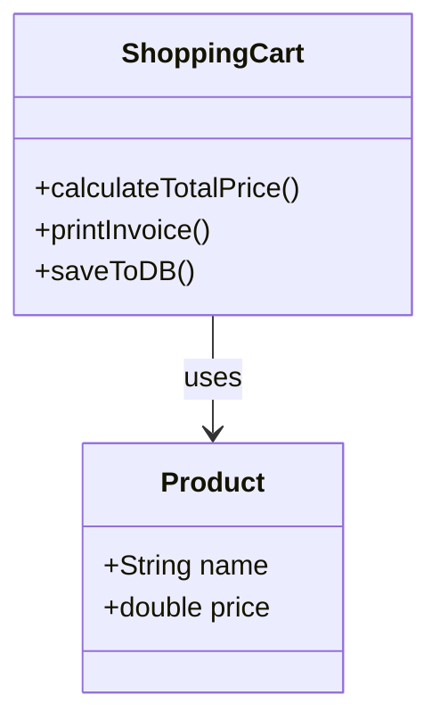

### Problem

The `ShoppingCart` class has **multiple responsibilities**:

| Responsibility | Method | What changes force edits here |
|----------------|--------|------------------------------|
| Business logic | `calculateTotalPrice()` | Pricing rules, discounts, tax |
| Presentation | `printInvoice()` | Invoice layout, PDF vs console |
| Persistence | `saveToDB()` | SQL → Mongo, schema, connection |

Changes in **any** of these areas modify the same class → harder to test, review, and deploy independently.

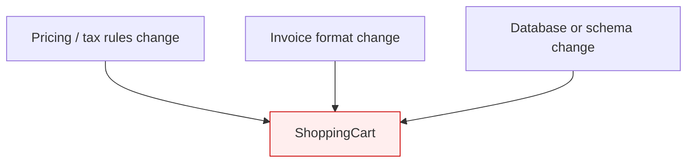

---

## Better Design

```text
Product
│
├── name
└── price

        1..*
          │
          ▼

ShoppingCart
│
└── calculateTotalPrice()

InvoicePrinter
│
└── printInvoice()

DBStorage
│
└── saveToDB()
```

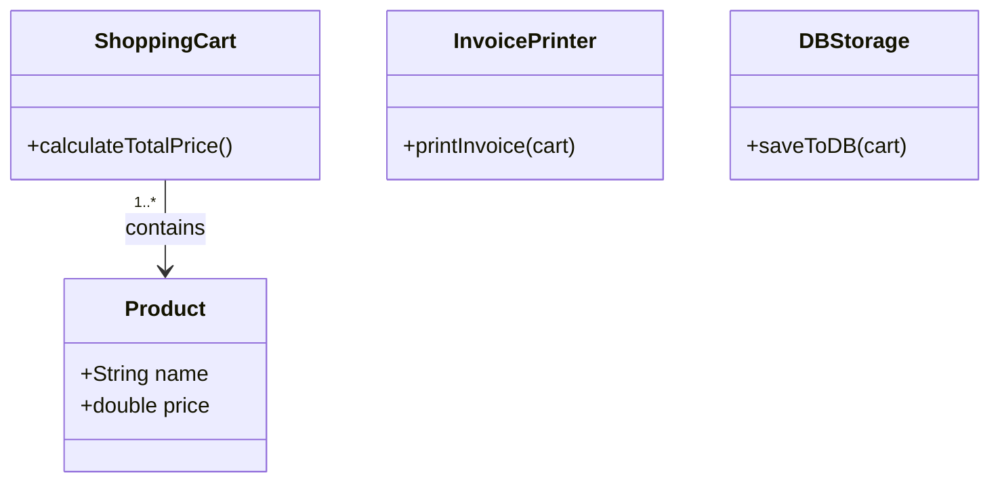

### Responsibilities

```text
ShoppingCart      → Cart calculations only
InvoicePrinter    → Invoice generation / output only
DBStorage         → Data persistence only
```

Each class now has **one reason to change**.

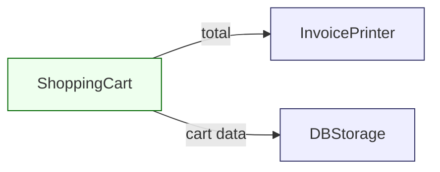

---

# O — Open Closed Principle (OCP)

### Definition

> **Software entities should be open for extension but closed for modification.**

You should add new behavior by **adding** new code (new classes, new plugins), not by **changing** code that already works and is tested.

---

## Bad Design

```text
DBStorage
│
└── saveToDB()
```

Later requirements:

```text
saveToSQL()
saveToMongo()
saveToFile()
```

Every new storage type means opening `DBStorage` and adding another method or another `if/else` branch.

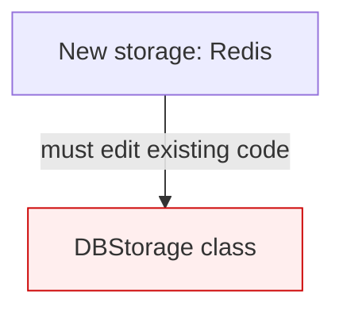

This violates OCP — existing callers and tests are touched for every new backend.

---

## Better Design

### Create abstraction

```text
<<abstract>>
DBPersistence
│
└── save()
```

### Implementations

```text
               DBPersistence
                     │
      ┌──────────────┼──────────────┐
      │              │              │
      ▼              ▼              ▼

 SaveToSQL      SaveToMongoDB    SaveToFile
     │                │              │
   save()           save()         save()
```

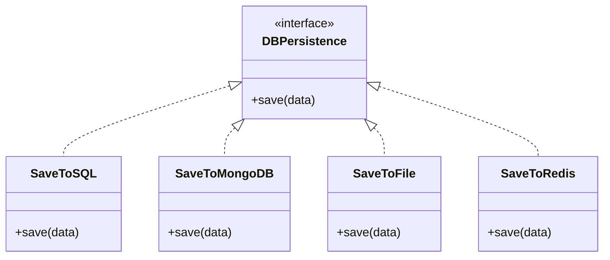

---

## Usage

```text
Cart
 │
 ▼
DBPersistence   ← depends on abstraction, not concrete SQL/Mongo
 │
 ├── SaveToSQL
 ├── SaveToMongoDB
 └── SaveToFile
```

Adding **Redis** later:

```text
SaveToRedis
    │
   save()
```

- No change to `SaveToSQL`, `SaveToMongoDB`, or `SaveToFile`
- Cart (or a factory) wires in `SaveToRedis` as another implementation
- **Extension only** — OCP satisfied

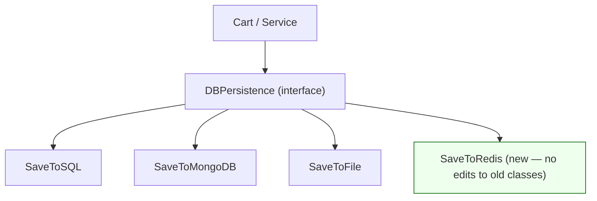

---

# L — Liskov Substitution Principle (LSP)

### Definition

> If class `B` is a subtype (child) of class `A` (parent), then objects of `A` should be replaceable with objects of `B` without affecting the correctness of the program.

In simple words:

- The client should not need to know whether it is working with a parent or a child.
- A child class must honor the **behavior and contract** defined by the parent.
- Inheritance should represent a true **"is-a"** relationship — not just sharing code.

> **One-line summary:** A derived class must completely replace its base class without surprising the client or changing program correctness.

---

## Generic structure

```text
Client
  │
  ▼

Base Class (A)
      ▲
      │
      │
Sub Class (B)
```

If:

```text
A* obj = new B();
```

then all behavior **promised by `A`** must work correctly on `B`.

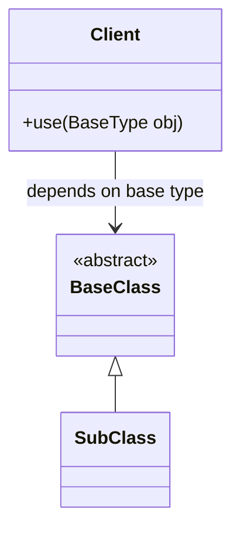

---

## The four rules of LSP

Formal rules that must hold when you use inheritance. Violating any of them breaks substitutability.

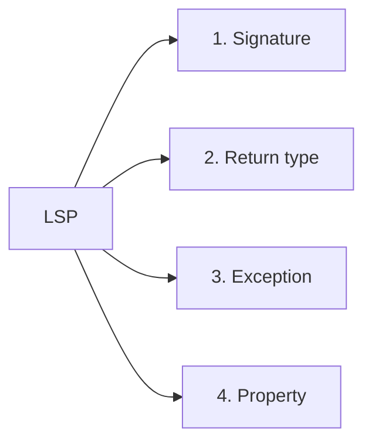

| Rule | Meaning |
|------|---------|
| **Signature** | Child keeps compatible method signatures |
| **Return type** | Child returns same or more specific (covariant) type |
| **Exception** | Child does not throw broader or unexpected exceptions |
| **Property** | Child preserves invariants and history constraints |

---

### 1. Signature rule

When overriding a method in a child:

- Method name stays the same.
- Parameter list stays compatible.
- Child cannot require **more restrictive or different** parameters than the parent.

**Correct:**

```cpp
class Parent {
public:
    virtual void solve(string s) {}
};

class Child : public Parent {
public:
    void solve(string s) override {}
};
```

```cpp
Parent* p = new Child();
p->solve("Hello");   // works — same contract
```

**Wrong:**

```cpp
class Parent {
public:
    virtual void solve(string s) {}
};

class Child : public Parent {
public:
    void solve(int x) {}   // different signature — not a valid override
};
```

```cpp
Parent* p = new Child();
p->solve("Hello");   // client expects string — breaks substitutability
```

**Key idea:** A child must not change the method contract the client relies on.

---

### 2. Return type rule

The child should return:

- The **same** return type, or
- A **more specific (covariant)** return type.

The client must still use the result as the parent promised.

**Parent:**

```cpp
class Animal {};

class Parent {
public:
    virtual Animal* random() {
        return new Animal();
    }
};
```

**Child:**

```cpp
class Dog : public Animal {};

class Child : public Parent {
public:
    Dog* random() override {
        return new Dog();
    }
};
```

**Client:**

```cpp
Parent* p = new Child();
Animal* a = p->random();   // OK: Dog* → Animal*
```

The client asked for an `Animal`. Receiving a `Dog` is fine because a Dog **is an** Animal.

**Key idea:** Child can be **more specific**, not incompatible.

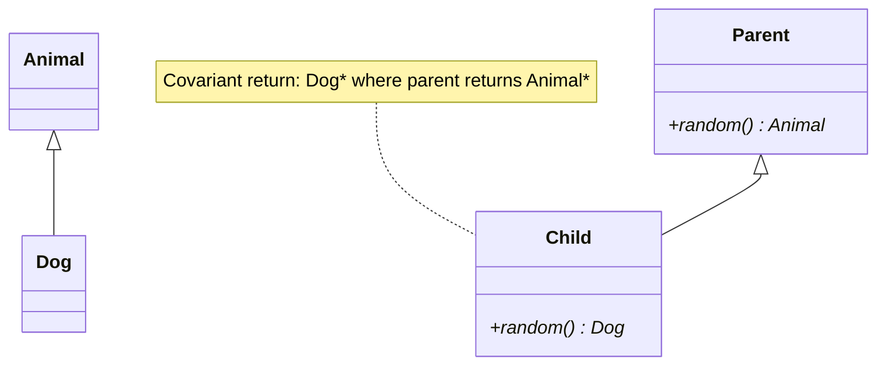

---

### 3. Exception rule

A child must not throw **broader or unexpected** exceptions compared to the parent. The client depends on the exception contract the parent declares.

**Parent:**

```cpp
class Parent {
public:
    virtual void m1() {
        throw std::out_of_range("error");
    }
};
```

**Child (violates LSP):**

```cpp
class Child : public Parent {
public:
    void m1() override {
        throw std::logic_error("error");
    }
};
```

**Client:**

```cpp
Parent* p = new Child();
try {
    p->m1();
} catch (std::out_of_range&) {
    // handle — never runs; child threw logic_error instead
}
```

Client expects `std::out_of_range`. Child throws `std::logic_error`. Catch block may never run → **LSP violated**.

**Exception hierarchy (C++):**

```text
Logic errors (often detectable before/during design):

std::logic_error
├── std::invalid_argument
├── std::domain_error
├── std::length_error
└── std::out_of_range

Runtime errors (during execution):

std::runtime_error
├── std::range_error
├── std::overflow_error
└── std::underflow_error
```

**LSP guideline:**

| Allowed | Not allowed |
|---------|-------------|
| Same exception as parent | Completely different, unexpected exception |
| More **specific** exception than parent | Broader exception client does not catch |

---

### 4. Property rule

The child must preserve important properties of the parent. Two major ideas:

1. **Class invariant** — condition that must always stay true for the object.
2. **History constraint** — child must not allow state changes the parent never allowed.

#### A. Class invariant

**Example — bank account:**

```cpp
class BankAccount {
protected:
    double balance;

public:
    virtual void withdraw(double amount) {
        if (balance - amount < 0)
            throw exception();
        balance -= amount;
    }
};
```

**Invariant:** `balance >= 0` must always hold.

**Wrong child:**

```cpp
class ChildAccount : public BankAccount {
public:
    void withdraw(double amount) override {
        balance -= amount;   // no check — balance can go negative
    }
};
```

Child breaks the invariant → **LSP violated**.

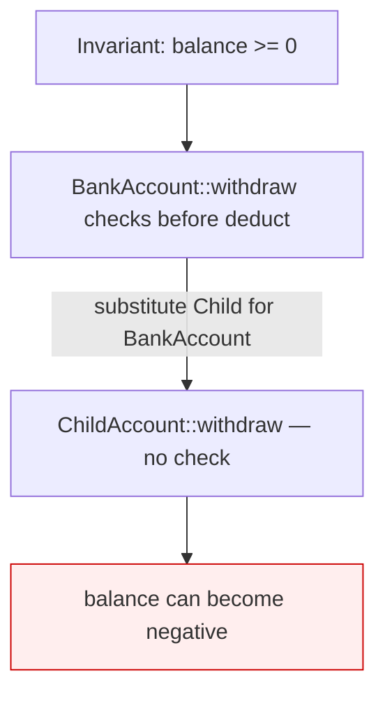

#### B. History constraint

**Parent — read-only file:**

```cpp
class ReadOnlyFile {
public:
    virtual string read() {
        return data;
    }
};
```

Object is read-only by contract.

**Wrong child:**

```cpp
class EditableFile : public ReadOnlyFile {
public:
    void write(string s) {
        data = s;
    }
};
```

A supposedly read-only file becomes mutable. Client expecting read-only behavior can break → **history constraint violated**.

**Fix:** Do not inherit `ReadOnlyFile` for editable files. Use separate types or composition (`ReadOnlyFile` vs `ReadWriteFile`).

---

## Design example — account hierarchy

The account example applies **property rule** and **behavioral contract** at the design level — same lesson as formal rules, different diagram.

### Bad design

```text
                <<abstract>>
                    Account
                ┌────────────┐
                │ deposit()  │
                │ withdraw() │
                └────────────┘

                  ▲    ▲    ▲
                  │    │    │

        Savings  Current  FixedDeposit
```

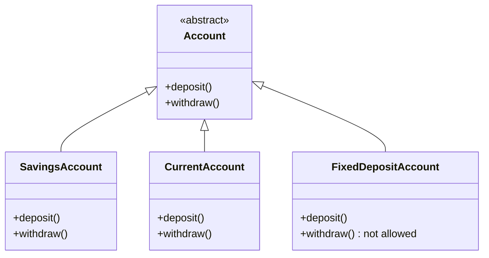

### Problem

```text
SavingsAccount
    ├── deposit()
    └── withdraw()

CurrentAccount
    ├── deposit()
    └── withdraw()

FixedDepositAccount
    ├── deposit()
    └── withdraw()   ← not valid for fixed deposit
```

`withdraw()` is not valid for a fixed deposit. A common (bad) fix:

```text
withdraw()
    -> throws exception
```

Then client code breaks:

```text
Account* acc = new FixedDepositAccount();
acc->withdraw();   // runtime failure — violates caller's expectation
```

The client trusted **any** `Account` to support `withdraw()`. `FixedDepositAccount` breaks that contract → **LSP violated**.

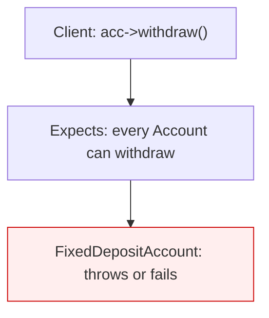

---

## Good design — split by behavior

Do not force one parent to expose operations that only some children support. **Split the hierarchy by capability.**

### Step 1 — non-withdrawable branch

```text
<<abstract>>
NonWithdrawableAccount
│
└── deposit()
```

### Step 2 — withdrawable branch

```text
<<abstract>>
WithdrawableAccount
│
├── deposit()
└── withdraw()
```

### Inheritance

```text
            NonWithdrawableAccount
                      ▲
                      │
              FixedDepositAccount


            WithdrawableAccount
                   ▲       ▲
                   │       │

           SavingsAcc   CurrentAcc
```

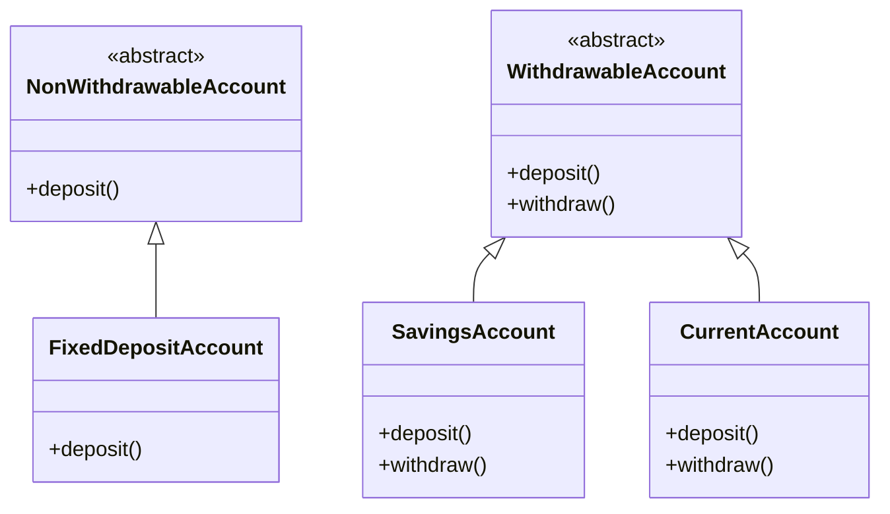

---

## Final structure — client usage

```text
Client
│
├── List<WithdrawableAccount>
│      ├── SavingsAccount
│      └── CurrentAccount
│
└── List<NonWithdrawableAccount>
       └── FixedDepositAccount
```

- Code that must call `withdraw()` only holds `WithdrawableAccount`
- Fixed deposits never appear where `withdraw()` is expected
- Every subclass supports **everything** its parent promises → **LSP satisfied**

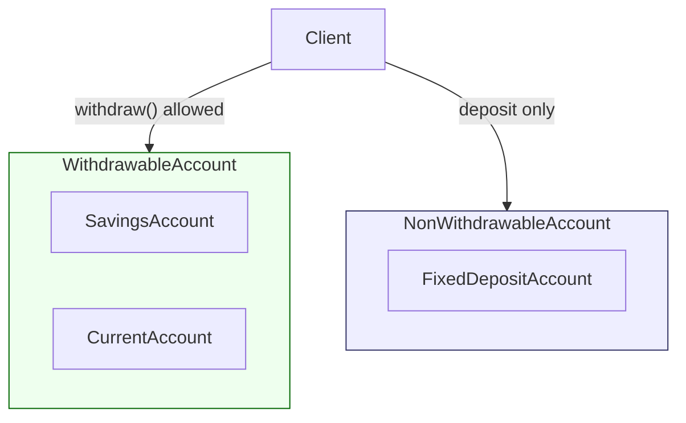

---

## LSP checklist before using inheritance

Before inheriting `B` from `A`, ask:

- Can the child be used **anywhere** the parent is expected?
- Does the child preserve **all** parent behaviors?
- Are method **signatures** compatible? (Signature rule)
- Are **return types** compatible or covariant? (Return type rule)
- Are **exception** guarantees preserved? (Exception rule)
- Are **invariants** maintained? (Property rule — class invariant)
- Does object **state** evolve according to parent rules? (Property rule — history constraint)

If any answer is **No**, inheritance is likely wrong — consider **composition** or a **split hierarchy** instead.

---

# Visual revision

Quick reference — same shapes as the lecture diagrams.

```text
SRP
----
ShoppingCart
 └─ calculateTotalPrice()

InvoicePrinter
 └─ printInvoice()

DBStorage
 └─ saveToDB()


OCP
----
DBPersistence
 ├─ SaveToSQL
 ├─ SaveToMongoDB
 └─ SaveToFile
 (+ SaveToRedis — extend without modifying above)


LSP (design)
----
WithdrawableAccount
 ├─ SavingsAccount
 └─ CurrentAccount

NonWithdrawableAccount
 └─ FixedDepositAccount

LSP (four rules)
----
1. Signature   — same compatible parameters
2. Return type — same or covariant (Dog* → Animal*)
3. Exception   — same or more specific, not unexpected
4. Property    — invariants + history constraint
```

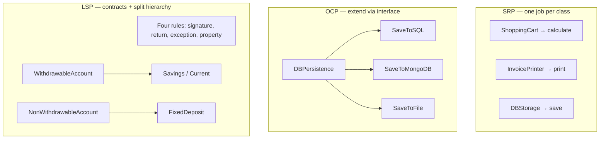

---

## How the three connect (interview tip)

| Principle | Question it answers |
|-----------|---------------------|
| **SRP** | “Who is allowed to change this class?” → One concern only |
| **OCP** | “How do we add features without breaking old code?” → Abstractions + new implementations |
| **LSP** | “Can I safely use a subtype wherever I use the base type?” → Match contracts: signatures, returns, exceptions, invariants |

**Related notes:** [System Design Fundamentals — Part 1](../Complete%20Fundamentals%20Notes/Part1.md) (architecture and modules at system level).

---

## Status & upcoming updates

| Planned | Status |
|---------|--------|
| S — Single Responsibility | Done (lecture example) |
| O — Open/Closed | Done (lecture example) |
| L — Liskov Substitution | Done (rules + account example) |
| I — Interface Segregation | Coming soon |
| D — Dependency Inversion | Coming soon |
| More code examples (Java/TypeScript) | Coming soon |
| ISP/DIP class diagrams | Coming soon |

*Last expanded: LSP four rules + account hierarchy. Check back for ISP and DIP.*
