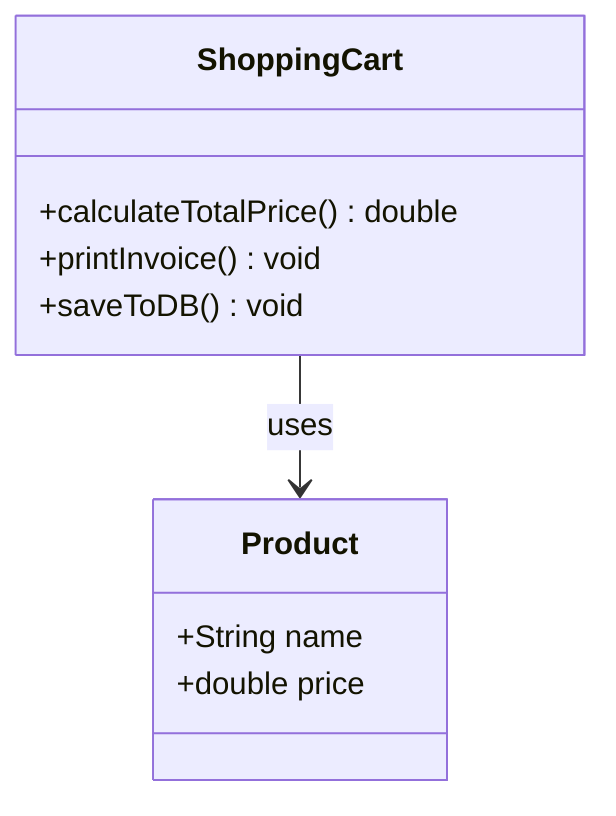
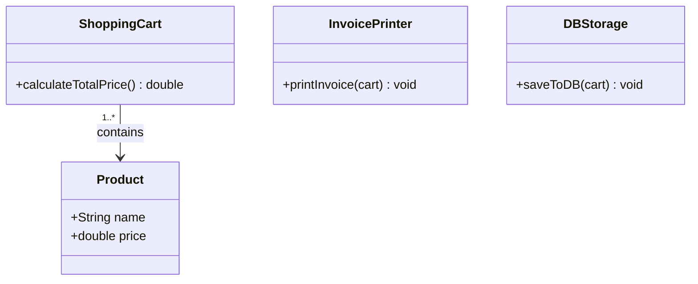
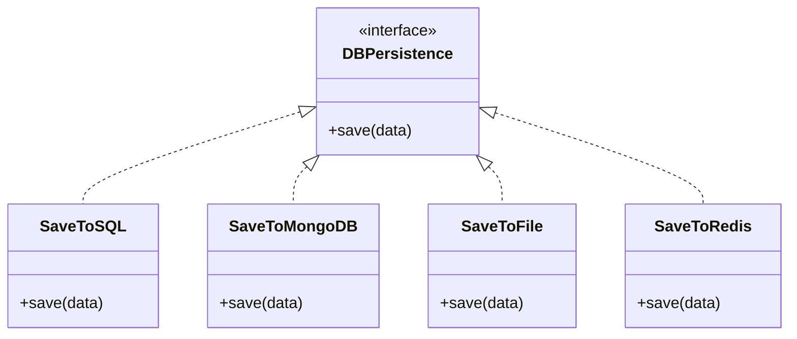
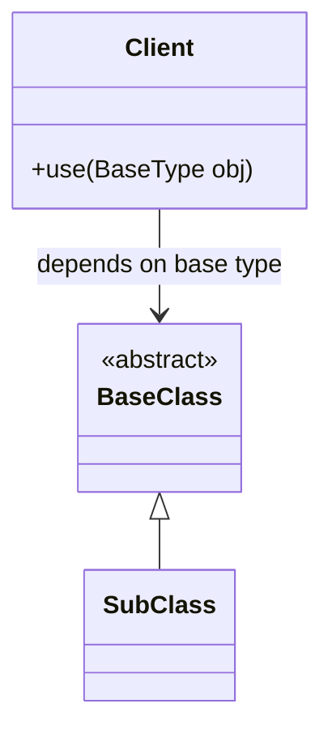

# SOLID Principles — Design Notes

> **Audience:** Software Engineers, Architects, and Interview Candidates  
> **Perspective:** Professional, third-person, comprehensive, and highly practical.  

These notes explain **why** each SOLID principle exists, using class-diagram examples. Each section shows a **bad design**, the **problem**, and a **better design** you can substitute in interviews and low-level design docs. They also explore the theoretical underpinnings, mechanical rules, and practical trade-offs of Object-Oriented Design.

---

## Table of Contents

| Principle | One-line idea |
|-----------|----------------|
| [S — Single Responsibility](#s--single-responsibility-principle-srp) | One class, one reason to change |
| [O — Open/Closed](#o--open-closed-principle-ocp) | Extend behavior without editing existing code |
| [L — Liskov Substitution](#l--liskov-substitution-principle-lsp) | Subtypes must honor the parent’s contract |
| [I — Interface Segregation](#i--interface-segregation-principle-isp) | Don't force clients to depend on things they don't use |
| [D — Dependency Inversion](#d--dependency-inversion-principle-dip) | Depend on abstractions, not concretions |
| [Final Thoughts & Trade-Offs](#final-thoughts--trade-offs) | SOLID as guidelines, not laws |

---

# S — Single Responsibility Principle (SRP)

### Definition

> **A class should have only one reason to change.**

> **A class should do only one thing.**

A *reason to change* corresponds to a stakeholder or area of the system (e.g., UI, business rules, database, reporting). If two unrelated changes both force edits to the same class, SRP is violated.

---

## Bad Design

```text
ShoppingCart
│
├── calculateTotalPrice()
├── printInvoice()
└── saveToDB()

ShoppingCart ----> Product
                  (name, price)
```



### Problem

The `ShoppingCart` class has **multiple responsibilities**:

| Responsibility | Method | What changes force edits here |
|----------------|--------|------------------------------|
| Business logic | `calculateTotalPrice()` | Pricing rules, discounts, tax |
| Presentation | `printInvoice()` | Invoice layout, PDF vs console |
| Persistence | `saveToDB()` | SQL → Mongo, schema, connection |

Changes in **any** of these areas modify the same class. This makes the class harder to test, review, and deploy independently. A bug introduced by changing the invoice format might inadvertently break the tax calculation.

---

## Better Design

Split the responsibilities into distinct, highly cohesive classes.

```text
Product
│
├── name
└── price

        1..*
          │
          ▼

ShoppingCart
│
└── calculateTotalPrice()

InvoicePrinter
│
└── printInvoice()

DBStorage
│
└── saveToDB()
```



### Responsibilities

```text
ShoppingCart      → Cart calculations only (Finance Actor)
InvoicePrinter    → Invoice generation / output only (UX Actor)
DBStorage         → Data persistence only (DB Actor)
```

Each class now has exactly **one reason to change**.

### Key Takeaways & Things to Check

* **Identify the Actors:** Ask yourself, "Who is asking for this feature?" If a class serves multiple actors (e.g., UI and Database), it violates SRP.
* **Watch for Name Clues:** Classes with names containing "And", "Or", "Manager", or "Processor" often do too much.
* **Check the Imports:** If a class imports UI libraries, database drivers, and business logic utilities all at once, it's a red flag.
* **Testability:** If setting up a unit test for one method requires mocking dependencies completely unrelated to that method, split the class.
* **Cohesion:** Ensure all methods in the class heavily use the class's fields. If methods are isolated to specific fields, extract them into a new class.

---

# O — Open Closed Principle (OCP)

### Definition

> **Software entities should be open for extension but closed for modification.**

You should add new behavior by **adding** new code (e.g., new classes, new plugins), not by **changing** code that already works and is tested.

---

## Bad Design

```text
DBStorage
│
└── saveToDB(type)
```

Later requirements:

```text
saveToSQL()
saveToMongo()
saveToFile()
```

Every new storage type means opening the `DBStorage` class and adding another method or another `if/else` branch.

```cpp
class DBStorage {
public:
    void save(Data data, string type) {
        if (type == "SQL") {
            // SQL logic
        } else if (type == "MongoDB") {
            // Mongo logic
        }
        // Adding Redis requires modifying this existing code!
    }
};
```

This violates OCP — existing callers and tests are touched for every new backend, increasing regression risk.

---

## Better Design

### Create an abstraction

```text
<<abstract>>
DBPersistence
│
└── save()
```

### Implementations

```text
               DBPersistence
                     │
      ┌──────────────┼──────────────┐
      │              │              │
      ▼              ▼              ▼

 SaveToSQL      SaveToMongoDB    SaveToFile
     │                │              │
   save()           save()         save()
```



When a requirement to save to Redis is added, you simply write a new class: `SaveToRedis`. 
- No change to `SaveToSQL` or `SaveToMongoDB`.
- The system is extended with new behavior, but existing code is strictly closed to modification.

### Key Takeaways & Things to Check

* **Identify Extension Points:** Design your system so new features can be added by creating new classes, rather than modifying existing ones.
* **Beware of `if/else` and `switch`:** Long chains of conditionals checking for "types" or "modes" are the biggest indicators that OCP is being violated.
* **Use Polymorphism over Enums:** Instead of using an Enum to decide behavior, create an interface and let different classes implement the behavior.
* **Don't Pre-Optimize:** Do not create abstractions for every single class "just in case." Only apply OCP when you foresee or experience changes.
* **Protect the Core:** Ensure your core business logic is completely closed to modification from outside infrastructural changes.

---

# L — Liskov Substitution Principle (LSP)

## Definition

> **Objects of a superclass should be replaceable with objects of a subclass without affecting the correctness of the program.**

In simple words:

- The client should not need to know whether it is working with a parent or a child.
- A child class must honor the **behavior and contract** defined by the parent.
- Inheritance should represent a true **"is-a"** relationship — not just sharing code.

Inheritance alone guarantees that methods exist (compile-time safety). It does **not** guarantee that behavior remains correct (runtime safety).

---

## Generic Structure

```text
Client
  │
  ▼

Base Class (A)
      ▲
      │
      │
Sub Class (B)
```

If:

```cpp
A* obj = new B();
```

then all behavior **promised by `A`** must work correctly on `B` without surprising the client.



---

## Why LSP Violations Happen

A subclass may:

* Change method signatures.
* Return incompatible results.
* Throw unexpected exceptions.
* Strengthen input requirements.
* Break invariants of the parent.
* Remove behaviors that clients depend upon.

In such cases, client code written for the parent class may fail when a child object is substituted.

---

## Categories of LSP Rules

LSP compliance can be verified through three major categories:

```text
LSP
│
├── Signature Rules
│
├── Property Rules
│
└── Method Rules
```

---

# 1. Signature Rules

These rules ensure that the interface contract remains compatible.

---

## A. Method Argument Rule

### Rule

The child method must accept:

* The same argument type, or
* A broader type (Contravariance)

It should never require a more restrictive input.

### Example

Parent:

```cpp
void solve(string s);
```

Child:

```cpp
void solve(string s);
```

**Valid.**

---

Invalid Child:

```cpp
void solve(int x);
```

The client expects to be able to pass a `string`.
The child changes the expected interface and becomes more restrictive.
This violates LSP.

---

## B. Return Type Rule

### Rule

The child method may return:

* The same type
* A narrower (more specific) subtype

This is called **Covariant Return Type**.

---

### Example

Parent:

```cpp
Animal* random();
```

Child:

```cpp
Dog* random();
```

**Valid because:**

```text
Dog IS-A Animal
```

The client expecting an `Animal` is perfectly happy receiving a `Dog`.

---

Invalid Child:

```cpp
Object* random();
```

when parent promised:

```cpp
Animal* random();
```

This weakens the contract. The client expects an `Animal` (with animal-specific methods), but receives a generic `Object`.

---

## C. Exception Rule

### Rule

The child may throw:

* Fewer exceptions
* More specific exceptions

The child must not throw broader or unrelated exceptions.

---

### Example

Parent throws:

```cpp
std::out_of_range
```

Child throwing:

```cpp
std::logic_error
```

This may break client code expecting only:

```cpp
catch(std::out_of_range&)
```

Since `logic_error` is a broader parent class of `out_of_range`, the client's `catch` block will miss it, causing a crash.

---

### Standard Exception Hierarchy

```text
std::logic_error
│
├── invalid_argument
├── domain_error
├── length_error
└── out_of_range  <-- Child can throw this, but not logic_error
```

```text
std::runtime_error
│
├── range_error
├── overflow_error
└── underflow_error
```

---

# 2. Property Rules

Property rules ensure that the child preserves the fundamental properties of the parent.

---

## A. Class Invariant

### Definition

A condition that must always remain true throughout the object's lifetime.

---

### Example

```cpp
balance >= 0
```

for a BankAccount.

---

Parent guarantees:

```text
balance can never be negative
```

Child allowing:

```cpp
balance = -500
```

breaks the invariant.
LSP violation.

---

## B. History Constraint

### Definition

The subclass must preserve the expected lifecycle and behavioral history of the parent.

---

### Example

Parent:

```cpp
withdraw()
```

is always allowed and mutates the balance.

Child:

```cpp
withdraw()
{
    throw exception();
}
```

for every withdrawal.

The client expects withdrawals to work. The behavioral history changes entirely because a mutable state is suddenly locked.
LSP is violated.

---

# 3. Method Rules

Method rules deal with conditions before and after method execution.

---

## A. Preconditions

### Definition

Conditions that must be true before a method executes (inputs and state validation).

---

### Rule

A child may weaken preconditions.
A child must not strengthen preconditions.

---

### Example

Parent:

```text
Accepts:
0 <= x <= 5
```

Child:

```text
Accepts:
0 <= x <= 10
```

**Valid.**
More inputs are accepted. The client passing `4` still succeeds.

---

Invalid Child:

```text
Accepts:
0 <= x <= 3
```

The child becomes more restrictive.
Client code that previously worked (e.g., passing `4`) may fail.

---

### Easy Memory Trick

```text
Preconditions
↓
Can only become weaker
```

---

## B. Postconditions

### Definition

Conditions guaranteed after method execution (outputs and state mutations).

---

### Rule

A child may strengthen postconditions.
A child must not weaken postconditions.

---

### Example

Parent:

```cpp
brake()
```

guarantees:

```text
Speed decreases
```

---

Child:

```text
Speed decreases
Battery gets charged
```

**Valid.**
Additional guarantee provided. Client relying on speed decreasing is still happy.

---

Invalid Child:

```text
Speed unchanged
```

or

```text
Speed increases
```

Parent contract is violated.

---

### Easy Memory Trick

```text
Postconditions
↓
Can only become stronger
```

---

## Design Example — Account Hierarchy

The classic structural violation of LSP occurs when forcing classes into an inheritance hierarchy just because they share a name, ignoring behavioral differences.

### Bad Design

```text
                <<abstract>>
                    Account
                ┌────────────┐
                │ deposit()  │
                │ withdraw() │
                └────────────┘

                  ▲    ▲    ▲
                  │    │    │

        Savings  Current  FixedDeposit
```

A `FixedDepositAccount` cannot allow withdrawals. Usually developers write:

```cpp
void withdraw(double amount) {
    throw exception();
}
```

The client trusted **any** `Account` to support `withdraw()`. `FixedDepositAccount` breaks that contract. **LSP is violated.**

### Good Design — Split by Behavior

Do not force one parent to expose operations that only some children support. Split the hierarchy by capability.

```text
            NonWithdrawableAccount
                      ▲
                      │
              FixedDepositAccount


            WithdrawableAccount
                   ▲       ▲
                   │       │

           SavingsAcc   CurrentAcc
```

- Code that must call `withdraw()` only holds `WithdrawableAccount`.
- Fixed deposits never appear where `withdraw()` is expected.
- Every subclass supports **everything** its parent promises → **LSP satisfied**.

---

# Final LSP Checklist

Before creating inheritance, ask:

### Signature Rules
* Same method signature?
* Compatible arguments?
* Compatible return type?
* Compatible exceptions?

### Property Rules
* Parent invariants preserved?
* History constraint preserved?

### Method Rules
* Preconditions not strengthened?
* Postconditions not weakened?

If any answer is No, inheritance is probably incorrect.

### Key Takeaways & Things to Check

* **Is-A vs. Has-A:** Ensure the subclass truly "is a" version of the superclass in behavior, not just in data. If not, use composition (Has-A).
* **Don't Stub Behaviors:** If a subclass implements a parent's method by throwing a `NotImplementedException` or returning empty/null, it violates LSP.
* **Respect the Contract:** Never strengthen the preconditions (inputs) or weaken the postconditions (outputs) defined by the parent.
* **Watch for Type Checks:** If client code has to use `instanceof` or `typeof` to check which subclass it's dealing with before calling a method, LSP is broken.
* **Preserve Invariants:** Ensure that any business rules or state constraints guaranteed by the parent class are never compromised by the subclass.

---

# I — Interface Segregation Principle (ISP)

## Definition

> **Clients should not be forced to depend upon interfaces they do not use.**

---

## Problem: Fat Interfaces

A large interface often contains unrelated methods that combine distinct behaviors.

Example:

```cpp
class Shape
{
    virtual double area() = 0;
    virtual double volume() = 0;
};
```

---

Now:

```cpp
Square
Rectangle
```

must implement:

```cpp
volume()
```

even though volume makes no sense for them.

Usually developers write:

```cpp
throw exception();
```

or

```cpp
return 0;
```

which is poor design and inherently violates LSP.

---

## Exact Reasoning Behind ISP

Why are "Fat" interfaces bad?

1. **Unnecessary Methods:** Classes are forced to write dummy code.
2. **Coupling Unrelated Clients:** A client dealing with 2D layouts is forced to depend on an interface that changes whenever 3D physics formulas are updated.
3. **Compilation Dependencies:** In compiled languages (like C++ or Java), modifying a fat interface (e.g., adding `calculateMass()`) forces all clients and all shapes—even 2D ones—to recompile and redeploy.

---

## ISP Solution

Split interfaces according to client needs.

### 2D Shape

```cpp
class TwoDShape
{
    virtual double area() = 0;
};
```

Examples:
```cpp
Square
Rectangle
Circle
```

---

### 3D Shape

```cpp
class ThreeDShape
{
    virtual double area() = 0;
    virtual double volume() = 0;
};
```

Examples:
```cpp
Cube
Sphere
Cylinder
```

---

## Benefits

* **No unnecessary methods:** Classes implement only what they need.
* **Better SRP:** Each interface has a single responsibility.
* **Easier Maintenance:** Smaller interfaces are easier to understand and modify.
* **Better Extensibility:** New shapes can be added without affecting unrelated classes.

### Key Takeaways & Things to Check

* **Keep Interfaces Lean:** Interfaces should represent a specific role or capability, not a dumping ground for every possible method.
* **Avoid Dummy Implementations:** If implementing classes are forced to write empty methods or throw exceptions for methods they don't need, the interface is too fat.
* **Client-Driven Design:** Design interfaces based on what the *client* needs to call, not on what the implementing class is capable of doing.
* **Segregate by Feature:** Separate completely unrelated behaviors (e.g., `Printable` and `Savable`) into different interfaces so clients only depend on what they use.
* **Watch Compilation Dependencies:** In compiled languages, fat interfaces force unnecessary recompilations. Keep them small to minimize build times.

---

# D — Dependency Inversion Principle (DIP)

## Definition

### Rule 1
> **High-level modules should not depend on low-level modules. Both should depend on abstractions.**

### Rule 2
> **Abstractions should not depend on details. Details should depend on abstractions.**

---

## Why Direct Coupling Is Bad

Consider a high-level application directly calling a specific database:

```cpp
Application
 ├── SQLDB
 └── MongoDB
```

The application directly knows implementation details.

Changing:
```text
MongoDB → CassandraDB
```
requires changing application code.

This creates:
* **Tight coupling:** The business logic is glued to the storage mechanism.
* **Difficult testing:** You cannot test the application without a live database.
* **Poor scalability:** Adapting to new technologies requires rewriting core logic.
* **OCP violation:** You must modify `Application` to extend support to new databases.

---

## DIP Solution

Introduce an abstraction layer.

```cpp
class Persistence
{
    virtual void save() = 0;
};
```

---

Implementations:

```cpp
SqlDatabase
MongoDatabase
```

depend on (implement):

```cpp
Persistence
```

---

Application also depends on:

```cpp
Persistence
```

---

Architecture:

```text
               Persistence
                    ▲
                    │
      ┌─────────────┴─────────────┐
      │                           │
 SqlDatabase              MongoDatabase
      ▲                           ▲
      └────────── Application ────┘
```

Notice the arrows. Instead of `Application` pointing down to `SqlDatabase`, both `Application` and `SqlDatabase` point **up** to `Persistence`. The dependency has been inverted.

---

## Dependency Injection

Instead of creating dependencies internally:

```cpp
// Bad: Internal instantiation
class Application {
    SqlDatabase db; 
};
```

Inject them externally:

```cpp
// Good: Injecting the abstraction
class Application {
    Persistence* db;
public:
    Application(Persistence* injectedDb) : db(injectedDb) {}
};

// Usage
Application app(new SqlDatabase());
// or
Application app(new MongoDatabase());
```

---

## Benefits

* **Loose coupling:** High-level code doesn't care how data is stored.
* **Better testing:** You can easily inject a mock database.
* **Easier maintenance:** Database technology can be swapped invisibly.
* **Supports OCP:** New databases can be added without altering `Application`.

### Key Takeaways & Things to Check

* **Abstract the Volatile:** Always depend on abstractions (interfaces) for volatile, external dependencies like databases, APIs, or UI frameworks.
* **Inject Dependencies:** Do not instantiate concrete low-level details inside high-level modules using the `new` keyword; inject them via constructors.
* **Invert the Flow:** Ensure that the architectural flow points *inward* toward the core business logic, never outward to infrastructure.
* **Test in Isolation:** If you cannot easily swap a real database for a mock database in your unit tests, you are violating DIP.
* **Interfaces Belong to the Client:** The high-level module should dictate the shape of the interface it needs, and the low-level module should adapt to it.

---

# Final Thoughts & Trade-Offs

SOLID principles are **guidelines**, not strict laws. 

### Practical Considerations

Sometimes constraints force you to bend a principle:
* **Performance requirements:** Polymorphism (DIP/OCP) relies on virtual table lookups. In high-performance hot paths (e.g., game engines), direct coupling may be chosen to ensure speed.
* **Legacy systems:** Refactoring an old monolithic architecture into perfect SOLID components might not justify the business cost.
* **Business constraints:** Rapid prototyping to hit a market deadline might necessitate tight coupling initially.

### The Golden Rule

The goal is not perfect dogmatic adherence. The goal is creating software that is:
* Maintainable
* Extensible
* Scalable
* Easy to understand

Whenever you find yourself violating one principle, check whether it’s in service of a higher-priority need (like performance) and **document your reasoning**. Adhering to these principles generally leads to more robust object-oriented code—but balance is key. By following LSP guidelines and applying ISP and DIP judiciously, you’ll write cleaner code that stands the test of evolving requirements.
