# SOLID Principles — Design Notes

These notes explain **why** each SOLID principle exists, using the lecture’s class-diagram examples. Each section shows a **bad design**, the **problem**, and a **better design** you can substitute in interviews and low-level design docs.

---

## Table of Contents

| Principle | One-line idea |
|-----------|----------------|
| [S — Single Responsibility](#s--single-responsibility-principle-srp) | One class, one reason to change |
| [O — Open/Closed](#o--open-closed-principle-ocp) | Extend behavior without editing existing code |
| [L — Liskov Substitution](#l--liskov-substitution-principle-lsp) | Subtypes must honor the parent’s contract |
| [Visual revision](#visual-revision) | All three at a glance |

---

# S — Single Responsibility Principle (SRP)

### Definition

> **A class should have only one reason to change.**

> **A class should do only one thing.**

A *reason to change* = a stakeholder or area of the system (UI, business rules, database, reporting). If two unrelated changes both force edits to the same class, SRP is violated.

---

## Bad Design

```text
ShoppingCart
│
├── calculateTotalPrice()
├── printInvoice()
└── saveToDB()

ShoppingCart ----> Product
                  (name, price)
```

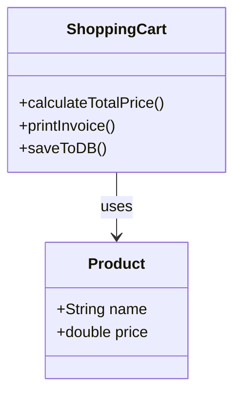

### Problem

The `ShoppingCart` class has **multiple responsibilities**:

| Responsibility | Method | What changes force edits here |
|----------------|--------|------------------------------|
| Business logic | `calculateTotalPrice()` | Pricing rules, discounts, tax |
| Presentation | `printInvoice()` | Invoice layout, PDF vs console |
| Persistence | `saveToDB()` | SQL → Mongo, schema, connection |

Changes in **any** of these areas modify the same class → harder to test, review, and deploy independently.

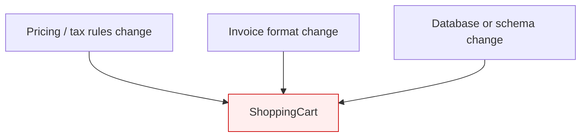

---

## Better Design

```text
Product
│
├── name
└── price

        1..*
          │
          ▼

ShoppingCart
│
└── calculateTotalPrice()

InvoicePrinter
│
└── printInvoice()

DBStorage
│
└── saveToDB()
```

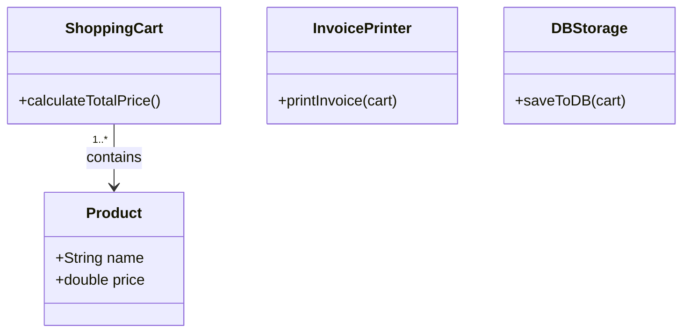

### Responsibilities

```text
ShoppingCart      → Cart calculations only
InvoicePrinter    → Invoice generation / output only
DBStorage         → Data persistence only
```

Each class now has **one reason to change**.

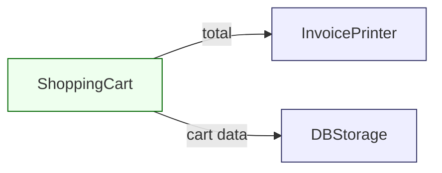

---

# O — Open Closed Principle (OCP)

### Definition

> **Software entities should be open for extension but closed for modification.**

You should add new behavior by **adding** new code (new classes, new plugins), not by **changing** code that already works and is tested.

---

## Bad Design

```text
DBStorage
│
└── saveToDB()
```

Later requirements:

```text
saveToSQL()
saveToMongo()
saveToFile()
```

Every new storage type means opening `DBStorage` and adding another method or another `if/else` branch.

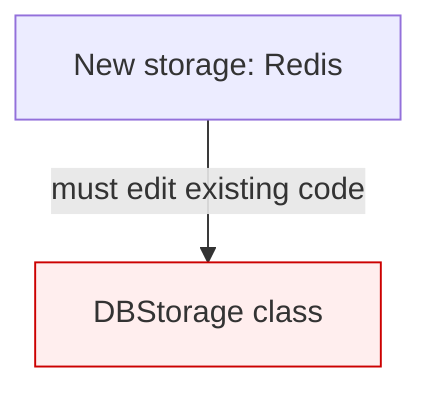

This violates OCP — existing callers and tests are touched for every new backend.

---

## Better Design

### Create abstraction

```text
<<abstract>>
DBPersistence
│
└── save()
```

### Implementations

```text
               DBPersistence
                     │
      ┌──────────────┼──────────────┐
      │              │              │
      ▼              ▼              ▼

 SaveToSQL      SaveToMongoDB    SaveToFile
     │                │              │
   save()           save()         save()
```

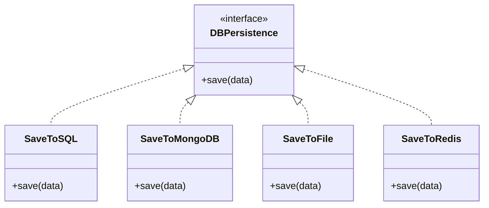

---

## Usage

```text
Cart
 │
 ▼
DBPersistence   ← depends on abstraction, not concrete SQL/Mongo
 │
 ├── SaveToSQL
 ├── SaveToMongoDB
 └── SaveToFile
```

Adding **Redis** later:

```text
SaveToRedis
    │
   save()
```

- No change to `SaveToSQL`, `SaveToMongoDB`, or `SaveToFile`
- Cart (or a factory) wires in `SaveToRedis` as another implementation
- **Extension only** — OCP satisfied

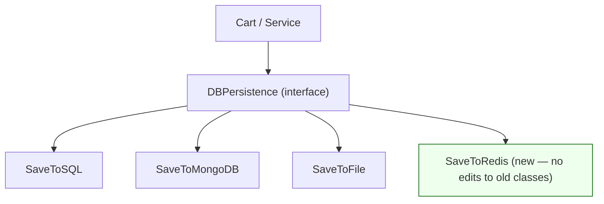

---

# L — Liskov Substitution Principle (LSP)

### Definition

> **Subclasses should be substitutable for their base classes.**

Wherever code expects type `A`, you should be able to pass subtype `B` without surprises — no broken assumptions, no “this method doesn’t apply here.”

---

## Generic structure

```text
Client
  │
  ▼

Base Class (A)
      ▲
      │
      │
Sub Class (B)
```

If:

```text
A* obj = new B();
```

then all behavior **promised by `A`** must work correctly on `B`.

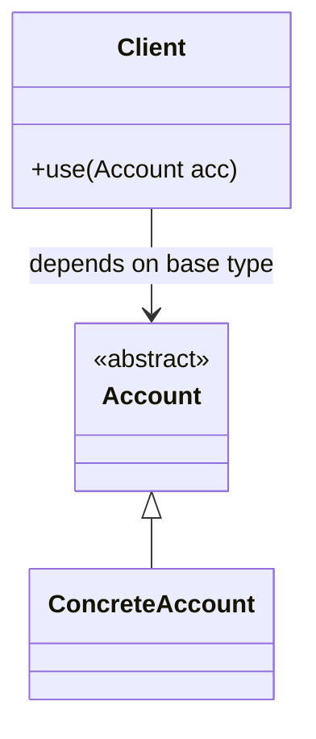

---

## Bad example — account hierarchy

```text
                <<abstract>>
                    Account
                ┌────────────┐
                │ deposit()  │
                │ withdraw() │
                └────────────┘

                  ▲    ▲    ▲
                  │    │    │

        Savings  Current  FixedDeposit
```

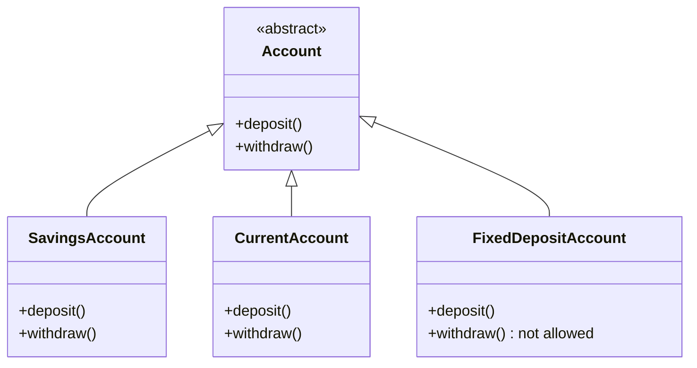

### Problem

```text
SavingsAccount
    ├── deposit()
    └── withdraw()

CurrentAccount
    ├── deposit()
    └── withdraw()

FixedDepositAccount
    ├── deposit()
    └── withdraw()   ← not valid for fixed deposit
```

`withdraw()` is not valid for a fixed deposit. A common (bad) fix:

```text
withdraw()
    -> throws exception
```

Then client code breaks:

```text
Account* acc = new FixedDepositAccount();
acc->withdraw();   // runtime failure — violates caller's expectation
```

The client trusted **any** `Account` to support `withdraw()`. `FixedDepositAccount` breaks that contract → **LSP violated**.

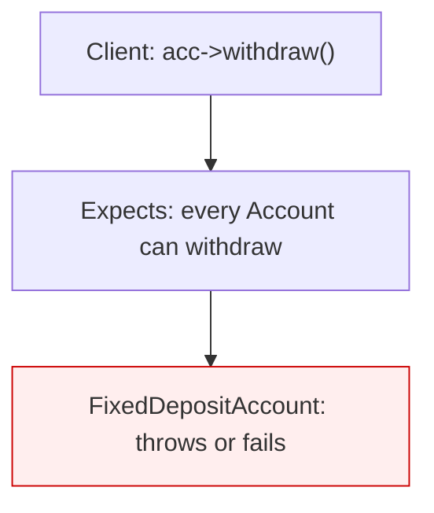

---

## Good design — split by behavior

Do not force one parent to expose operations that only some children support. **Split the hierarchy by capability.**

### Step 1 — non-withdrawable branch

```text
<<abstract>>
NonWithdrawableAccount
│
└── deposit()
```

### Step 2 — withdrawable branch

```text
<<abstract>>
WithdrawableAccount
│
├── deposit()
└── withdraw()
```

### Inheritance

```text
            NonWithdrawableAccount
                      ▲
                      │
              FixedDepositAccount


            WithdrawableAccount
                   ▲       ▲
                   │       │

           SavingsAcc   CurrentAcc
```

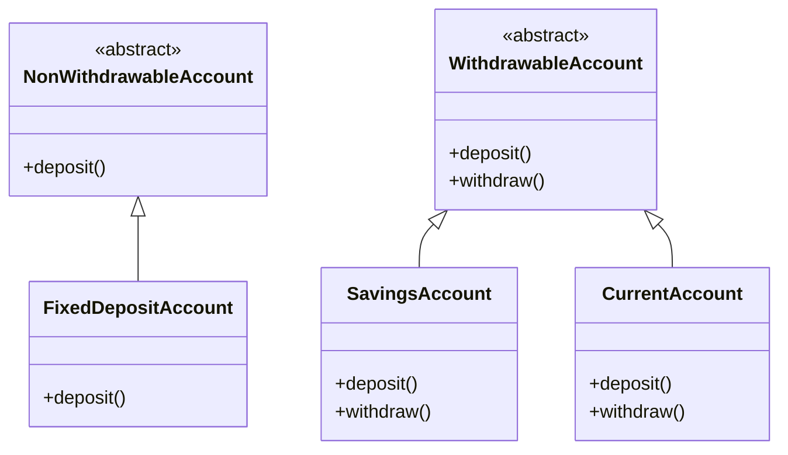

---

## Final structure — client usage

```text
Client
│
├── List<WithdrawableAccount>
│      ├── SavingsAccount
│      └── CurrentAccount
│
└── List<NonWithdrawableAccount>
       └── FixedDepositAccount
```

- Code that must call `withdraw()` only holds `WithdrawableAccount`
- Fixed deposits never appear where `withdraw()` is expected
- Every subclass supports **everything** its parent promises → **LSP satisfied**

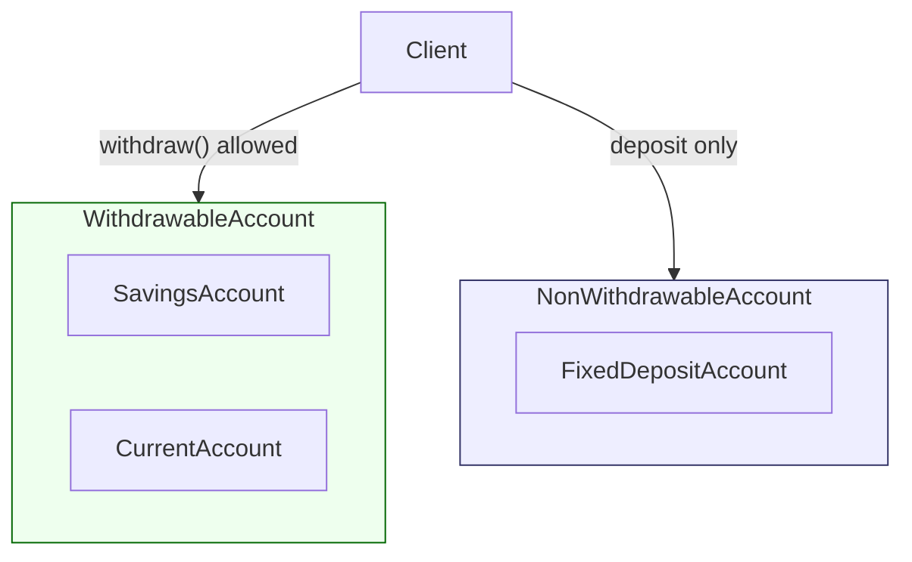

---

# Visual revision

Quick reference — same shapes as the lecture diagrams.

```text
SRP
----
ShoppingCart
 └─ calculateTotalPrice()

InvoicePrinter
 └─ printInvoice()

DBStorage
 └─ saveToDB()


OCP
----
DBPersistence
 ├─ SaveToSQL
 ├─ SaveToMongoDB
 └─ SaveToFile
 (+ SaveToRedis — extend without modifying above)


LSP
----
WithdrawableAccount
 ├─ SavingsAccount
 └─ CurrentAccount

NonWithdrawableAccount
 └─ FixedDepositAccount
```

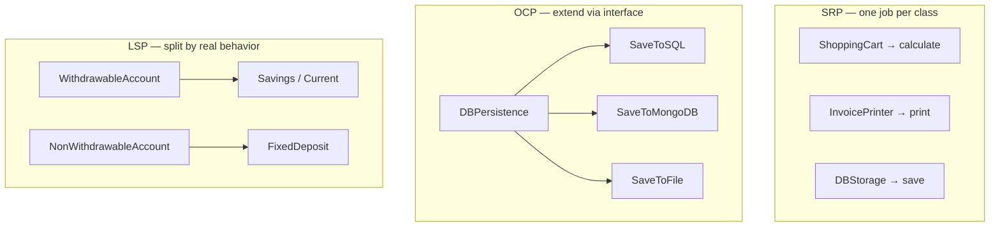

---

## How the three connect (interview tip)

| Principle | Question it answers |
|-----------|---------------------|
| **SRP** | “Who is allowed to change this class?” → One concern only |
| **OCP** | “How do we add features without breaking old code?” → Abstractions + new implementations |
| **LSP** | “Can I safely use a subtype wherever I use the base type?” → Match real behavior in the type hierarchy |

**Related notes:** [System Design Fundamentals — Part 1](../Complete%20Fundamentals%20Notes/Part1.md) (architecture and modules at system level).

*I and D (Interface Segregation, Dependency Inversion) can be added in the same format when you cover them in lecture.*
